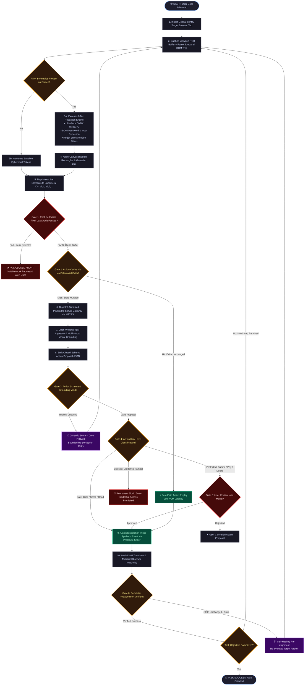
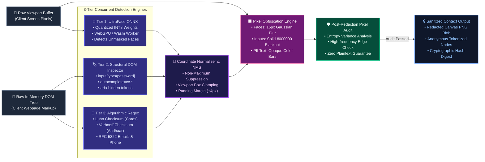
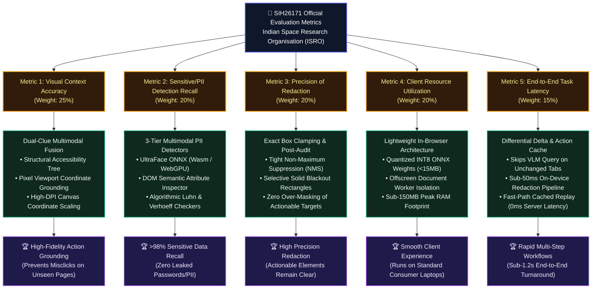

# 🎨 PrivaPilot (SIH26171) — PPT Architecture Diagrams & Algorithmic DAGs

> **Official Problem Statement:** SIH26171 — *On-device Visual Perception for Light-weight Browser Agents*  
> **Target Organisation:** Indian Space Research Organisation (ISRO), Department of Space  
> **Theme:** Smart Automation / Software  
> **Audience:** SIH Evaluation Jury, PPT Slide Decks, Technical Architecture Reviewers

This document provides **contest-winning, publication-grade architectural diagrams and Directed Acyclic Graphs (DAGs)** designed for presentation slides and technical documentation. All diagrams are natively rendered on GitHub using Mermaid and engineered to fit standard **16:9 presentation slides**.

---

## 📋 Table of Diagrams for SIH PPT Slides

| Slide # | Diagram Title | Purpose & Jury Focus |
| :--- | :--- | :--- |
| **Slide 1** | [4-Zone Hardware & Privacy Isolation Pipeline](#1-slide-1-master-4-zone-hardware--privacy-isolation-pipeline) | Demonstrates the strict fail-closed boundary between client browser and cloud server. |
| **Slide 2** | [Algorithmic Execution DAG & Decision Flowchart](#2-slide-2-algorithmic-execution-dag--decision-flowchart) | Decision-tree logic showing multi-tier gates, fallbacks, and human-in-the-loop safety. |
| **Slide 3** | [On-Device Redaction & Privacy Guard Deep Dive](#3-slide-3-on-device-redaction--privacy-guard-deep-dive) | Focuses on the 40% evaluation weight: UltraFace ONNX + DOM Sanitizer + Luhn/Verhoeff. |
| **Slide 4** | [Compact 1-Page PPT Master Layout (2-in-1 Architecture)](#4-slide-4-compact-1-page-ppt-master-layout) | Optimized high-density layout fitting both system flow and core novelty onto one slide. |
| **Slide 5** | [Official ISRO Evaluation Metrics vs Technical Alignment](#5-slide-5-isro-evaluation-metrics-vs-technical-architecture-alignment) | Direct mapping of project subsystems to the official 5 SIH evaluation criteria. |

---

## 1. [Slide 1] Master 4-Zone Hardware & Privacy Isolation Pipeline

> **Presenter Pitch Note:** *"Most browser agents leak user data by streaming raw frames to cloud LLMs. PrivaPilot enforces a strict physical and cryptographic split: local lightweight models handle visual perception and redaction on-device, and only sanitized, unidentifiable tokens leave the browser."*

```mermaid
flowchart TB
    %% ==========================================
    %% GLOBAL STYLES & DEFINITIONS
    %% ==========================================
    classDef clientZone fill:#0f172a,stroke:#3b82f6,stroke-width:2px,color:#f8fafc;
    classDef engineZone fill:#090d16,stroke:#f59e0b,stroke-width:2px,color:#fef08a;
    classDef serverZone fill:#0c1322,stroke:#8b5cf6,stroke-width:2px,color:#ede9fe;
    classDef execZone fill:#062817,stroke:#10b981,stroke-width:2px,color:#ecfdf5;
    
    classDef processNode fill:#1e293b,stroke:#475569,stroke-width:1.5px,color:#f1f5f9;
    classDef privacyNode fill:#311b0b,stroke:#d97706,stroke-width:2px,color:#fef3c7;
    classDef modelNode fill:#2e1065,stroke:#a855f7,stroke-width:2px,color:#f3e8ff;
    classDef actionNode fill:#064e3b,stroke:#059669,stroke-width:2px,color:#a7f3d0;
    classDef gateNode fill:#450a0a,stroke:#ef4444,stroke-width:2px,color:#fee2e2;

    %% ==========================================
    %% ZONE 1: USER VIEWPORT & ACTIVE TAB
    %% ==========================================
    subgraph Zone1 ["ZONE 1: Client Environment & Browser Viewport (Chrome MV3)"]
        direction TB
        UserPrompt(["👤 User High-Level Goal: 'Search flights, autofill profile & submit'"]):::processNode
        ActiveTab["🌐 Active Webpage DOM & Viewport<br/>(Confidential Data: Passwords, Aadhaar, Profile)"]:::processNode
        CaptureHook["📷 Offscreen Document Viewport Capture<br/>(Lossless RGB Frame Buffer + Accessibility Tree)"]:::processNode

        UserPrompt --> ActiveTab
        ActiveTab --> CaptureHook
    end

    %% ==========================================
    %% ZONE 2: IN-BROWSER PRIVACY & PERCEPTION
    %% ==========================================
    subgraph Zone2 ["ZONE 2: On-Device Fail-Closed Privacy & Perception Engine (Wasm / WebGPU)"]
        direction TB
        subgraph DetectionTiers ["3-Tier Concurrent PII & Biometric Detection"]
            Tier1["🧠 Tier 1: UltraFace ONNX<br/>(Quantized INT8 Wasm/WebGPU · 25ms)"]:::privacyNode
            Tier2["🏷️ Tier 2: Structural DOM Scanner<br/>(input[type=password], autocomplete, ARIA)"]:::privacyNode
            Tier3["🔢 Tier 3: Heuristic Regex & Checksums<br/>(Luhn CC, Verhoeff Aadhaar, PAN, Phone)"]:::privacyNode
        end

        MaskEngine["⬛ Canvas Pixel Obfuscator<br/>(Solid #000000 Masks + 16px Gaussian Blur)"]:::privacyNode
        TokenEngine["🏷️ Ephemeral Local ID Tokenizer<br/>(Replaces XPath/Selectors with el_btn_1, el_inp_2)"]:::privacyNode
        AuditGate{"🛡️ Pixel Leak & Cryptographic Audit<br/>Fail-Closed Security Gate"}:::gateNode
        
        CaptureHook --> Tier1 & Tier2 & Tier3
        Tier1 & Tier2 & Tier3 --> MaskEngine
        MaskEngine --> TokenEngine
        TokenEngine --> AuditGate
    end

    %% ==========================================
    %% ZONE 3: REASONING GATEWAY (SERVER)
    %% ==========================================
    subgraph Zone3 ["ZONE 3: Centralized Open-Weights Reasoning Gateway (Node / Express)"]
        direction TB
        Payload["📦 Privacy-Sanitized HTTPS Payload<br/>• Redacted Screenshot (Zero PII)<br/>• Ephemeral Local Element Map"]:::modelNode
        ModelRouter["🔀 Gateway Router & Probe<br/>(Ollama / LM Studio / Cloud Open-Weights)"]:::modelNode
        OpenVLM["🧠 Open-Weights VLM Reasoning Engine<br/>(Qwen2.5-VL 72B / 7B Instruct)"]:::modelNode
        SchemaValidator["📐 Closed-Schema Action Validator<br/>(Emits strictly typed JSON command)"]:::modelNode

        Payload --> ModelRouter --> OpenVLM --> SchemaValidator
    end

    %% ==========================================
    %% ZONE 4: CLIENT-SIDE EXECUTION & VERIFICATION
    %% ==========================================
    subgraph Zone4 ["ZONE 4: Local Closed-Loop Execution & Safety Guard (Content Script)"]
        direction TB
        RiskGuard{"⚖️ Client Risk Matrix<br/>(Safe vs Protected vs Blocked)"}:::gateNode
        HumanModal["🙋 Human-in-the-Loop Confirmation<br/>(Required for Submit, Pay, Delete)"]:::privacyNode
        DOMDispatcher["⚡ Native Event Dispatcher<br/>(Trusted Prototype Event Setters)"]:::actionNode
        StateVerifier{"🔄 Semantic State Verifier<br/>(MutationObserver DOM & URL Check)"}:::actionNode
        TelemetryHUD["📊 Mission Control Telemetry HUD<br/>(Dual Viewport, Latency Breakdown, PII Stats)"]:::processNode

        RiskGuard -->|Safe: Click / Type / Scroll| DOMDispatcher
        RiskGuard -->|Protected: Form Submit / Pay| HumanModal -->|Approved| DOMDispatcher
        RiskGuard -->|Blocked: Credential Tamper| TelemetryHUD
        DOMDispatcher --> StateVerifier
        StateVerifier -->|Verified State Transition| TelemetryHUD
    end

    %% ==========================================
    %% CROSS-ZONE BOUNDARIES & DATA FLOW
    %% ==========================================
    AuditGate -->|PASS: Transmit Sanitized Only| Payload
    AuditGate -.->|FAIL: Abort Network Request| TelemetryHUD
    SchemaValidator -->|Strict Action JSON Proposal| RiskGuard
    StateVerifier -.->|Re-perceive Delta Loop| CaptureHook

    class Zone1 clientZone;
    class Zone2 engineZone;
    class Zone3 serverZone;
    class Zone4 execZone;
```

---

## 2. [Slide 2] Algorithmic Execution DAG & Decision Flowchart

> **Presenter Pitch Note:** *"This algorithmic DAG illustrates our fail-closed agent loop. At every turn, the agent evaluates safety gates, differential cache hits, and semantic postconditions. If a pixel leak is detected, it fails closed; if an action is high-risk, it requires human consensus."*

---

## 3. [Slide 3] On-Device Redaction & Privacy Guard Deep Dive

> **Presenter Pitch Note:** *"Metrics 2 and 3 account for 40% of the entire ISRO evaluation. Here is our 3-tier redaction pipeline: visual biometrics, DOM structural semantics, and algorithmic string checksums merge into a unified canvas mask before undergoing a post-redaction pixel audit."*

---

## 4. [Slide 4] Compact 1-Page PPT Master Layout

> **Presenter Pitch Note:** *"For a single slide combining both architecture and core technical innovations, this high-density layout clearly communicates how the user, client extension, and server gateway interact without clutter."*

```mermaid
flowchart LR
    %% ==========================================
    %% COMPACT 1-PAGE PPT MASTER
    %% ==========================================
    classDef userBox fill:#1e293b,stroke:#94a3b8,stroke-width:2px,color:#f8fafc;
    classDef clientBox fill:#0f172a,stroke:#3b82f6,stroke-width:2px,color:#93c5fd;
    classDef privacyBox fill:#451a03,stroke:#f59e0b,stroke-width:2px,color:#fef08a;
    classDef serverBox fill:#2e1065,stroke:#a855f7,stroke-width:2px,color:#f3e8ff;
    classDef safeBox fill:#064e3b,stroke:#10b981,stroke-width:2px,color:#a7f3d0;

    User(["👤 User Goal"]):::userBox --> Extension["🧩 In-Browser Extension (MV3)<br/>Viewport & DOM Capture"]:::clientBox

    subgraph Privacy_Barrier ["🔒 FAIL-CLOSED PRIVACY BOUNDARY (On-Device)"]
        direction TB
        Extension --> Redact["🛡️ On-Device Redaction Pipeline<br/>• UltraFace ONNX (Faces)<br/>• DOM Inspector (Passwords)<br/>• Luhn/Verhoeff (CC/Aadhaar)"]:::privacyBox
        Redact --> Mask["⬛ Canvas Pixel Obfuscator<br/>(Solid Blackout + Blur Masks)"]:::privacyBox
        Mask --> Verify{"🛡️ Pixel Leak Audit<br/>Fail-Closed Gate"}:::privacyBox
    end

    Verify -->|Clean Sanitized Context| Gateway["🌐 Server Reasoning Gateway<br/>Open-Weights VLM (Qwen2.5-VL)<br/>Emits: Closed-Schema JSON Action"]:::serverBox
    Verify -.->|Leak Detected| Abort(["🚫 Abort Request"]):::userBox

    Gateway --> RiskCheck{"⚖️ Risk Matrix"}:::safeBox
    RiskCheck -->|Safe| Execute["⚡ Content Script Dispatcher<br/>Native Prototype Event Injection"]:::safeBox
    RiskCheck -->|Protected| Confirm["🙋 Human Confirmation Modal<br/>(Submit / Pay / Delete)"]:::privacyBox
    Confirm -->|Approved| Execute

    Execute --> ClosedLoop["🔄 Semantic State Verifier<br/>MutationObserver Watchdog"]:::clientBox
    ClosedLoop -.->|Next Step Loop| Extension
```

---

## 5. [Slide 5] ISRO Evaluation Metrics vs Technical Architecture Alignment

> **Presenter Pitch Note:** *"Our entire technical architecture was deliberately engineered around the 5 official SIH26171 evaluation criteria. Redaction and privacy are weighted at 40%, visual accuracy at 25%, efficiency at 20%, and latency at 15%."*

---

## 6. Key Takeaways & Jury Talking Points for PPT

### 🛡️ Why PrivaPilot Wins the SIH Finale
1. **True Fail-Closed Guarantee:**
   Unlike traditional agents that blindly trust cloud LLMs, PrivaPilot *never* transmits raw visual context. If an element's privacy status is ambiguous, it over-masks locally or aborts transmission.
2. **Generalization to Unseen Evaluation Portals:**
   As stated in the official ISRO problem statement (*"Use cases will be provided during finale"*), PrivaPilot uses zero hardcoded selectors. All detection is structural, heuristic, and neural.
3. **Double Verification Loops:**
   - *Pre-Transmission:* Cryptographic pixel audit prevents leakage before HTTPS dispatch.
   - *Post-Execution:* Semantic `MutationObserver` checks ensure synthetic events actually succeeded on the page.
4. **40% Score Optimization:**
   The highest weighted criteria (PII Recall & Redaction Precision) are isolated into dedicated, unit-tested modules within `packages/pii-rules` and `apps/extension/src/sanitizer`.

---

### 💡 How to Export for PPT Slides
- **Direct GitHub Viewing:** These diagrams render automatically in your GitHub repository browser.
- **Copying to PowerPoint:**
  1. Open [index.html](file:///c:/Users/HP/Desktop/sih/index.html) in any browser and click **"Export HD PNG"** for crystal-clear slide graphics.
  2. Or paste any diagram's Mermaid code into [Mermaid Live Editor](https://mermaid.live) to download SVG/PNG vector exports.
