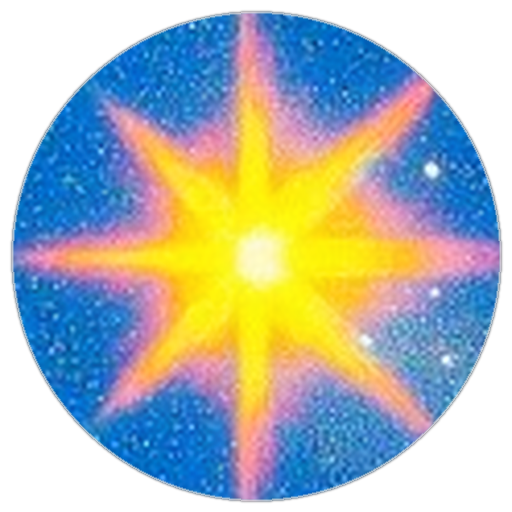
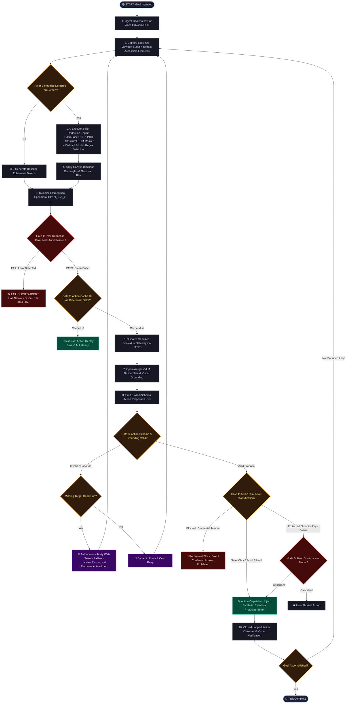

<div align="center">



<h1 align="center" style="font-family: 'Instrument Serif', 'Playfair Display', 'New York', Georgia, serif; font-size: 50px; font-weight: 500; letter-spacing: 0.5px; margin-top: 12px; margin-bottom: 6px;">Comet</h1>

### On-Device Visual Perception for Light-Weight Browser Agents

**A browser agent that sees your screen, thinks through complex goals, and proves zero secrets ever leave the device.**

[Problem Statement](docs/00_PROBLEM_STATEMENT.md) · [Master Architecture](diagrams/06_CODE_ALIGNED_MASTER_ARCHITECTURE.md) · [Interactive Diagram Studio](index.html) · [Agent Harness](agent-harness/README.md) · [Full Documentation](docs/INDEX.md)

</div>

---

## 🏛️ System Architecture: 4-Zone Hardware & Privacy Isolation

```mermaid
flowchart TB
    %% ==========================================
    %% GLOBAL STYLES & DEFINITIONS
    %% ==========================================
    classDef clientZone fill:#0f172a,stroke:#3b82f6,stroke-width:2px,color:#f8fafc;
    classDef engineZone fill:#090d16,stroke:#f59e0b,stroke-width:2px,color:#fef08a;
    classDef serverZone fill:#0c1322,stroke:#8b5cf6,stroke-width:2px,color:#ede9fe;
    classDef execZone fill:#062817,stroke:#10b981,stroke-width:2px,color:#ecfdf5;
    
    classDef processNode fill:#1e293b,stroke:#475569,stroke-width:1.5px,color:#f1f5f9;
    classDef privacyNode fill:#311b0b,stroke:#d97706,stroke-width:2px,color:#fef3c7;
    classDef modelNode fill:#2e1065,stroke:#a855f7,stroke-width:2px,color:#f3e8ff;
    classDef actionNode fill:#064e3b,stroke:#059669,stroke-width:2px,color:#a7f3d0;
    classDef gateNode fill:#450a0a,stroke:#ef4444,stroke-width:2px,color:#fee2e2;

    %% ZONE 1: USER VIEWPORT & ACTIVE TAB
    subgraph Zone1 ["ZONE 1: Client Environment & Browser Viewport (Chrome MV3)"]
        direction TB
        UserGoal(["👤 User Goal (Voice / Text): 'Search flights, autofill profile & submit'"]):::processNode
        ActiveTab["🌐 Active Webpage DOM & Viewport<br/>(Contains: Passwords, Aadhaar, Face, Profile)"]:::processNode
        CaptureHook["📷 Offscreen Document Viewport Capture<br/>(Lossless RGB Frame Buffer + Accessibility Tree)"]:::processNode

        UserGoal --> ActiveTab
        ActiveTab --> CaptureHook
    end

    %% ZONE 2: IN-BROWSER PRIVACY & PERCEPTION
    subgraph Zone2 ["ZONE 2: On-Device Fail-Closed Privacy & Perception Engine (Wasm / WebGPU)"]
        direction TB
        subgraph DetectionTiers ["3-Tier Concurrent PII & Biometric Detection"]
            Tier1["🧠 Tier 1: UltraFace ONNX<br/>(Quantized INT8 Wasm/WebGPU · 25ms)"]:::privacyNode
            Tier2["🏷️ Tier 2: Structural DOM Scanner<br/>(input[type=password], autocomplete, ARIA)"]:::privacyNode
            Tier3["🔢 Tier 3: Heuristic Regex & Checksums<br/>(Luhn CC, Verhoeff Aadhaar, PAN, Phone)"]:::privacyNode
        end

        MaskEngine["⬛ Canvas Pixel Obfuscator<br/>(Solid #000000 Masks + Gaussian Blur)"]:::privacyNode
        TokenEngine["🏷️ Ephemeral Local ID Tokenizer<br/>(Replaces Selectors with el_1, el_2)"]:::privacyNode
        AuditGate{"🛡️ Pixel Leak & Cryptographic Audit<br/>Fail-Closed Security Gate"}:::gateNode
        
        CaptureHook --> Tier1 & Tier2 & Tier3
        Tier1 & Tier2 & Tier3 --> MaskEngine
        MaskEngine --> TokenEngine
        TokenEngine --> AuditGate
    end

    %% ZONE 3: REASONING GATEWAY
    subgraph Zone3 ["ZONE 3: Centralized Open-Weights Reasoning Gateway (Node.js node:http :4501)"]
        direction TB
        Payload["📦 Privacy-Sanitized HTTPS Payload<br/>• Redacted Screenshot (Zero PII)<br/>• Ephemeral Local Element Map"]:::modelNode
        CanaryCheck{"🔍 Cryptographic Canary Scanner<br/>Prohibits Raw Token Leaks"}:::gateNode
        ModelRouter["🔀 Gateway Router & Open-Weights VLM<br/>(Qwen2.5-VL 72B / Ollama / LM Studio)"]:::modelNode
        SchemaCheck{"📐 Closed-Schema JSON Validator<br/>Strict Schema Enforcement"}:::gateNode
        ActionProposal["⚡ Structured Action Proposal JSON<br/>(actionId, kind, targetLocalId, rationale)"]:::modelNode

        Payload --> CanaryCheck
        CanaryCheck --> ModelRouter
        ModelRouter --> SchemaCheck
        SchemaCheck --> ActionProposal
    end

    %% ZONE 4: EXECUTION SHIELD
    subgraph Zone4 ["ZONE 4: In-Browser Execution Shield & DOM Dispatcher"]
        direction TB
        RiskGate{"⚖️ Action Risk Gate<br/>(Safe vs Protected vs Blocked)"}:::gateNode
        HumanModal["🙋 Human-in-the-Loop Confirmation<br/>(Required for Submit, Pay, Delete)"]:::actionNode
        EventDispatcher["🎯 Synthetic Event Injector<br/>(Prototype Setters + Click Dispatch)"]:::actionNode
        Observer["👁️ Closed-Loop Mutation Observer<br/>(DOM Verification & Action Cache)"]:::actionNode

        ActionProposal --> RiskGate
        RiskGate -- Protected --> HumanModal
        HumanModal -- Approved --> EventDispatcher
        RiskGate -- Safe --> EventDispatcher
        RiskGate -- Blocked --> AbortAction["🚫 Tamper Block"]:::gateNode
        EventDispatcher --> Observer
        Observer -.->|"Next Perception Step"| ActiveTab
    end

    %% INTER-ZONE HIGHWAY
    AuditGate -- "Pass (Sanitized Only)" --> Payload
    AuditGate -- "Fail: Leak Suspected" --> AbortNet["🛑 Halt Network Request"]:::gateNode
```



---

## 🔒 The Unbreakable Privacy Guarantee

```
       CLIENT BROWSER (On-Device Sandbox)                 SERVER GATEWAY
┌───────────────────────────────────────────────┐     ┌──────────────────────┐
│                                               │     │                      │
│  1. Capture Viewport RGB Buffer               │     │   Open-Weights VLM   │
│  2. Local Detect: UltraFace + DOM + Verhoeff  │     │   (Qwen2.5-VL 72B)   │
│  3. Pixel Masking: Solid Blackout Rectangles  │     │                      │
│  4. Leak Audit: Fail-Closed Verification      │     │   Reasons ONLY over  │
│  5. Ephemeral Tokenization: el_btn_1          │     │   redacted images    │
│                        │                      │     │          │           │
│                        └─── Sanitized Payload ┼────▶│          ▼           │
│                                               │     │   ONE single action  │
│  6. Execute Action ◀── Risk & Human Gate ─────┼─────┤   by local ID only   │
│                                               │     │                      │
└───────────────────────────────────────────────┘     └──────────────────────┘
       ▲ RAW PIXELS, PASSWORDS, AND PLAIN IDENTIFIERS NEVER CROSS THIS LINE ▲
```

| Never Leaves Browser | Redacted on Canvas | Server Receives |
| :--- | :--- | :--- |
| **Passwords, PINs, OTPs** | **Aadhaar, PAN, SSN** | Redacted screenshot with blacked-out PII |
| **Raw Unmasked Screen Pixels** | **Credit & Debit Card Numbers** | Ephemeral element IDs (`el_btn_1`, `el_inp_2`) |
| **Plaintext Personal Free Text** | **User Faces & Profile Photos** | Sanitized semantic roles (`button`, `input`) |
| **Session Cookies & Auth Tokens** | **Phone Numbers & Email Addresses** | Normalized bounding coordinates (`[ymin, xmin, ymax, xmax]`) |
| **DOM Hierarchy & CSS Selectors** | **Uninspectable Canvases / IFrames** | Action capabilities (`['click', 'fill']`) |

---

## 🔄 Algorithmic Workflow: How Comet Really Works



---

## 🧠 The Agent Thinking Monologue & Deliberation Loop

Comet does not guess — it exposes its step-by-step reasoning through structured thinking tokens:

```mermaid
sequenceDiagram
    autonumber
    actor User as 👤 User
    participant HUD as 🪟 Sidepanel HUD (Orbloom 3D)
    participant Coord as 🕹️ Coordinator (MV3)
    participant San as 🛡️ Privacy Sanitizer (Wasm)
    participant VLM as 🧠 Server Gateway (Qwen2.5-VL)
    participant Page as 🌐 Browser DOM

    User->>HUD: "Find ISRO Chandrayaan-3 Brochure and download it"
    HUD->>Coord: Dispatch Goal + Session Options
    Coord->>Page: Capture Viewport Buffer + Extract Interactive DOM
    Coord->>San: Redact PII (Faces, Numbers, Form Values)
    San-->>Coord: SanitizedContext (Branded, Zero Secrets)
    Coord->>VLM: HTTPS POST /api/v1/reason (Redacted Screenshot + Ephemeral Elements)
    
    rect rgb(20, 20, 35)
        Note over VLM: Streaming Thinking Deliberation:<br/>"<think>The brochure is not in the immediate viewport.<br/>I see a link 'Media Resources' at el_4.<br/>I should click el_4 to expand documents.</think>"
    end

    VLM-->>HUD: Stream <think> Monologue (Live Shimmer Text)
    VLM-->>Coord: Closed-Schema JSON { kind: "click", targetLocalId: "el_4" }
    Coord->>HUD: Update Action Timeline Node
    Coord->>Page: Synthetic Prototype Event Click on el_4
    Page-->>Coord: DOM Mutation Triggered
    Coord->>Coord: Closed-Loop Verification: URL Changed & Target Expanded
    Coord->>HUD: Render Step Success + Orbloom Audio Reactive Glow
```



---

## 💻 Complete Technology Stack

```
┌────────────────────────────────────────────────────────────────────────────────────────┐
│                              COMET ARCHITECTURE & STACK                                │
├──────────────────────────┬─────────────────────────────┬───────────────────────────────┤
│    CLIENT & BROWSER      │     AI & ON-DEVICE CV       │      SERVER & PROTOCOL        │
├──────────────────────────┼─────────────────────────────┼───────────────────────────────┤
│ • Chrome Manifest V3     │ • ONNX Runtime Web INT8     │ • Native Node.js node:http    │
│ • WebExtensions API      │ • UltraFace-320 INT8 Model  │ • Zero-Framework Architecture │
│ • Offscreen Canvas Host  │ • WebAssembly / WebGPU      │ • Cryptographic Canary Guard  │
│ • TypeScript 5.8+ Strict │ • Verhoeff Algorithm        │ • Closed-Schema JSON Rules    │
│ • esbuild Standalone     │ • Luhn Algorithm            │ • Qwen2.5-VL 72B / 7B Open    │
│ • Web Audio API 60 FPS   │ • Canvas 2D Blackout Engine │ • Ollama / LM Studio Offline  │
│ • Orbloom 3D WebGL / OGL │ • Perception Fusion Engine  │ • Tavily Web Search API       │
└──────────────────────────┴─────────────────────────────┴───────────────────────────────┘
```

---

## 🚀 End-to-End Installation & Setup Guide

### 1. Prerequisites
- **Node.js**: `v20.0.0` or higher (`node -v`)
- **Google Chrome**: Recent version with Manifest V3 support
- **No discrete GPU required** (UltraFace runs via quantized Wasm/WebGPU on any laptop CPU)

### 2. Clone Repository & Install Dependencies
```bash
# Clone the repository
git clone https://github.com/kushagara175/comet_browser_agent.git
cd comet_browser_agent

# Install dependencies across all workspace packages
npm install
```

### 3. Build All Workspace Packages
```bash
# Compiles TypeScript and creates standalone esbuild IIFE/ESM bundles
npm run build
```
*Build artifacts validated: `apps/extension/dist/`, `apps/server/dist/`, `packages/*/dist/`.*

### 4. Configure Environment & Model
Copy the environment template:
```bash
cp .env.example .env
```
Edit `.env` to select your model backend:

#### Option A: Cloud Open-Weights (Qwen2.5-VL-72B via OpenRouter - Recommended)
```ini
VLM_ENDPOINT=https://openrouter.ai/api/v1/chat/completions
VLM_API_KEY=sk-or-v1-your-api-key-here
VLM_MODEL=qwen/qwen2.5-vl-72b-instruct
```

#### Option B: Offline Local Open-Weights (Ollama)
```bash
# In a separate terminal, pull and start Ollama
ollama run qwen2.5vl
```
```ini
VLM_ENDPOINT=http://127.0.0.1:11434/api/generate
VLM_MODEL=qwen2.5vl
```

#### Option C: Zero-Model Deterministic Mock (Instant Offline Development)
Leave `VLM_ENDPOINT` blank. The reasoning gateway automatically falls back to the deterministic local mock engine.

### 5. Launch the Local Services
In terminal 1, start the reasoning gateway:
```bash
npm run dev:server
# Gateway online -> http://localhost:4501
```

In terminal 2, start the synthetic PII demo portal:
```bash
npm run dev:portal
# Demo portal online -> http://localhost:4500
```

### 6. Load the Extension into Google Chrome
1. Open Google Chrome and navigate to `chrome://extensions`.
2. Toggle **Developer mode** on (top-right corner).
3. Click the **Load unpacked** button (top-left).
4. Select the directory: `SIH/apps/extension/`.
5. Comet is now loaded with active Manifest V3 service workers!

### 7. Run Your First Task
1. Open `http://localhost:4500` (the seeded PII demo portal) or any live web page.
2. Click the puzzle icon in Chrome and click **Comet** to open the **Side Panel HUD**.
3. Type or speak a goal into the Orbloom voice bar:
   > *"Fill out the application form using my vault profile and preview submission"*
4. Watch the dual visualizer: The left HUD displays your live screen; the right HUD proves that all sensitive data is solid blacked-out before reaching the server!

---

## 🩺 Diagnostics & Health Verification

Verify gateway and model connectivity:
```bash
# Gateway status & VLM probe
curl http://localhost:4501/api/v1/model-status

# Full local LLM backend diagnostic
npm run test:llm
```

Run repository integrity & type checks:
```bash
npm run lint
```

Execute the full 456-test agent harness suite:
```bash
npm test
```

---

## 📂 Repository Layout

```
SIH/
├── apps/
│   ├── extension/            # Chrome MV3 Extension (Offscreen, Background, Content, HUD)
│   │   ├── src/background/   # RunCoordinator, Telemetry, Multi-step loops
│   │   ├── src/browser/      # High-performance BrowserAdapter & Tab Controller
│   │   ├── src/sanitizer/    # UltraFace ONNX, DOM Scanner, Verhoeff/Luhn Maskers
│   │   ├── src/sidepanel/    # Mission Control HUD, Orbloom 3D, VoiceBeam Audio Canvas
│   │   └── src/vault/        # AES-GCM Encrypted Credentials & Demographic Profiles
│   ├── server/               # Stateless Node.js Reasoning Gateway (node:http, Canary Scanner)
│   └── demo-portal/          # Synthetic PII testing ground & multi-step demo workflows
│
├── agent-harness/            # Comprehensive Agent Evaluation Harness & Testbeds (456 tests)
│   ├── agent-core/           # Coordinator, thinking monologue, multi-step agent loop
│   ├── browser-mgmt/         # Browser adapter, DOM interaction, HUD sidepanel, voice, Tavily
│   ├── models-perception/    # UltraFace ONNX model, face blur, visual perception, focused crop
│   ├── privacy-sanitizer/    # PII rules, Verhoeff/Luhn checksums, offscreen canvas sanitizer
│   ├── server-gateway/       # Closed-schema gateway validator, canary scanner, VLM auth
│   └── benchmarks-eval/      # Official ISRO evaluation metrics, action cache, repo integrity
│
├── packages/
│   ├── protocol/             # Type-enforced privacy contracts & branded types
│   ├── pii-rules/            # Deterministic regex, DOM & checksum PII detectors
│   ├── benchmark/            # ISRO 5-pillar evaluation engine
│   └── test-fixtures/        # Authoritative ground truth annotated pages
│
├── scripts/                  # Automated build, CDP benchmark runner, E2E matrix
│   ├── build.js              # Production monorepo builder & bundler
│   ├── run-benchmarks.js     # ISRO 5-pillar evaluation benchmark runner
│   ├── run-browser-benchmark.mjs # Real Chrome CDP benchmark against ground truth
│   └── lib/                  # CDP client, Chrome launcher, harness runner
│
├── diagrams/                 # Publication-grade Mermaid diagrams & PPT slides
│   ├── 01_4zone_system_architecture.md
│   ├── 02_algorithmic_execution_dag.md
│   ├── 03_on_device_redaction_pipeline.md
│   ├── 06_CODE_ALIGNED_MASTER_ARCHITECTURE.md
│   └── README.md
├── index.html                # Interactive PPT Diagrams & Algorithmic DAGs Studio
└── docs/                     # Authoritative specifications, audit reports & playbooks
```

---

## 🎯 Alignment with Official ISRO Evaluation Rubric

| Criterion | Weight | Comet Architectural Implementation |
| :--- | :---: | :--- |
| **Visual Context Accuracy** | **25%** | DOM element extractor + UltraFace ONNX INT8 + Viewport normalized bounding |
| **PII Detection Recall & Precision** | **20%** | 3-tier concurrent detectors (DOM semantics + Verhoeff Aadhaar + Luhn Cards + Regex) |
| **Redaction Tightness & Precision** | **20%** | Tight text-range bounding boxes without masking entire parent containers |
| **Client Resource Utilization** | **20%** | Lightweight INT8 ONNX running in Wasm/WebGPU; zero heavy LLM models on client |
| **End-to-End Task Latency** | **15%** | Native `node:http` gateway with sub-millisecond overhead + 0ms Differential Delta Cache |

---

## 📜 Contributing & Rules

All changes must abide by the non-negotiable guarantees documented in **[docs/AGENT_RULES.md](docs/AGENT_RULES.md)**:
1. Never bypass `SanitizedContext`.
2. Never transmit unmasked raw viewport pixels.
3. Never log raw screen, DOM, or payload values.
4. Never auto-execute protected/high-risk actions without explicit user confirmation.
5. Never report unmeasured performance claims.

---

## 📄 License

MIT — see [LICENSE](LICENSE).

<div align="center">
<sub>Smart India Hackathon 2026 · Problem Statement SIH26171 · Indian Space Research Organisation (ISRO)</sub>
</div>
