# Slide 1: Master 4-Zone Hardware & Privacy Isolation Pipeline

> **Problem Statement:** SIH26171 — *On-device Visual Perception for Light-weight Browser Agents*  
> **Organisation:** Indian Space Research Organisation (ISRO)  
> **Use Case:** PPT Architecture Slide / Technical Defense

### Key Talking Points for Judges:
- **Zero Raw Screen Leakage:** All screen capture and pixel redaction happen inside the user's browser sandbox using Manifest V3 Offscreen Canvas and WebAssembly/WebGPU.
- **Fail-Closed Boundary:** Raw pixels, passwords, faces, and plaintext PII never cross the network. Only sanitized canvas blobs and anonymous local element IDs are transmitted.
- **Open-Weights Reasoning:** The server reasoning gateway uses an open-weights VLM (Qwen2.5-VL 72B / 7B) running locally via Ollama / LM Studio or cloud-hosted open endpoint.

```mermaid
flowchart TB
    %% GLOBAL STYLES
    classDef clientZone fill:#0f172a,stroke:#3b82f6,stroke-width:2px,color:#f8fafc;
    classDef engineZone fill:#090d16,stroke:#f59e0b,stroke-width:2px,color:#fef08a;
    classDef serverZone fill:#0c1322,stroke:#8b5cf6,stroke-width:2px,color:#ede9fe;
    classDef execZone fill:#062817,stroke:#10b981,stroke-width:2px,color:#ecfdf5;
    
    classDef processNode fill:#1e293b,stroke:#475569,stroke-width:1.5px,color:#f1f5f9;
    classDef privacyNode fill:#311b0b,stroke:#d97706,stroke-width:2px,color:#fef3c7;
    classDef modelNode fill:#2e1065,stroke:#a855f7,stroke-width:2px,color:#f3e8ff;
    classDef actionNode fill:#064e3b,stroke:#059669,stroke-width:2px,color:#a7f3d0;
    classDef gateNode fill:#450a0a,stroke:#ef4444,stroke-width:2px,color:#fee2e2;

    %% ZONE 1
    subgraph Zone1 ["ZONE 1: Client Environment & Browser Viewport (Chrome MV3)"]
        direction TB
        UserPrompt(["👤 User High-Level Goal: 'Search flights, autofill profile & submit'"]):::processNode
        ActiveTab["🌐 Active Webpage DOM & Viewport<br/>(Confidential Data: Passwords, Aadhaar, Profile)"]:::processNode
        CaptureHook["📷 Offscreen Document Viewport Capture<br/>(Lossless RGB Frame Buffer + Accessibility Tree)"]:::processNode

        UserPrompt --> ActiveTab
        ActiveTab --> CaptureHook
    end

    %% ZONE 2
    subgraph Zone2 ["ZONE 2: On-Device Fail-Closed Privacy & Perception Engine (Wasm / WebGPU)"]
        direction TB
        subgraph DetectionTiers ["3-Tier Concurrent PII & Biometric Detection"]
            Tier1["🧠 Tier 1: UltraFace ONNX<br/>(Quantized INT8 Wasm/WebGPU · 25ms)"]:::privacyNode
            Tier2["🏷️ Tier 2: Structural DOM Scanner<br/>(input[type=password], autocomplete, ARIA)"]:::privacyNode
            Tier3["🔢 Tier 3: Heuristic Regex & Checksums<br/>(Luhn CC, Verhoeff Aadhaar, PAN, Phone)"]:::privacyNode
        end

        MaskEngine["⬛ Canvas Pixel Obfuscator<br/>(Solid #000000 Masks + 16px Gaussian Blur)"]:::privacyNode
        TokenEngine["🏷️ Ephemeral Local ID Tokenizer<br/>(Replaces XPath/Selectors with el_btn_1, el_inp_2)"]:::privacyNode
        AuditGate{"🛡️ Pixel Leak & Cryptographic Audit<br/>Fail-Closed Security Gate"}:::gateNode
        
        CaptureHook --> Tier1 & Tier2 & Tier3
        Tier1 & Tier2 & Tier3 --> MaskEngine
        MaskEngine --> TokenEngine
        TokenEngine --> AuditGate
    end

    %% ZONE 3
    subgraph Zone3 ["ZONE 3: Centralized Open-Weights Reasoning Gateway (Node.js node:http :4501)"]
        direction TB
        Payload["📦 Privacy-Sanitized HTTPS Payload<br/>• Redacted Screenshot (Zero PII)<br/>• Ephemeral Local Element Map"]:::modelNode
        ModelRouter["🔀 Gateway Router & Probe<br/>(Ollama / LM Studio / Cloud Open-Weights)"]:::modelNode
        OpenVLM["🧠 Open-Weights VLM Reasoning Engine<br/>(Qwen2.5-VL 72B / 7B Instruct)"]:::modelNode
        SchemaValidator["📐 Closed-Schema Action Validator<br/>(Emits strictly typed JSON command)"]:::modelNode

        Payload --> ModelRouter --> OpenVLM --> SchemaValidator
    end

    %% ZONE 4
    subgraph Zone4 ["ZONE 4: Local Closed-Loop Execution & Safety Guard (Content Script)"]
        direction TB
        RiskGuard{"⚖️ Client Risk Matrix<br/>(Safe vs Protected vs Blocked)"}:::gateNode
        HumanModal["🙋 Human-in-the-Loop Confirmation<br/>(Required for Submit, Pay, Delete)"]:::privacyNode
        DOMDispatcher["⚡ Native Event Dispatcher<br/>(Trusted Prototype Event Setters)"]:::actionNode
        StateVerifier{"🔄 Semantic State Verifier<br/>(MutationObserver DOM & URL Check)"}:::actionNode
        TelemetryHUD["📊 Mission Control Telemetry HUD<br/>(Dual Viewport, Latency Breakdown, PII Stats)"]:::processNode

        RiskGuard -->|Safe: Click / Type / Scroll| DOMDispatcher
        RiskGuard -->|Protected: Form Submit / Pay| HumanModal -->|Approved| DOMDispatcher
        RiskGuard -->|Blocked: Credential Tamper| TelemetryHUD
        DOMDispatcher --> StateVerifier
        StateVerifier -->|Verified State Transition| TelemetryHUD
    end

    %% CROSS-ZONE BOUNDARIES & DATA FLOW
    AuditGate -->|PASS: Transmit Sanitized Only| Payload
    AuditGate -.->|FAIL: Abort Network Request| TelemetryHUD
    SchemaValidator -->|Strict Action JSON Proposal| RiskGuard
    StateVerifier -.->|Re-perceive Delta Loop| CaptureHook

    class Zone1 clientZone;
    class Zone2 engineZone;
    class Zone3 serverZone;
    class Zone4 execZone;
```

