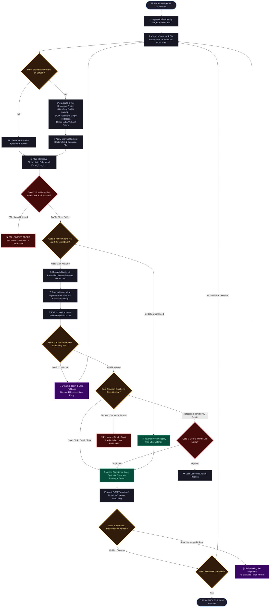

# Slide 2: Algorithmic Execution DAG & Multi-Gate Decision Flow

> **Problem Statement:** SIH26171 — *On-device Visual Perception for Light-weight Browser Agents*  
> **Organisation:** Indian Space Research Organisation (ISRO)  
> **Use Case:** PPT Algorithmic Flowchart / Judge Defense for Decision Gates

### Key Talking Points for Judges:
- **Fail-Closed Gate 1:** If post-redaction pixel audit detects any high-entropy text or face features surviving inside bounding boxes, the entire HTTP dispatch is aborted instantly.
- **Differential Delta Cache (Gate 2):** If user/page state hasn't changed, cached action steps are replayed with 0ms VLM latency.
- **Human-in-the-Loop Consensus (Gate 5):** Reversible actions (clicks, navigation) run automatically; protected high-consequence actions (form submit, payments, deletions) mandate explicit modal confirmation.
- **Closed-Loop Verification (Gate 6):** Semantic `MutationObserver` checks ensure that synthetic events produced the intended page state changes before advancing the loop.

