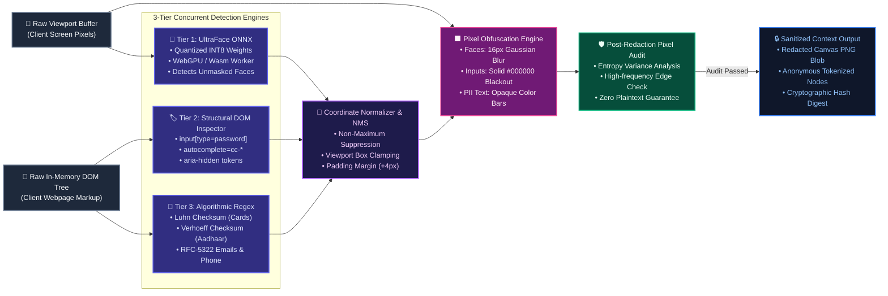

# Slide 3: On-Device Redaction & Privacy Guard Deep Dive

> **Problem Statement:** SIH26171 — *On-device Visual Perception for Light-weight Browser Agents*  
> **Organisation:** Indian Space Research Organisation (ISRO)  
> **Evaluation Importance:** Directly targets **Metric 2 (PII Recall & Precision - 20%)** and **Metric 3 (Redaction Precision - 20%)** = **40% of Total Score!**

### Key Talking Points for Judges:
- **3-Tier Concurrent Scanning:** Blends neural vision models (UltraFace ONNX for biometrics), structural DOM tree inspectors (passwords, tokens, hidden fields), and heuristic validators (Luhn for credit cards, Verhoeff for Aadhaar).
- **Sub-50ms Latency:** The quantized INT8 ONNX model runs in an isolated Offscreen Document using WebGPU/Wasm, taking only ~25ms on consumer hardware.
- **Tight Box Clamping:** Uses Non-Maximum Suppression (NMS) and exact bounding box clamping with a subtle +4px padding to guarantee zero under-masking while preventing over-masking of clickable buttons.
- **Post-Redaction Pixel Audit:** Analyzes the final canvas buffer for residual high-frequency text edges before generating the cryptographic hash digest.

