# Slide 4: Compact 1-Page PPT Master Layout (2-in-1 Architecture + Safety)

> **Problem Statement:** SIH26171 — *On-device Visual Perception for Light-weight Browser Agents*  
> **Organisation:** Indian Space Research Organisation (ISRO)  
> **Slide Strategy:** Designed specifically to fit in **one single slide** of a 16:9 presentation without overcrowding, leaving room for key bullet points.

### Slide Layout Recommendation:
- **Left 60% of Slide:** The clean horizontal Mermaid diagram below.
- **Right 40% of Slide:** 4 bullet points highlighting ISRO compliance:
  1. **Strict Client-Side Privacy:** Fail-closed boundary ensures unredacted pixels never reach the network.
  2. **Open-Weights VLM Reasoning:** Uses Qwen2.5-VL 72B/7B via local Ollama or cloud-hosted open API.
  3. **Human Safety Barrier:** High-risk actions (payment, submission) require human confirmation.
  4. **Closed-Loop Verification:** MutationObserver guarantees state transition validity.

```mermaid
flowchart LR
    classDef userBox fill:#1e293b,stroke:#94a3b8,stroke-width:2px,color:#f8fafc;
    classDef clientBox fill:#0f172a,stroke:#3b82f6,stroke-width:2px,color:#93c5fd;
    classDef privacyBox fill:#451a03,stroke:#f59e0b,stroke-width:2px,color:#fef08a;
    classDef serverBox fill:#2e1065,stroke:#a855f7,stroke-width:2px,color:#f3e8ff;
    classDef safeBox fill:#064e3b,stroke:#10b981,stroke-width:2px,color:#a7f3d0;

    User(["👤 User Goal"]):::userBox --> Extension["🧩 In-Browser Extension (MV3)<br/>Viewport & DOM Capture"]:::clientBox

    subgraph Privacy_Barrier ["🔒 FAIL-CLOSED PRIVACY BOUNDARY (On-Device)"]
        direction TB
        Extension --> Redact["🛡️ On-Device Redaction Pipeline<br/>• UltraFace ONNX (Faces)<br/>• DOM Inspector (Passwords)<br/>• Luhn/Verhoeff (CC/Aadhaar)"]:::privacyBox
        Redact --> Mask["⬛ Canvas Pixel Obfuscator<br/>(Solid Blackout + Blur Masks)"]:::privacyBox
        Mask --> Verify{"🛡️ Pixel Leak Audit<br/>Fail-Closed Gate"}:::privacyBox
    end

    Verify -->|Clean Sanitized Context| Gateway["🌐 Server Reasoning Gateway<br/>Open-Weights VLM (Qwen2.5-VL)<br/>Emits: Closed-Schema JSON Action"]:::serverBox
    Verify -.->|Leak Detected| Abort(["🚫 Abort Request"]):::userBox

    Gateway --> RiskCheck{"⚖️ Risk Matrix"}:::safeBox
    RiskCheck -->|Safe| Execute["⚡ Content Script Dispatcher<br/>Native Prototype Event Injection"]:::safeBox
    RiskCheck -->|Protected| Confirm["🙋 Human Confirmation Modal<br/>(Submit / Pay / Delete)"]:::privacyBox
    Confirm -->|Approved| Execute

    Execute --> ClosedLoop["🔄 Semantic State Verifier<br/>MutationObserver Watchdog"]:::clientBox
    ClosedLoop -.->|Next Step Loop| Extension
```

