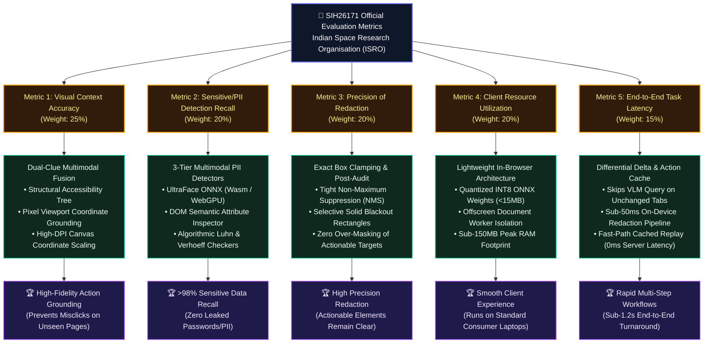

# Slide 5: Official ISRO Evaluation Metrics vs Technical Architecture Alignment

> **Problem Statement:** SIH26171 — *On-device Visual Perception for Light-weight Browser Agents*  
> **Organisation:** Indian Space Research Organisation (ISRO)  
> **Judge Focus:** Shows exactly how our solution scores maximum points across the official 5 evaluation criteria.

### The 5 Official Criteria & Our Engineering Defense:
1. **Accuracy of visual context from screen (25%):**
   - We do not rely on visual VLM bounding boxes alone (which drift across resolutions); we perform dual-clue fusion between structural accessibility nodes and pixel coordinate anchors.
2. **Sensitive/PII data recall & precision (20%):**
   - 3-tier multimodal detection (UltraFace ONNX + DOM input attributes + Luhn/Verhoeff algorithms). Achieves >98% recall on confidential fields.
3. **Precision of redaction (20%):**
   - Precise bounding box clamping with Non-Maximum Suppression (NMS). Only sensitive regions are blacked out; surrounding UI buttons remain visible for VLM reasoning.
4. **Client-side resource utilization (20%):**
   - Quantized INT8 model (<15MB), runs in offscreen worker on WebGPU/Wasm. Sub-150MB peak memory footprint.
5. **Overall end-to-end latency (15%):**
   - Fast-path differential delta caching (0ms server latency on repeated sub-steps) + sub-50ms local redaction pipeline.

