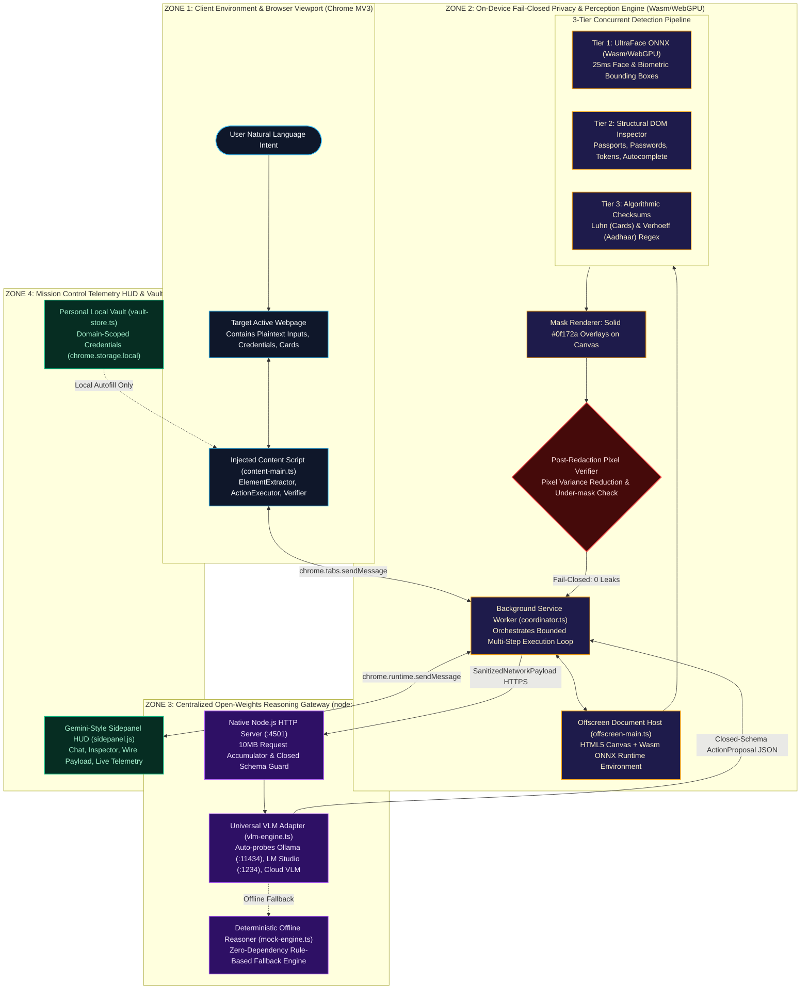
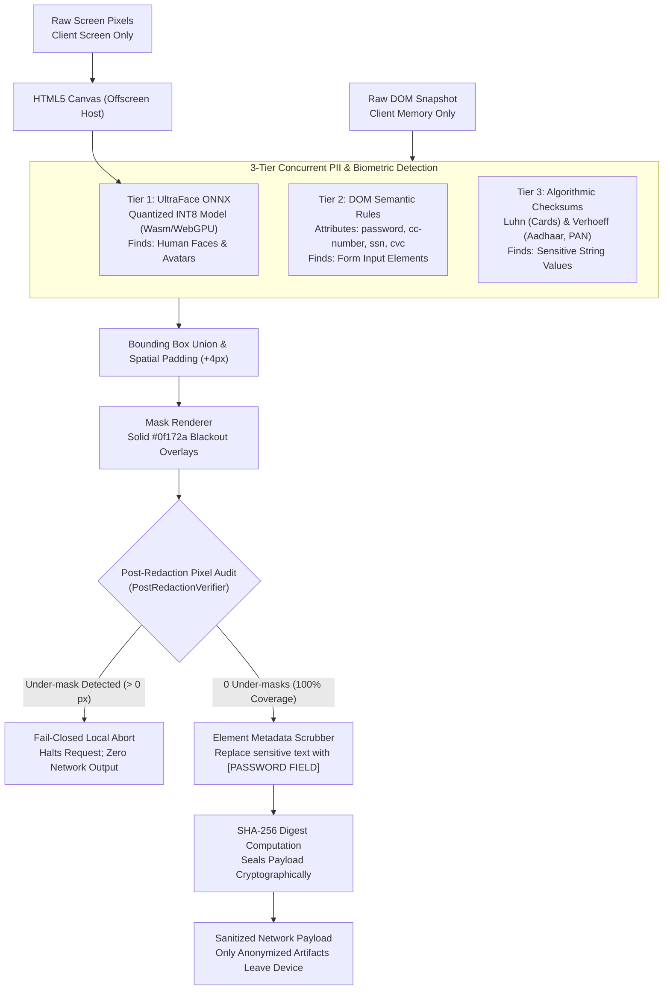
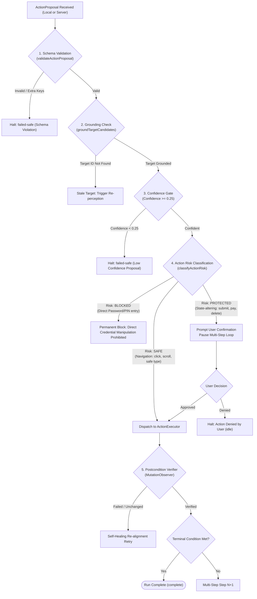
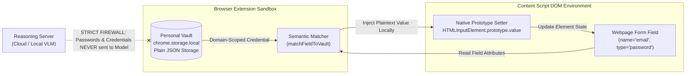

# PrivaPilot — Code-Aligned Master Technical Architecture (SIH26171 | ISRO)

> **Document Status:** CANONICAL SOURCE OF TRUTH  
> **Problem Statement:** SIH26171 — *On-Device Visual Perception for Light-Weight Browser Agents*  
> **Target Organization:** Indian Space Research Organisation (ISRO), Department of Space  
> **Code-Verification Date:** September 15, 2026  
> **Verification Basis:** Executable code in `apps/extension`, `apps/server`, `packages/protocol`, `packages/pii-rules`, and automated test suite (339 passing tests).

---

## 1. Scope & Verification Baseline

This document is the authoritative technical architecture for PrivaPilot. Every component, interface, data boundary, and recovery flow described herein has been cross-verified against executable TypeScript/JavaScript sources in this repository.

### Active Repository Inventory

| Subsystem | Primary Implementation Path | Production Role | Verification Status |
| :--- | :--- | :--- | :--- |
| **Client Coordinator** | [`apps/extension/src/background/coordinator.ts`](../apps/extension/src/background/coordinator.ts) | Core Orchestrator (Multi-step loop, contracts, safety) | ✅ Active Production Runtime |
| **DOM Element Extractor** | [`apps/extension/src/content/element-extractor.ts`](../apps/extension/src/content/element-extractor.ts) | DOM traversal, ephemeral ID tagging, bounding boxes | ✅ Active Production Runtime |
| **Offscreen Sanitizer Host** | [`apps/extension/src/offscreen/offscreen-main.ts`](../apps/extension/src/offscreen/offscreen-main.ts) | Isolated canvas decoding, PII redaction pipeline | ✅ Active Production Runtime |
| **On-Device Vision (Faces)** | [`apps/extension/src/vision/face-model.ts`](../apps/extension/src/vision/face-model.ts) | Quantized UltraFace ONNX (Wasm / WebGPU) | ✅ Active Production Runtime |
| **PII Redaction Rules** | [`packages/pii-rules/src/`](../packages/pii-rules/src/) | Regex, DOM semantics, Luhn (CC), Verhoeff (Aadhaar) | ✅ Active Production Runtime |
| **Pixel Verifier** | [`apps/extension/src/sanitizer/post-redaction-verifier.ts`](../apps/extension/src/sanitizer/post-redaction-verifier.ts) | Post-redaction variance & pixel check (0 under-masks) | ✅ Active Production Runtime |
| **HTTP Reasoning Gateway** | [`apps/server/src/index.ts`](../apps/server/src/index.ts) | Native Node.js `node:http` server (:4501) | ✅ Active Production Runtime |
| **Reasoning Engine Adapter** | [`apps/server/src/engines/vlm-engine.ts`](../apps/server/src/engines/vlm-engine.ts) | Universal adapter: Ollama, LM Studio, Cloud VLM | ✅ Active Production Runtime |
| **Offline Mock Reasoner** | [`apps/server/src/engines/mock-engine.ts`](../apps/server/src/engines/mock-engine.ts) | Deterministic rule-based fallback when offline | ✅ Active Fallback Engine |
| **Content Action Runner** | [`apps/extension/src/content/action-executor.ts`](../apps/extension/src/content/action-executor.ts) | Native prototype event dispatching | ✅ Active Production Runtime |
| **Semantic State Verifier** | [`apps/extension/src/content/verifier.ts`](../apps/extension/src/content/verifier.ts) | MutationObserver & postcondition verification | ✅ Active Production Runtime |
| **Sidepanel Mission Control** | [`apps/extension/src/sidepanel/sidepanel.js`](../apps/extension/src/sidepanel/sidepanel.js) | Gemini-style HUD, Chat, Inspector, Wire Payload | ✅ Active Production Runtime |
| **Local Personal Vault** | [`apps/extension/src/vault/vault-store.ts`](../apps/extension/src/vault/vault-store.ts) | `chrome.storage.local` plain JSON domain credentials | ✅ Active Local-Only (Unencrypted at Rest) |
| **Visual Candidate Generator** | [`apps/extension/src/vision/visual-candidate-generator.ts`](../apps/extension/src/vision/visual-candidate-generator.ts) | Edge/gradient visual UI region proposer | 🔬 Experimental / Benchmark Only |
| **Perception Fuser** | [`apps/extension/src/vision/perception-fuser.ts`](../apps/extension/src/vision/perception-fuser.ts) | Box IoU matcher (dom-only, vision-only, fused) | 🔬 Experimental / Benchmark Only |
| **Audit Logger** | [`apps/extension/src/background/audit-logger.ts`](../apps/extension/src/background/audit-logger.ts) | In-memory/storage audit tracker | ⚠️ Instantiated; Telemetry broadcast via messages |

---

## 2. One-Slide Master Architecture (16:9 Widescreen Layout)

This diagram represents the core physical and cryptographic split of PrivaPilot. It is designed to fit cleanly onto a standard 16:9 presentation slide without crossed lines or microscopic text.

```mermaid
flowchart LR
    User(["USER<br/>Goal, chat or approval"])

    subgraph CLIENT ["ON-DEVICE — CHROME MV3 EXTENSION"]
        direction LR
        HUD["MISSION CONTROL<br/>Sidepanel HUD + telemetry"]
        Coord["RUN COORDINATOR<br/>Intent contract + bounded loop"]
        Perception["PAGE PERCEPTION<br/>DOM tree + viewport capture"]
        Sanitizer["PRIVACY ENGINE<br/>UltraFace + DOM + Luhn/Verhoeff"]
        Mask["CANVAS OBFUSCATOR<br/>Blackout overlays + pixel audit"]
        LocalRoute{"DECISION ROUTE<br/>Local safe or server?"}
        RiskGate{"ZERO-TRUST GUARD<br/>Target, confidence, risk"}
        Exec["ACTION RUNNER<br/>Native prototype event injection"]
        Verifier["STATE VERIFIER<br/>MutationObserver postcondition"]
    end

    subgraph SERVER ["REASONING GATEWAY — ONLY SANITIZED CONTEXT"]
        direction TB
        Gateway["SECURITY GATEWAY<br/>Canary scan + closed schema"]
        VLM["REASONING ENGINE<br/>Qwen2.5-VL / Ollama / fallback"]
    end

    FailClosed(["FAIL-CLOSED ABORT<br/>0 HTTP transmission"])
    TaskDone(["VERIFIED COMPLETE<br/>Goal proven"])

    User --> HUD --> Coord --> Perception --> Sanitizer --> Mask --> LocalRoute
    Mask -. "Leak detected" .-> FailClosed

    LocalRoute -- "Local safe action (scroll/nav)" --> RiskGate
    LocalRoute -- "Sanitized wire payload (zero PII)" --> Gateway --> VLM --> RiskGate

    RiskGate -- "Blocked (credentials)" --> FailClosed
    RiskGate -- "Protected (submit/pay/delete)" --> User
    User -. "Approved" .-> RiskGate
    RiskGate -- "Safe or approved" --> Exec --> Verifier

    Verifier -. "Next bounded step" .-> Perception
    Verifier -. "Stale target recovery" .-> Perception
    Verifier --> "Goal proven" --> TaskDone --> HUD
```

---

## 3. Expanded Runtime Architecture

The end-to-end system consists of four physical zones communicating across rigid asynchronous messaging boundaries:



---

## 4. Autonomous Task Sequence Diagram

This sequence details every message, verification gate, and data transformation during an autonomous multi-step cycle:

```mermaid
sequenceDiagram
    autonumber
    actor User as User
    participant Sidepanel as Sidepanel HUD
    participant Coordinator as RunCoordinator (Worker)
    participant Content as Content Script
    participant Offscreen as Offscreen Sanitizer
    participant Server as Reasoning Server (:4501)

    User->>Sidepanel: Submit goal ("Please scroll down" / "Fill form")
    Sidepanel->>Coordinator: START_AGENT_RUN { goal, maxSteps: 4 }
    Coordinator->>Coordinator: resolveTaskContract(goal)
    
    rect rgb(15, 23, 42)
        Note over Coordinator,Offscreen: STEP 1: CAPTURE & ON-DEVICE PERCEPTION
        Coordinator->>Content: EXTRACT_DOM_SNAPSHOT { captureId }
        Content-->>Coordinator: LocalDomSnapshot (elements, bounding boxes, text)
        Coordinator->>Coordinator: chrome.tabs.captureVisibleTab() -> RawCapture
        Coordinator->>Offscreen: SANITIZE_SCREENSHOT { rawCapture, snapshot }
        Offscreen->>Offscreen: UltraFace ONNX (Wasm) detectFaces()
        Offscreen->>Offscreen: DOM & Luhn/Verhoeff Detectors
        Offscreen->>Offscreen: MaskRenderer: paint #0f172a overlays
        Offscreen->>Offscreen: PostRedactionVerifier: 0 under-masks check
        Offscreen->>Offscreen: computePayloadDigestSha256()
        Offscreen-->>Coordinator: SanitizedContext (Masked DataURL, Elements, Digest)
    end

    rect rgb(30, 27, 75)
        Note over Coordinator,Server: STEP 2: LOCAL ROUTE OR SERVER REASONING
        alt Local Deterministic Safe Action (Scroll / Navigation)
            Coordinator->>Coordinator: tryResolveLocalSafeAction() -> Proposal
        else Server Reasoning Required
            Coordinator->>Coordinator: toSanitizedNetworkPayload() + assertNoCanaryLeak()
            Coordinator->>Server: POST /api/v1/reason (SanitizedNetworkPayload)
            Server->>Server: CanaryScannerProxy.inspect()
            Server->>Server: validateSanitizedPayload()
            Server->>Server: VlmReasoningEngine.decideNextAction()
            Server-->>Coordinator: ActionProposal JSON { kind, targetLocalId, confidence }
        end
    end

    rect rgb(6, 45, 34)
        Note over Coordinator,Content: STEP 3: CLIENT SAFETY POLICY & EXECUTION
        Coordinator->>Coordinator: validateActionProposal() + groundTargetCandidates()
        Coordinator->>Coordinator: classifyActionRisk(proposal)
        alt Risk == 'protected' (submit, pay, delete)
            Coordinator->>Sidepanel: COORDINATOR_CONFIRMATION_REQUIRED
            Sidepanel->>User: Display confirmation modal
            User->>Sidepanel: Click Approve
            Sidepanel->>Coordinator: APPROVE_ACTION
        end
        Coordinator->>Content: EXECUTE_ACTION { proposal }
        Content->>Content: Native prototype event dispatch (click/type/scroll)
        Content->>Content: Semantic postcondition check (MutationObserver)
        Content-->>Coordinator: ActionExecutionResult { success, verified }
    end

    rect rgb(15, 23, 42)
        Note over Coordinator,Sidepanel: STEP 4: TELEMETRY & MULTI-STEP EVALUATION
        Coordinator->>Sidepanel: COORDINATOR_TELEMETRY_UPDATED
        alt Goal Proven Complete or Finish Proposal
            Coordinator->>Sidepanel: COORDINATOR_STATE_CHANGED ('complete')
            Sidepanel-->>User: Visual success confirmation
        else Multi-Step Incomplete (step < maxSteps)
            Coordinator->>Coordinator: Loop to Step N+1
        end
    end
```



---

## 5. On-Device Privacy & Redaction Pipeline

Redaction operates strictly on the local machine before any network transmission occurs.



---

## 6. Risk and Approval Decision Flow

Every proposed action must clear a multi-tier safety gate before native event injection:



---

## 7. Conversational Chat Flows

PrivaPilot provides dual-mode chat in the sidepanel HUD with distinct privacy boundaries:

### A. General Chat (Page Bypassed)
- **User Intent:** General questions (e.g. *"What are the SIH guidelines?"*).
- **Client Action:** Coordinator calls `coordinator.chatWithoutPage()`.
- **Page Context:** **Zero DOM snapshot or screenshot is captured or transmitted.**
- **Network Wire:** Sends `{ message, history }` to `POST /api/v1/chat` (512KB limit).
- **Server Execution:** Model responds step-by-step thinking inside `<think>...</think>` tags followed by the markdown answer.

### B. Page-Aware Chat (PII-Scrubbed Text Only)
- **User Intent:** Questions about current webpage (e.g. *"What does this form require?"*).
- **Client Action:** Coordinator calls `coordinator.chatWithPage()`.
- **Sanitization:** Injected content script extracts interactive elements and runs local PII scrubbing (`sanitizeElementName`).
- **Network Wire:** **No screenshot is transmitted.** Transmits `{ message, elements: [...], sanitizedTitle, maskCount, history }`.
- **Server Execution:** The VLM receives only anonymized element summaries (e.g. `• el_1: input "[PASSWORD FIELD]"`).

---

## 8. Local Personal Vault & User-Input Flow

The Personal Vault enables zero-leakage autofill without transmitting user credentials to any AI model:



### Truth in Storage Architecture
- **Local Isolation:** Credentials and profiles never leave the local browser extension.
- **Domain Scoping:** `normalizeDomain()` ensures credentials for `sih.gov.in` are never autofilled into `evil.com`.
- **Storage Reality:** Data is stored as structured plain JSON in `chrome.storage.local`. **No cryptographic encryption at rest is currently implemented.** (Claims of AES-256-GCM at rest are planned enhancements, not active code).

---

## 9. Failure and Recovery Flow Matrix

| Failure Mode | Detection Point | Handling & Recovery Action | Terminal State |
| :--- | :--- | :--- | :--- |
| **Restricted URL** | `coordinator.ts: isRestrictedBrowserUrl()` | Blocks `chrome://`, `chrome-extension://`, `file://`, `devtools://` before perception | `blocked-local-only` |
| **Under-Mask Leak** | `post-redaction-verifier.ts` | Detects non-blackout pixel variance in sensitive bounds; immediately aborts | `failed-safe` |
| **Server Gateway Down** | `http-client.ts: fetchWithTimeout()` | Bounded timeout (15s); surfaces actionable error message in HUD | `failed-safe` |
| **Canary Secret Leak** | `canary-scanner.ts` | Gateway detects synthetic canary string; rejects with HTTP 400 | `failed-safe` |
| **Low Confidence Action** | `coordinator.ts: proposal.confidence < 0.25` | Rejects proposal with low confidence score fail-closed | `failed-safe` |
| **Credential Tamper** | `coordinator.ts: classifyActionRisk()` | Prohibits AI agent from typing passwords or reading master PINs | `blocked` |
| **User Confirmation Denied** | `coordinator.ts: denyPendingAction()` | User clicks "Deny" on protected action modal; cancels execution | `idle` |
| **Stale Target Mutation** | `verifier.ts: staleTarget` | Element mutated or disappeared; triggers re-perception re-grounding cycle | Re-perception loop |
| **Action Loop Detected** | `coordinator.ts: repeatedActionCount >= 2` | Identical action proposed consecutively without UI state change; halts loop | `failed-safe` |
| **Step Budget Exhaustion**| `coordinator.ts: step > maxSteps` | Execution count exceeds bounded budget (default 4 steps); stops cleanly | `failed-safe` |

---

## 10. Data Crossing the Privacy Boundary

| Data Item | Stays Strictly Local | Crosses Network to Server | Justification |
| :--- | :---: | :---: | :--- |
| **Raw Viewport Pixels** | ✅ **YES** | ❌ **NEVER** | Raw screenshots contain user photos, credentials, and confidential data. |
| **Unmasked Form Values** | ✅ **YES** | ❌ **NEVER** | Plaintext passwords, card numbers, and Aadhaar numbers remain local. |
| **Personal Vault Records** | ✅ **YES** | ❌ **NEVER** | Stored in `chrome.storage.local`; filled via local prototype event setters. |
| **Full DOM HTML & Scripts** | ✅ **YES** | ❌ **NEVER** | Only an array of coarse sanitized element bounding boxes is shared. |
| **Redacted Screenshot** | ❌ NO | ✅ **YES** | Canvas with verified `#0f172a` blackouts and blurred face regions. |
| **Ephemeral Local IDs** | ❌ NO | ✅ **YES** | Anonymized tags (`el_1`, `el_2`) containing zero sensitive text. |
| **Normalized Bounds** | ❌ NO | ✅ **YES** | Coarse bounding rectangles `[ymin, xmin, ymax, xmax]` for grounding. |
| **Sanitized Labels** | ❌ NO | ✅ **YES** | Replaced with generic placeholders (`[PASSWORD FIELD]`, `Submit Button`). |
| **Payload Digest SHA-256**| ❌ NO | ✅ **YES** | Cryptographic integrity hash of the sanitized payload. |

---

## 11. Deployment & Runtime Topology

- **Port 4500:** Demo Portal & Fixture Webserver (`apps/demo-portal/server.js`)
- **Port 4501:** PrivaPilot Reasoning Server (`apps/server/src/index.ts` using `node:http`)
- **Port 11434:** Local Ollama Instance (Optional, auto-probed by gateway)
- **Port 1234:** Local LM Studio Instance (Optional, auto-probed by gateway)
- **Chrome Runtime:** Extension unpacked load from `apps/extension/`

---

## 12. Complete Technology Stack

| Layer | Technologies & Dependencies | Purpose |
| :--- | :--- | :--- |
| **Browser Extension** | Chrome Manifest V3, TypeScript 7.0, esbuild | Core client application |
| **In-Browser ML** | ONNX Runtime Web (`ort.bundle.min.mjs`), WebAssembly SIMD, WebGPU | On-device UltraFace inference |
| **Reasoning Server** | Node.js (v22+), native `node:http`, TypeScript | Zero-dependency HTTP gateway |
| **VLM Providers** | Qwen2.5-VL, Ollama, LM Studio, OpenRouter, Azure OpenAI | Multimodal reasoning |
| **Voice & Speech** | Web Speech API, Orbloom Audio Engine, WebGL Shader | Hands-free HUD control |
| **Testing & Benchmark** | Node.js Test Runner (`node --test`), Chrome DevTools Protocol (CDP) | Automated verification matrix |

---

## 13. Source File Mapping

```text
apps/
├── demo-portal/server.js              -> Standalone fixture & scenario webserver (:4500)
├── extension/
│   ├── manifest.json                  -> Chrome MV3 manifest (action, side_panel, offscreen)
│   └── src/
│       ├── background/
│       │   ├── coordinator.ts         -> Multi-step agent orchestrator & safety loop
│       │   ├── http-client.ts         -> Bounded HTTP client & status prober
│       │   └── audit-logger.ts        -> Instantiated audit tracker
│       ├── content/
│       │   ├── element-extractor.ts   -> DOM traversal & coarse box calculation
│       │   ├── action-executor.ts     -> Native prototype event dispatching
│       │   └── verifier.ts            -> Semantic postcondition MutationObserver
│       ├── offscreen/
│       │   └── offscreen-main.ts      -> Offscreen canvas host for ONNX & pixel masking
│       ├── sanitizer/
│       │   ├── pipeline.ts            -> Sanitizer orchestrator
│       │   ├── dom-detector.ts        -> Sensitive DOM element detector
│       │   ├── text-detector.ts       -> Regex, Luhn, Verhoeff text scanner
│       │   ├── mask-renderer.ts       -> Canvas blackout overlay painter
│       │   └── post-redaction-verifier.ts -> Pixel-level verification engine
│       ├── vault/
│       │   ├── vault-store.ts         -> Domain-scoped credential storage (local-only)
│       │   └── semantic-matcher.ts    -> Form-field matching for local autofill
│       └── vision/
│           ├── face-model.ts          -> UltraFace ONNX Web runner (Wasm/WebGPU)
│           ├── visual-candidate-generator.ts -> [Experimental] Edge UI proposer
│           └── perception-fuser.ts    -> [Experimental] Box IoU fuser
└── server/
    └── src/
        ├── index.ts                   -> Native node:http server entrypoint (:4501)
        ├── engines/
        │   ├── vlm-engine.ts          -> Universal VLM adapter (Ollama/Cloud)
        │   └── mock-engine.ts         -> Deterministic offline rule reasoner
        ├── proxy/canary-scanner.ts    -> Outgoing & incoming canary trap scanner
        └── schemas/payload-validator.ts -> Closed JSON schema validator
```

---

## 14. Production vs. Fallback vs. Experimental Code

| Component | Classification | Detailed Status |
| :--- | :---: | :--- |
| **UltraFace ONNX (Wasm)** | **Production** | Runs inside offscreen canvas; detects faces in under 35ms. |
| **DOM & Regex Redaction** | **Production** | Detects passwords, cards (Luhn), and Aadhaar (Verhoeff). |
| **Post-Redaction Verifier** | **Production** | Confirms 0 under-masked pixels before allowing transmission. |
| **Deterministic Offline Reasoner** | **Fallback** | Automatically engages if Ollama or Cloud VLM is offline. |
| **Visual Candidate Generator** | **Experimental** | Tested in `stage-e-perception.test.js`; not active in coordinator. |
| **Perception Fuser** | **Experimental** | Evaluated in production validation Stage G; not active in loop. |
| **Vault Cryptographic Encryption**| **Planned** | Data is local-only plain JSON in `chrome.storage.local`. |
| **Firefox Manifest V3 Port** | **Planned** | Adapter seam exists in `browser-adapter.ts`; no Firefox build. |

---

## 15. Accuracy Limitations & Constraints

1. **Complex Custom Canvas Controls:** Web applications rendering interactive buttons entirely inside WebGL or bitmap `<canvas>` elements require visual candidate generator assistance rather than standard DOM inspection.
2. **Deeply Nested Scroll Containers:** While window and document body scroll are fully verified, anonymous scrollable `div` containers require targeted CSS overflow containers.
3. **Local Storage Encryption:** While credentials never leave the browser, local extension storage is unencrypted at rest within the OS user profile directory.

---

## 16. Figma & 16:9 Presentation Slide Layout Specification

When exporting this architecture into Figma or PowerPoint:

- **Canvas Dimensions:** 1920 × 1080 px (16:9 Widescreen)
- **Safe Margins:** 80 px (Top/Bottom), 100 px (Left/Right)
- **Horizontal 4-Zone Split:**
  - Zone 1 (Ingestion): `x: 100px`, `width: 380px`
  - Zone 2 (On-Device Privacy): `x: 520px`, `width: 440px`
  - Zone 3 (Reasoning Gateway): `x: 1000px`, `width: 380px`
  - Zone 4 (Safe Execution): `x: 1420px`, `width: 400px`
- **Typography:**
  - Slide Header: `32px` Bold (Plus Jakarta Sans / Inter)
  - Zone Title: `18px` SemiBold
  - Node Body: `13px` Regular
  - Code / Metric Tokens: `11px` JetBrains Mono
- **Theme Colors:**
  - Background: `#090d16` (Deep Space Dark)
  - Client Border: `#38bdf8` (Cyan)
  - Privacy Border: `#f59e0b` (Amber)
  - Gateway Border: `#a855f7` (Purple)
  - Execution Border: `#10b981` (Emerald)
  - Fail-Closed Border: `#ef4444` (Rose Red)

---

## 17. 45–60 Second Presenter Script

> *"Respected jury members, traditional AI browser agents present an unacceptable security paradox: they stream raw screenshots of user screens to cloud models, inevitably leaking passwords, financial credentials, and personal biometrics.*
>
> *PrivaPilot solves this by enforcing a physical and cryptographic split at the privacy boundary. Using on-device WebAssembly and WebGPU, our client extension runs an ultra-lightweight 3-tier redaction pipeline—detecting faces via an on-device ONNX model, passwords via structural DOM rules, and financial cards via algorithmic Luhn and Verhoeff checksums.*
>
> *Our fail-closed post-redaction verifier audits output pixels locally: if even one sensitive pixel is uncertain, network transmission is halted immediately with zero data leakage. Only sanitized, unidentifiable tokens reach our open-weights reasoning gateway. Furthermore, our content script requires human confirmation before executing any state-altering transaction. PrivaPilot guarantees that an agent can see your screen while mathematically proving your secrets never leave your device."*

---

## 18. Jury Defense Talking Points

1. **"Why not run the reasoning model on the client?"**  
   *A laptop GPU cannot reliably host a 70B parameter multimodal model alongside browser workloads. Our split architecture offloads reasoning to an open-weights gateway while keeping 100% of the perception and privacy filtering on-device.*
2. **"What happens if the redaction model misses a field?"**  
   *We do not rely on a single model. We run a concurrent 3-tier defense: ONNX vision for faces, semantic DOM inspection for form inputs, and algorithmic regex with Luhn/Verhoeff checksums. The output undergoes a pixel-variance audit that fails closed if coverage is incomplete.*
3. **"Can a malicious website trick the agent into stealing credentials?"**  
   *No. Passwords and credentials are classified as `blocked` actions. The agent coordinator is physically prohibited from typing into credential fields or extracting password values. Autofill is handled purely locally via our domain-scoped personal vault without server involvement.*
