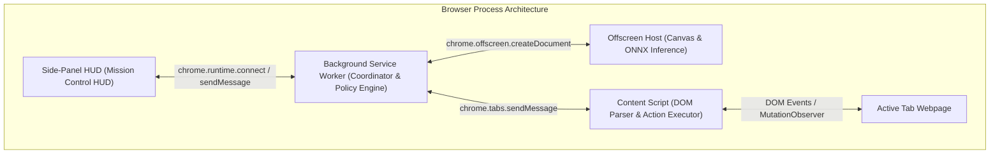

# 04. Browser Extension Architecture & Automation — SIH26171

> **Notice:** The canonical, fully verified technical architecture document for this project is **[`diagrams/06_CODE_ALIGNED_MASTER_ARCHITECTURE.md`](../diagrams/06_CODE_ALIGNED_MASTER_ARCHITECTURE.md)**. This document serves as a modular browser extension reference.

## 1. Extension Architecture (Manifest V3)

The client agent is built as a browser extension adhering to the **Chrome Manifest V3** standard (with Firefox port planned as future work):



---

## 2. Manifest V3 Configuration (`manifest.json`)

```json
{
  "manifest_version": 3,
  "name": "SIH26171 Privacy Browser Agent",
  "version": "1.0.0",
  "description": "On-device visual perception and privacy-preserving autonomous web agent.",
  "permissions": [
    "activeTab",
    "storage",
    "offscreen",
    "sidePanel"
  ],
  "host_permissions": [
    "<all_urls>"
  ],
  "background": {
    "service_worker": "dist/background/background-main.js"
  },
  "content_scripts": [
    {
      "matches": ["<all_urls>"],
      "js": ["dist/content/content-main.js"],
      "run_at": "document_idle"
    }
  ],
  "side_panel": {
    "default_path": "src/sidepanel/sidepanel.html"
  }
}
```

---

## 3. DOM Action Executor (Content Script Engine)

The content script executes proposed actions addressed by **ephemeral local IDs** using native prototype setters and standard bubbling events:

```typescript
export class ActionExecutor {
  public static async executeAction(
    proposal: ActionProposal,
    elementMap: Map<string, HTMLElement>
  ): Promise<ActionExecutionResult> {
    const target = proposal.targetLocalId ? elementMap.get(proposal.targetLocalId) : null;
    
    if (proposal.kind === 'click' && target) {
      target.scrollIntoView({ behavior: 'smooth', block: 'center' });
      target.focus();
      target.dispatchEvent(new MouseEvent('click', { bubbles: true, cancelable: true }));
      return { success: true, actionId: proposal.actionId };
    }

    if (proposal.kind === 'type' && target) {
      target.focus();
      const nativeSetter = Object.getOwnPropertyDescriptor(
        window.HTMLInputElement.prototype, 'value'
      )?.set;
      if (nativeSetter) {
        nativeSetter.call(target, proposal.textToType || '');
      } else {
        (target as HTMLInputElement).value = proposal.textToType || '';
      }
      target.dispatchEvent(new Event('input', { bubbles: true }));
      target.dispatchEvent(new Event('change', { bubbles: true }));
      return { success: true, actionId: proposal.actionId };
    }

    return { success: false, actionId: proposal.actionId, message: 'Invalid target or unsupported action' };
  }
}
```

---

## 4. Generalization Across Arbitrary Web Interfaces

To fulfill ISRO's requirement that the agent dynamically handles **unseen use cases during the finale**:
1. **Dynamic Ephemeral Local IDs:** Elements are assigned ephemeral IDs per perception cycle based on semantic roles and accessibility properties.
2. **Framework Compatibility:** Dispatches standard DOM events and uses native prototype value setters to trigger state updates across React, Vue, Angular, and vanilla DOM.
3. **Controlled Inputs & Shadow DOM:** Supports controlled framework inputs and traverses open Shadow DOM roots without site-specific logic.
4. **Experimental Coordinate Fallback:** Coordinate-based clicking is treated as an experimental fallback only when an ungrounded region requires interaction.

