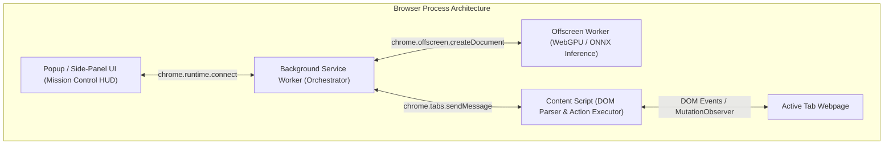

# 04. Browser Extension Architecture & Automation — SIH26171

## 1. Extension Architecture (Manifest V3)

The client agent is built as a cross-browser extension adhering to the **Chrome Manifest V3** and **Firefox WebExtensions** standard:



---

## 2. Manifest V3 Configuration (`manifest.json`)

```json
{
  "manifest_version": 3,
  "name": "SIH26171 Privacy Browser Agent",
  "version": "1.0.0",
  "description": "On-device visual perception and privacy-preserving autonomous web agent.",
  "permissions": [
    "activeTab",
    "storage",
    "offscreen",
    "sidePanel"
  ],
  "host_permissions": [
    "<all_urls>"
  ],
  "background": {
    "service_worker": "dist/background.js"
  },
  "content_scripts": [
    {
      "matches": ["<all_urls>"],
      "js": ["dist/contentScript.js"],
      "run_at": "document_idle"
    }
  ],
  "side_panel": {
    "default_path": "dist/sidepanel.html"
  }
}
```

---

## 3. DOM Action Executor (Content Script Engine)

The content script executes the server's structured action commands directly in the active browser tab:

```typescript
export class DOMActionExecutor {
  public static async execute(action: ActionCommand): Promise<boolean> {
    switch (action.action) {
      case 'click':
        return this.handleClick(action);
      case 'type':
        return this.handleType(action);
      case 'scroll':
        return this.handleScroll(action);
      case 'select':
        return this.handleSelect(action);
      default:
        return false;
    }
  }

  private static handleClick(action: ActionCommand): boolean {
    let target: HTMLElement | null = null;
    if (action.target_selector) {
      target = document.querySelector(action.target_selector);
    }
    
    if (target) {
      target.scrollIntoView({ behavior: 'smooth', block: 'center' });
      target.focus();
      target.dispatchEvent(new MouseEvent('click', { bubbles: true, cancelable: true }));
      return true;
    } else if (action.target_coordinates) {
      // Fallback coordinate click for canvas elements
      const el = document.elementFromPoint(action.target_coordinates.x, action.target_coordinates.y);
      if (el) {
        el.dispatchEvent(new MouseEvent('click', { bubbles: true, cancelable: true }));
        return true;
      }
    }
    return false;
  }

  private static handleType(action: ActionCommand): boolean {
    const input = document.querySelector(action.target_selector || 'input') as HTMLInputElement;
    if (input) {
      input.focus();
      input.value = action.input_text || '';
      input.dispatchEvent(new Event('input', { bubbles: true }));
      input.dispatchEvent(new Event('change', { bubbles: true }));
      return true;
    }
    return false;
  }

  private static handleScroll(action: ActionCommand): boolean {
    const dy = action.scroll_delta?.dy || 300;
    window.scrollBy({ top: dy, behavior: 'smooth' });
    return true;
  }

  private static handleSelect(action: ActionCommand): boolean {
    const select = document.querySelector(action.target_selector || 'select') as HTMLSelectElement;
    if (select && action.input_text) {
      select.value = action.input_text;
      select.dispatchEvent(new Event('change', { bubbles: true }));
      return true;
    }
    return false;
  }
}
```

---

## 4. Generalization Across Arbitrary Web Interfaces

To fulfill ISRO's requirement that the agent dynamically handles **unseen use cases during the finale**:
1. **Fallback Grounding:** If a CSS selector fails due to dynamic class obfuscation (e.g. styled-components / tailwind random hashes), the executor falls back to visual bounding box coordinates predicted by the VLM.
2. **Shadow DOM Traversal:** Recursive query helper traverses open Shadow DOM roots in modern Web Components.
3. **Iframe & Canvas Safety:** For non-standard canvas interfaces, the agent uses normalized $(x, y)$ coordinate interpolation to trigger drag and click events.
