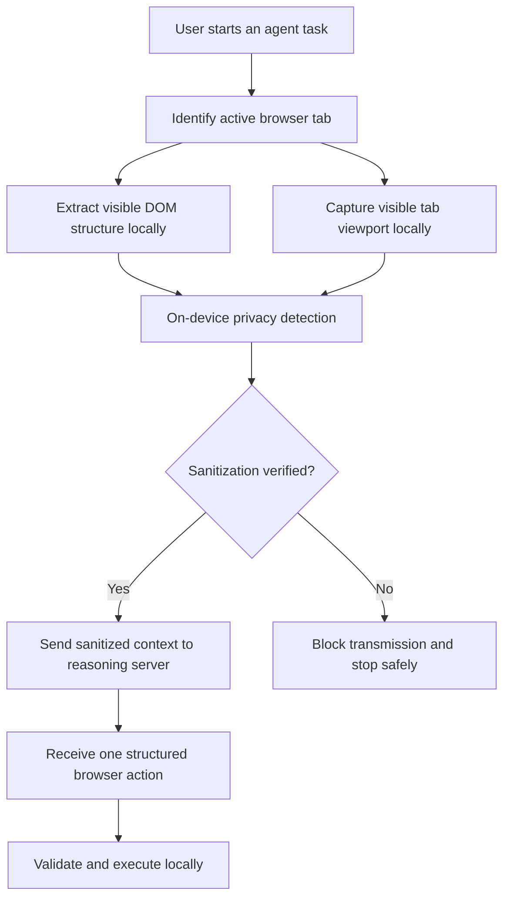

# 08. Agent Screen Visibility and Hidden-Mode Behavior

## 1. Purpose

This document explains how **PrivaPilot**, the SIH26171 privacy-preserving browser agent, obtains visual context and what happens when the extension interface, browser tab, or webpage content is hidden.

The key principle is:

> PrivaPilot does not continuously watch the user's device. It captures the currently visible area of the active browser tab only when an agent perception step requires it.

---

## 2. What the agent can see

PrivaPilot uses two local sources of browser context:

1. **A screenshot of the visible viewport** of the active browser tab, captured with the browser's `captureVisibleTab` API.
2. **A structured DOM snapshot** produced by the content script, containing visible controls, semantic labels, element bounds, and action capabilities.

These sources are combined locally to understand the page and identify sensitive information before anything is sent to the server.



The screenshot and raw DOM data exist only inside the browser-side privacy boundary. The server may receive only the verified, redacted screenshot and sanitized element descriptions.

---

## 3. What the agent cannot see

The current implementation is a **browser agent**, not a device-wide screen recorder. It cannot see:

- Other desktop applications.
- The operating-system desktop, taskbar, dock, or notifications outside the captured browser viewport.
- Other browser tabs that are not active.
- Content outside the current visible viewport until the page is scrolled and a new perception cycle runs.
- Browser-protected pages such as `chrome://`, extension pages, developer tools, and other restricted surfaces.
- Hidden webpage elements with zero visible size as normal actionable controls.
- Inaccessible content inside cross-origin frames, closed shadow roots, videos, canvases, embedded PDFs, or plugins as trusted DOM data. Such visible regions are treated as uninspectable and masked or blocked according to the fail-closed policy.

PrivaPilot therefore does not claim unrestricted access to the user's complete screen or browser session.

---

## 4. Meaning of “hidden mode”

The phrase **hidden mode** can refer to several different situations. Their behavior is not the same.

| Situation | Can the agent continue? | What can it perceive? |
| :--- | :---: | :--- |
| Mission Control side panel or popup is closed | **Yes, for an already started bounded run** | The active webpage remains available to the background coordinator and content script. A fresh visible-tab screenshot can be requested for each step. |
| Extension offscreen document is hidden | **Yes** | This document is intentionally invisible. It does not watch the user; it only processes a supplied capture locally using Canvas and ONNX, then closes after an idle period. |
| A webpage element uses `display: none`, `visibility: hidden`, `hidden`, `aria-hidden`, or has zero size | **No, not as a visible target** | It is absent from the screenshot or treated as hidden. The executor rejects hidden targets rather than clicking invisible controls. |
| User switches to another tab | **Not safely as the same visual task** | `captureVisibleTab` represents the tab currently visible when capture occurs. The agent must re-identify and re-perceive the active tab; it must not assume the old page is still visible. |
| Target tab is in the background | **No visual screenshot of that background tab through the current capture path** | The implementation captures the active visible tab, not an arbitrary background tab. |
| Browser window is minimized, occluded, suspended, or the device is locked | **Not guaranteed** | Browser rendering and extension scheduling may be throttled or unavailable. PrivaPilot must pause or fail safely instead of claiming reliable vision. |
| Incognito/private window | **Only if the user explicitly enables the extension there** | Browser policy controls access. Incognito access is not silently granted by the extension. |

### Important clarification

Closing the side panel hides only the **user interface**, not necessarily the already-running extension workflow. It does not grant extra permissions and it does not turn PrivaPilot into a background surveillance tool.

---

## 5. Is the agent continuously recording screenshots?

No. The intended execution model is **event-driven and bounded**:

1. The user provides a goal or asks a page-context question.
2. The coordinator begins a perception cycle.
3. It captures the active tab's current viewport and extracts the current DOM state.
4. Local detectors identify and redact sensitive content.
5. A verifier checks that the result is safe to transmit.
6. The server proposes one action.
7. The client validates and executes that action.
8. If another step is required, the client performs a fresh perception cycle.

A screenshot is therefore a point-in-time input to a specific step. It is not a permanent live video stream. Fresh captures are needed after clicks, navigation, scrolling, or page updates because the old screenshot and ephemeral element IDs may be stale.

---

## 6. What happens to the actual screenshot?

The processing path is:

| Artifact | Location | Network status |
| :--- | :--- | :--- |
| Raw visible-tab screenshot | Browser memory | **Never transmitted** |
| Raw DOM snapshot and live field context | Browser memory | **Never transmitted** |
| Detection boxes and privacy masks | Browser/offscreen sanitizer | Local processing only |
| Verified redacted screenshot | Browser, then server if verification passes | May be transmitted |
| Sanitized element metadata | Browser, then server | May be transmitted |
| Passwords, OTPs, tokens, card data, government IDs, and other prohibited values | Browser only | **Must never be transmitted** |

The local sanitizer uses DOM semantics, deterministic PII rules, face detection, risky-surface detection, and pixel masking. If sanitization cannot be verified, the system **fails closed**: it sends nothing and stops or asks the user to intervene.

---

## 7. How the server “sees” the page

The centralized reasoning model does not receive unrestricted browser access. It receives a deliberately limited representation:

- A redacted image of the visible viewport, when image transmission is safe and supported.
- Ephemeral local element IDs such as `el_4`.
- Sanitized roles and labels such as “button” or “Search”.
- Normalized bounds, visibility/enabled state, and allowed action capabilities.
- The user's task goal.

It returns one closed-schema proposal, for example:

```json
{
  "kind": "click",
  "targetLocalId": "el_4",
  "confidence": 0.96,
  "risk": "safe",
  "expectedState": "Search results become visible"
}
```

The server cannot directly click the page, inspect the raw DOM, request arbitrary selectors, or execute code. The browser validates the proposal and performs the action locally.

---

## 8. Safety behavior while the UI is hidden

If Mission Control is closed during an active task, the same safety rules still apply:

- The run remains bounded by its configured step limit.
- Every action uses fresh ephemeral element IDs.
- Hidden or stale targets are rejected.
- Restricted browser URLs are blocked.
- Protected actions such as submit, pay, or delete pause for explicit user confirmation.
- Credential entry and other blocked actions are not auto-executed.
- Sanitization failure prevents network transmission.
- Raw screenshots, raw DOM values, and secrets must not appear in logs.

A future product mode could require a persistent visible indicator whenever a run is active. That would improve user awareness, but it must not be confused with the current technical ability to continue a bounded run after the panel closes.

---

## 9. Example scenarios

### Scenario A: Side panel closed, webpage still active

The user starts “Find the lowest-priced option,” then closes the side panel. The active tab remains visible. The coordinator may continue the bounded task, capture the active viewport at the next step, sanitize it locally, and execute safe actions.

### Scenario B: User switches tabs during execution

The original task was running on Tab A, but the user switches to Tab B. A new visible-tab screenshot may represent Tab B. The agent must not combine Tab A's stale element map with Tab B's screenshot. The safe behavior is to detect the context change, re-perceive, pause, or stop.

### Scenario C: Sensitive field is visible

A page shows an Aadhaar number and password field. The local privacy pipeline masks those pixels and removes prohibited values from semantic context before any request. If complete coverage cannot be verified, no screenshot is sent.

### Scenario D: Element is hidden in the page

A button exists in the DOM but is styled with `display: none`. It is not a valid visible target. The extractor skips zero-size controls and the action executor rejects hidden elements.

---

## 10. Final concept statement

PrivaPilot's agent can **read the visible state of the active browser tab at explicit perception steps**, even when its side-panel interface is not open, because capture and coordination occur through browser extension components. It **cannot secretly view the whole device, arbitrary background tabs, or genuinely hidden webpage content**. Every captured screen state is processed locally first, sensitive information is redacted, and only verified sanitized context may cross the network.

This design provides useful browser automation without treating screen access as unlimited surveillance.