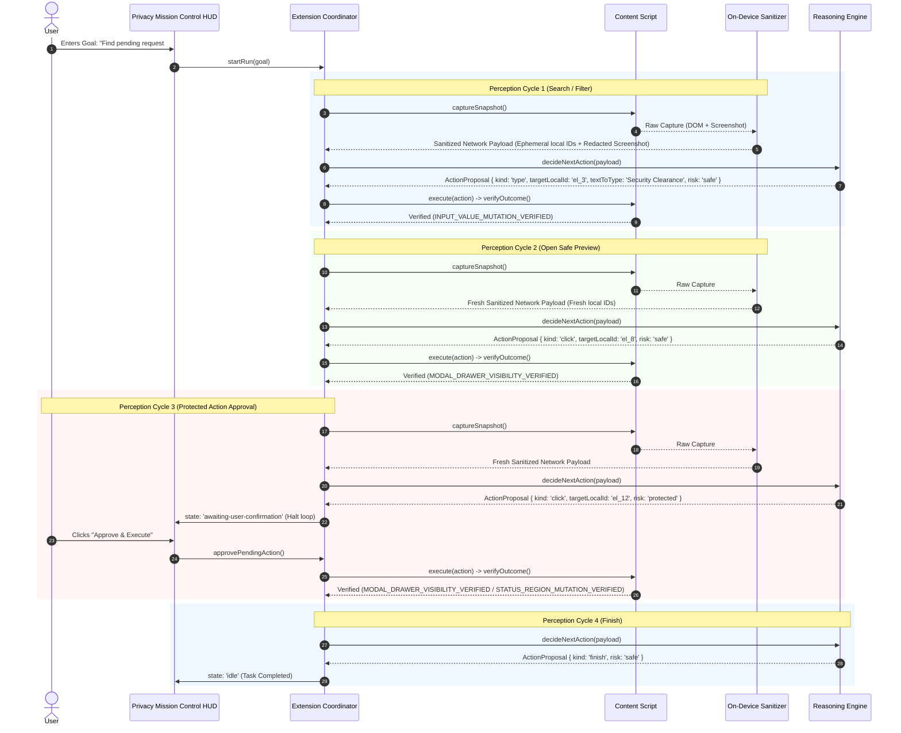

# PrivaPilot Demo Portal Workflow & Manual Rehearsal Guide

## Overview

The **PrivaPilot Demo Portal** demonstrates a generic, privacy-preserving 4-step browser automation workflow without any site-specific selectors, hardcoded URLs, or DOM IDs in the extension or reasoning backend.

All automation executes exclusively via generic semantic extraction (`role`, `sanitizedName`, `coarseBounds`) and ephemeral local IDs (`el_1`, `el_2`, ...). Sensitive credentials, personal data, human faces, and hardware canvases are automatically detected and masked on-device prior to network transmission.

---

## 1. Synthetic Privacy Evidence on the Demo Page

The demo portal page features real-world synthetic data to prove on-device privacy redaction:

| Evidence Type | Value on Demo Page | On-Device Treatment | Wire Payload Guarantee |
|---|---|---|---|
| **Password Input** | `passInput` (`SecretPasscode99!`) | Local opaque black mask; `[PASSWORD FIELD]` descriptor | Value never extracted; typing strictly blocked |
| **Email Address** | `kushagra.singh@valley.work` | Regex/NER detector + visual opaque black mask | Scrubbed from DOM text nodes & OCR layers |
| **Phone Number** | `+91 98765 43210` | E.164 phone pattern detector + visual opaque mask | Scrubbed from DOM text nodes & OCR layers |
| **Employee ID** | `VAL-89012` | Pattern detector + visual opaque mask | Secret canary token embedded & tested |
| **Confidential Canary** | `SECRET_CANARY_SIH26171_DO_NOT_TRANSMIT` | Scrubbed by post-redaction verifier | Verified by `assertNoCanaryLeak()` canary scanner |
| **Human Face / Avatar** | 44×44px Avatar / Face graphic | ONNX UltraFace / avatar heuristic + Gaussian blur | Visual face obscured before transmission |
| **Uninspectable Surface** | Hardware `<canvas id="telemetryCanvas">` | High-risk surface detector + opaque mask | Entire uninspectable surface covered |

---

## 2. Multi-Step Target Demonstration Workflow



---

## 3. Manual Rehearsal Steps

### Prerequisites
1. Open a terminal and start the local reasoning server & demo portal:
   ```bash
   # Terminal 1: Reasoning Server
   npm run dev:server

   # Terminal 2: Demo Portal Static Server (Port 4500)
   npm run dev:portal
   ```
2. Open Google Chrome or Chromium and navigate to `chrome://extensions/`.
3. Enable **Developer mode** and click **Load unpacked**.
4. Select the `apps/extension/` directory.

### Step 1: Open Portal & Launch Side Panel
1. In the browser, navigate to: `http://localhost:4500/`.
2. Click the PrivaPilot Extension icon to open the **Privacy Mission Control Side Panel**.
3. Notice the live Comparative Inspector:
   - **Local Only (Never Transmitted)**: Raw DOM and credentials visible locally.
   - **Outgoing Wire Payload**: Passwords, emails, phone numbers, employee ID, avatar faces, and canvas surfaces are blacked out / blurred.
   - **Mask Counter**: Displays exact count breakdown (`Password: 1, Email: 1, Phone: 1, National ID: 1, Face: 1, Surface: 1`).

### Step 2: Run Workflow
1. In the Side Panel prompt input, type:
   ```
   Find synthetic pending request for Security Clearance, open its preview, and submit the approval
   ```
2. Click **Run Agent Loop**.
3. **Observation 1 (Cycle 1 - Safe Filter)**:
   - Agent types `"Security Clearance"` into the search input.
   - Verifier checks `INPUT_VALUE_MUTATION_VERIFIED`.
   - Side panel displays state `executing` -> `verified`.
4. **Observation 2 (Cycle 2 - Safe Preview)**:
   - Agent clicks the `"Open Safe Preview"` button (`#openSafePreviewBtn`).
   - The preview drawer slides open.
   - Verifier checks `MODAL_DRAWER_VISIBILITY_VERIFIED` (`role="dialog"` landmark active).
5. **Observation 3 (Cycle 3 - Protected Action Pause)**:
   - Agent targets `"Submit Final Approval"` inside the modal.
   - Safety policy flags risk as **`protected`**.
   - Coordinator immediately pauses execution and transitions to `awaiting-user-confirmation`.
   - Side panel renders human confirmation card:
     > *"Targeting 'Submit Final Approval'. This is a state-altering protected action requiring user confirmation."*
6. **Observation 4 (Cycle 4 - Approval Execution)**:
   - Click **Approve & Execute** in the Side Panel.
   - Content script executes click on `#submitApprovalBtn`.
   - Table row badge updates to `Approved`.
   - Status region announces `✓ Final approval submitted and clearance granted for #REQ-1044`.
   - Verifier confirms postcondition satisfaction.
   - Agent transitions to `idle` (`Task complete`).

---

## 4. Alternative Paths Rehearsal

### Cancellation Path (User Denial)
1. Repeat the workflow until Step 5 (Protected Action Pause).
2. Click **Cancel / Deny** in the Side Panel.
3. **Result**:
   - Loop immediately transitions to `idle` (`"Action cancelled by user"`).
   - Zero click events dispatched to the submit button.
   - Request #REQ-1044 status remains `Pending`.

### Stale Target Mutation Recovery
1. In the demo portal, click the button **"Mutate Row (Stale Demo)"**.
2. This replaces the active table row with a newly cloned DOM element, rendering any existing element references detached.
3. When the agent attempts an action on a detached element:
   - `ActionExecutor` returns `{ success: false, staleTarget: true }`.
   - `Coordinator` intercepts the stale target failure without failing the run.
   - `Coordinator` triggers a bounded re-perception cycle (`staleRetries++ < 3`), captures a fresh semantic snapshot with fresh ephemeral local IDs, and resumes execution seamlessly.

---

## 5. Automated Verification

Run the end-to-end integration test suite verifying privacy redaction, multi-step execution, cancellation, and stale recovery:

```bash
npm run test
```

Expected result:
```
✓ Demo Portal Architecture: No site-specific IDs or URLs in extension codebase
✓ Demo Portal Privacy: Synthetic evidence detected, redacted, and canary-checked
✓ Demo Portal Multi-Step Workflow: Generic search, preview, protected approval, and outcome verification
✓ Demo Portal Cancellation Path: Denying protected action halts without modifying state
✓ Demo Portal Stale-Target Mutation: Re-perception and retry handles detached nodes
159/159 tests passing (0 failures)
```
