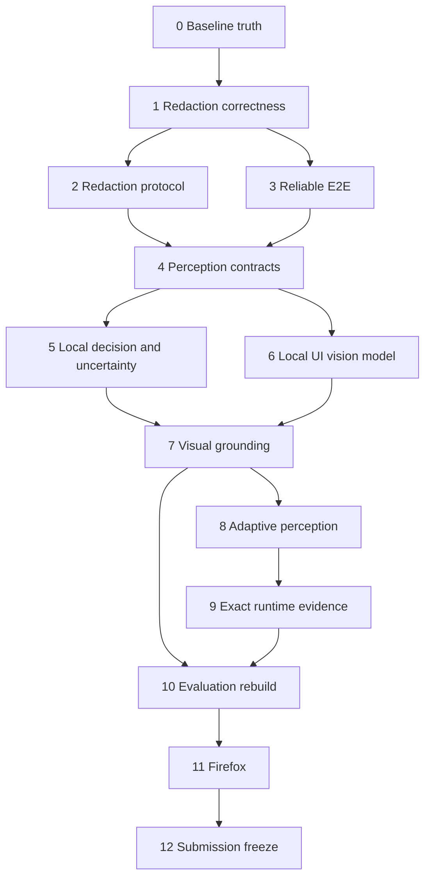

# Detailed Implementation Phases

Complete phases in order. A phase is complete only when its exit gate is demonstrated. Do not begin a later phase to hide a failed earlier gate.

## Dependency map



---

# Phase 0 — Truthful baseline and reproducibility

## Objective

Make source, generated bundles, public claims, and reports mechanically consistent before changing behavior.

## Current problems

- Root `lint` only echoes success.
- Benchmarks can consume stale `dist/` artifacts.
- Reports come from different commits/environments.
- README includes stale paths/statuses and claims stronger than current behavior.
- `payloadDigestSha256` is not SHA-256.
- Zero-denominator categories can appear as 100%.

## Required implementation

### Real lint/typecheck

Replace the fake lint script. Prefer a small repository-local solution:

- Add `scripts/typecheck.js` to run workspace TypeScript checks.
- Add `scripts/check-repo-integrity.mjs` for repository-specific truth checks.
- Make `npm run lint` execute real checks.

Integrity checks should detect:

- README links to nonexistent source files.
- Current reports whose recorded SHA differs from HEAD unless archived.
- Source newer than required production bundles.
- Production reports containing fabricated/simulated markers.
- Zero-denominator metrics represented as 100%.
- Public claims that conflict with machine-readable phase status where practical.

### Build freshness

Either build before `benchmark`, `benchmark:browser`, and `test:e2e`, or enforce source/artifact hashes. Build-first is preferred for correctness.

Never manually modify `dist/`.

### Immutable result directories

Create run directories under `docs/benchmark-results/runs/<timestamp>-<sha>/`. Include `manifest.json` containing:

- Commit and dirty state
- Exact command
- OS, architecture, Node
- Exact Chrome/Firefox version and flags
- CPU, RAM, GPU/WebGPU adapter when obtainable
- Viewport and DPR
- Model filename, size, SHA-256, runtime version
- Actual execution provider
- Trial count and timestamps
- Network/model dependencies

Top-level reports may point to the latest run but must not erase provenance.

### Real safe digest

Create `apps/extension/src/security/digest.ts`. Use Web Crypto SHA-256 over canonical safe metadata and/or sanitized content. Never hash raw predictable PII. Add deterministic canonical serialization.

### Claim cleanup

Synchronize `README.md`, `docs/PHASES.md`, `docs/AUDIT_LOCAL_VS_DEFERRED.md`, pitch documentation, and side-panel language with current truth:

- Local vision is face redaction, not UI action grounding yet.
- Firefox is incomplete.
- Production pixel verification is incomplete until Phase 1.
- The committed E2E run failed.
- The server lacks the complete redaction manifest.
- WebGPU is attempted, not proven unless telemetry records it.
- Test counts must come from the latest run.

## Tests

Add or update:

- `tests/repo-integrity.test.js`
- `tests/build-artifacts.test.js`
- `tests/payload-digest.test.js`
- `tests/benchmark-honest.test.js`

Test known SHA-256 vectors, deterministic serialization, source/build freshness, invalid report provenance, and zero-denominator semantics.

## Exit gate

`npm install`, `npm run build`, `npm run lint`, and `npm test` pass. Public status matches observed results.

---

# Phase 1 — Production pixel redaction correctness

## Objective

Prove every detected sensitive region is actually altered in the final transmitted image.

## Current root defect

`apps/extension/src/sanitizer/post-redaction-verifier.ts` compares region and rendered-mask counts. A wrong-position/no-op mask can pass. Browser-only pixel logic exists in `apps/extension/src/harness/harness-entry.ts` but is not a production gate. Existing browser evidence reports two under-masked faces and one uncovered image region.

## Files to inspect

- `apps/extension/src/sanitizer/pipeline.ts`
- `mask-renderer.ts`
- `post-redaction-verifier.ts`
- `coordinate-transformer.ts`
- `face-detector.ts`
- `apps/extension/src/vision/face-model.ts`
- `apps/extension/src/harness/harness-entry.ts`
- `apps/extension/src/offscreen/offscreen-main.ts`
- `packages/protocol/src/coordinates.ts`
- Browser benchmark scripts and redaction tests

## Required implementation

### Shared production verifier

Create `apps/extension/src/sanitizer/pixel-redaction-verifier.ts`. Both production and the harness must call it. Remove duplicate benchmark-only definitions after migration.

For each region record:

- Region ID/category/method
- Requested and actual box
- Sample count
- Overlay fraction or change evidence
- Pass/fail reason

### Render records

Change `MaskRenderer.renderMasks()` from count-only output to per-region records:

```ts
interface RenderedRegionRecord {
  regionId: string;
  method: RedactionMethod;
  requestedBox: ScreenshotPixelBox;
  renderedBox: ScreenshotPixelBox;
  success: boolean;
}
```

Match verification by region ID, not count.

### Geometry validation

Reject before rendering:

- NaN/infinity
- Non-positive width/height
- Fully off-canvas boxes
- Invalid coordinate-space tags
- Suspicious one-pixel success produced by invalid values

Clipping a valid edge box is allowed and must be recorded. Invalid geometry must not be converted into apparent success.

### Opaque and face verification

Opaque masks require actual overlay coverage in expected pixels.

For faces, compare raw and sanitized pixels spatially, not only aggregate variance. Require changed-pixel/tile coverage. If blur cannot be proven, apply and verify an opaque fallback or block. Privacy is more important than preserving face context.

### Fix coordinate root cause

Verify UltraFace preprocessing/output mapping across:

- Input resize and aspect ratio
- Model normalized coordinates
- Screenshot pixels
- Viewport CSS pixels
- DPR
- Scroll offsets
- Non-4:3 viewports
- Edge clipping

Do not tune ground truth to incorrect output.

### Fail-closed behavior

Populate `requiresFailClosedBlock` truthfully. Block before network on invalid geometry, failed rendering, failed pixel verification, undecodable output, unprotected uninspectable surfaces, or required vision failure.

## Tests

Add:

- `tests/pixel-redaction-verifier.test.js`
- `tests/redaction-coordinate-transform.test.js`
- `tests/sanitizer-fail-closed.test.js`

Cases: correct mask, displaced mask, unchanged pixels with matching count, NaN/infinity/zero/off-canvas boxes, DPR 1/2, non-4:3, edge clipping, effective/ineffective face pixelation, opaque fallback, adjacent safe control, and no network-safe context after failure.

Use legally redistributable real/synthetic face images instead of SVG circles for face accuracy evidence.

## Exit gate

- All assessable sensitive regions in the browser benchmark are covered.
- A deliberately displaced mask fails in production verification.
- Safe-control preservation remains measured.
- No HTTP request can occur after verification failure.

---

# Phase 2 — Redaction-aware protocol and server

## Objective

Tell the server exactly what was redacted without revealing values.

## Protocol

Add a versioned `RedactionManifest` to `SanitizedContext` and `SanitizedNetworkPayload`. Include aggregated category/method counts, placeholder convention, geometry semantics, pixel-verification status, uninspectable-surface policy, and actual vision status/provider/duration. Do not transmit raw detector text or PII.

Suggested types:

```ts
interface RedactionManifestEntry {
  category: SensitiveCategory;
  method: RedactionMethod;
  count: number;
}

interface RedactionManifest {
  totalRegions: number;
  entries: ReadonlyArray<RedactionManifestEntry>;
  placeholderConvention: '[REDACTED: CATEGORY]';
  geometrySpace: 'normalized_viewport';
  pixelVerification: {
    performed: boolean;
    passed: boolean;
    minimumCoverage: number;
  };
  uninspectableSurfacePolicy: 'masked' | 'blocked' | 'none_detected';
  visionStatus: {
    attempted: boolean;
    succeeded: boolean;
    modelFamily?: string;
    executionProvider?: string;
    durationMs?: number;
  };
}
```

Use protocol `1.1` if necessary and migrate all consumers atomically.

## Network projection

Create `packages/protocol/src/network-projection.ts` with one `toSanitizedNetworkPayload()` implementation. HTTP and side-panel exact-payload display must use the same projection.

## Server validation and prompt

Update `apps/server/src/schemas/payload-validator.ts` to validate closed manifest schema, counts, limits, and contradictions. Require passed pixel verification when a screenshot is sent.

Generate the redaction section of the VLM prompt from the manifest. Tell the model redacted values are unavailable and must not be reconstructed. Preserve local-ID-only actions.

## Tests

Test valid/invalid manifests, count mismatch, unknown fields, canary rejection in new fields, absence of raw values, prompt derivation, and exact side-panel/network shape identity.

## Exit gate

An intercepted real request shows only a sanitized screenshot, safe elements, page state, and redaction manifest. The generated server prompt references actual redacted categories without values.

---

# Phase 3 — Reliable E2E verification and bounded recovery

## Objective

Produce repeatable successful multi-step runs without weakening postcondition checks.

## Verification policy

Create `apps/extension/src/content/verification-policy.ts` with bounded, action-aware delay, timeout, polling, settling, and recovery values. Replace the blanket ~150 ms behavior. Navigation may use a longer bounded budget; nothing waits indefinitely.

## Structured postconditions

Add a closed `ExpectedPostcondition` union to the protocol, such as dialog opened, URL changed, allowed target attribute changed, target value present, option selected, status region changed, element count changed, or scroll position changed. Keep textual `expectedState` only for explanation. Never accept arbitrary selectors.

## Recovery classification

Classify stale target, no change, navigation timeout, ambiguity, execution rejection, and confirmation expiry. Safe reversible failures may trigger fresh capture, equivalent-target re-grounding, and limited retry. Protected actions never auto-replay; changing/expired targets require new confirmation.

## Passive actions

- Verify scroll through before/after position and settling.
- `wait` has a bounded duration followed by re-perception.
- `observe` is recorded as non-mutating, not a verified mutation.
- `finish` requires a terminal reason and, where possible, a terminal state.

## E2E scenarios

Refactor `scripts/run-e2e-extension.mjs` into multiple scenarios: safe click, safe type, select, modal, navigation, delayed update, stale target, protected confirmation, expected safe failure, and repeat-loop protection. Preserve each result rather than one overwritten sample.

## Exit gate

Three consecutive successful 3+ step runs, one successful stale-layout recovery, one expected fail-safe, and zero automatic protected-action replays.

---

# Phase 4 — Perception contracts and truthful telemetry

## Objective

Separate DOM and visual perception so vision can become a real decision source.

## New modules

- `packages/protocol/src/perception.ts`
- `apps/extension/src/perception/perception-source.ts`
- `dom-perception-source.ts`
- `vision-perception-source.ts`
- `candidate-fusion.ts`

Define capture-bound `PerceptionCandidate` and `PerceptionResult` types carrying role, sanitized name, normalized bounds, confidence, visibility confidence, capabilities, optional DOM/visual IDs, provenance, policy, provider, model, duration, and warnings.

## Fusion rules

Fuse only same-capture candidates with compatible role/name and sufficient spatial overlap. Preserve disagreements and lower confidence instead of dropping them. Never fuse globally across fixtures/pages.

## Telemetry

Extend run telemetry with policy, candidate counts, vision duration/provider/model, fallback count, network count, decision origin, abstention reason, recovery attempts, verification duration, and bytes sent. Fields may be optional during migration.

## Migration

Route the current DOM-only flow through the abstraction before adding a UI model. Existing behavior must remain functional.

## Tests and exit gate

Test same/cross-capture fusion, compatible/conflicting candidates, deterministic ordering, warnings, and actual provider reporting. Exit when current DOM behavior operates entirely through the new interfaces.

---

# Phase 5 — Local decision router and uncertainty gate

## Objective

Resolve simple safe actions locally and prevent low-confidence or ambiguous automatic actions.

## Modules

- `apps/extension/src/decision/decision-router.ts`
- `goal-tokenizer.ts`
- `confidence-policy.ts`

Support a limited explainable local subset: scroll, close/dismiss, exact unique label click, high-confidence role/label click, stale re-perception, bounded wait, clarification.

Return a closed route:

```ts
type DecisionRoute =
  | { kind: 'local_action'; proposal: ActionProposal; evidence: DecisionEvidence }
  | { kind: 'remote_reasoning'; reason: string }
  | { kind: 'reinspect'; regions: RegionRequest[]; reason: string }
  | { kind: 'ask_user'; candidates: CandidateSummary[]; reason: string }
  | { kind: 'blocked'; reason: string };
```

Score label similarity, role compatibility, visibility, DOM/vision agreement, ambiguity, occlusion, and freshness. Call it a score—not calibrated probability—until Phase 10 calibration.

Initial configurable behavior may use high-confidence/clear-margin execution, medium-confidence reinspection/remote reasoning, and low-confidence abstention. Protected actions always confirm.

Apply the local gate to server proposals too. A `0.01` confidence proposal must not execute.

Count local decisions, server decisions, reinspection, intervention, abstention, and HTTP requests.

## Security tests

Test repeated labels, low confidence, protected action, DOM/vision disagreement, zero-network local action, webpage prompt-injection text, blocked risk overriding model confidence, and rejection of arbitrary selectors/URLs/scripts.

## Exit gate

A multi-step test includes at least one locally resolved action with zero network transmission for that step, while ambiguous and low-confidence cases abstain.

---

# Phase 6 — Local actionable-UI visual model

## Objective

Add a locally bundled model that recognizes actionable UI regions, not only faces.

## Model spike before selection

Compare compact UI detector and classical-proposal + compact CLIP-family approaches. Select by browser compatibility, license, quantized size, UI accuracy, cold/warm latency, memory, and actual WebGPU/WASM behavior. Do not select a model solely because a planning document named it.

A direct UI detector is preferable if properly licensed. A CLIP image tower with classical region proposal is acceptable but must be described accurately, not as end-to-end detection. OCR may assist labels but is not the sole visual system.

## Artifacts

Add model ONNX, checksum, attribution/license, reproducible export/quantization script, and model card. No CDN/runtime model download.

## Runtime modules

- `apps/extension/src/vision/ui-model.ts`
- `region-proposal.ts`
- `ui-labels.ts`

Return region ID, role, optional safe label, screenshot box, confidence, provider, model, and duration. Failures must be explicit: unavailable, provider fallback, timeout, invalid output, or budget exceeded. Never silently return an empty successful result.

Lazy-load one singleton session, bound inference/candidate count/input dimensions, serialize inference, and release temporary resources.

## Visual fixtures

Add canvas-rendered control, icon-only toolbar, screenshot-like form, occluded control, tiny target, repeated labels, and disabled-looking control.

## Exit gate

The model executes locally, reports actual provider/time, detects at least one DOM-inaccessible UI region, has documented size/checksum/license, and performs no runtime network asset fetch.

---

# Phase 7 — Visual grounding, fusion, and safe visual execution

## Objective

Use visual perception to select and execute targets, including a constrained DOM-inaccessible case.

## Action target schema

Introduce a discriminated target:

```ts
type ActionTarget =
  | { kind: 'dom'; localId: string; captureId: string }
  | {
      kind: 'visual';
      visualRegionId: string;
      captureId: string;
      normalizedPoint: readonly [number, number];
      normalizedBounds: readonly [number, number, number, number];
    };
```

Migrate `targetLocalId` safely; reject proposals containing conflicting target representations.

## Prefer DOM association

When visual and DOM candidates correspond, execute through DOM but preserve visual provenance. Use vision to corroborate actual visibility and detect occlusion.

## Coordinate-only execution

Permit only when no safe DOM association exists, confidence/margin pass strict thresholds, the action is reversible/safe, capture and viewport are fresh, a fresh observation confirms the region, bounds are away from browser chrome/unsafe edges, and `elementFromPoint()` reveals no conflicting protected target. Protected visual actions require confirmation.

Before execution, validate capture ID, page generation, DPR, viewport, point-in-bounds, and target freshness. Then highlight, execute, and verify.

## Occlusion

Use DOM bounds, sampled `elementFromPoint()`, modal state, and visual overlap. Never click through an overlay.

## DOM-ablation modes

Add browser benchmark modes `dom-only`, `vision-only`, and `fused`. Vision-only must use real visual regions and IoU; no DOM names or absent-box perfect scores.

## Tests

Test visual-DOM association, occlusion rejection, canvas click, stale capture, changed DPR, outside viewport, conflicting point element, protected confirmation, and true mode separation.

## Exit gate

- Non-zero vision-only grounding.
- At least one candidate sourced `both`.
- At least one canvas-only control safely acted upon.

---

# Phase 8 — Adaptive perception and resource governance

## Objective

Spend expensive visual computation only where needed and measure the trade-off.

## Modules

- `apps/extension/src/perception/perception-policy.ts`
- `perception-cache.ts`
- `page-generation.ts`

Policies should control screenshot scale, when UI vision runs, region/crop budget, crop scale, confidence/margin thresholds, reinspection count, provider preference, latency budget, and memory budget. Provide at least `fast` and `thorough`; optionally `balanced`.

## Adaptive ladder

1. Lightweight DOM + low-resolution scan.
2. High-resolution candidate crops when unclear, small, icon-only, occluded, or disagreeing.
3. Full-frame thorough pass only within budget.
4. Execute, ask, escalate, abstain, or block.

## Safe cache

Cache only capture/page fingerprints, viewport, candidate geometry, safe labels, and model metadata. Do not persist raw screenshots or PII. Invalidate on navigation, scroll, resize, zoom/DPR, significant mutation, modal changes, relevant form changes, element-map regeneration, TTL, or identity uncertainty.

## Degradation order

Reduce proposal count, crop count, scale, optional corroboration, safe DOM fallback, then abstain. Record every skipped/dropped stage. Never silently claim fused perception after skipping vision.

## Exit gate

Measured fast/thorough results demonstrate different latency and accuracy/resource behavior, including expensive-fallback frequency and abstention.

---

# Phase 9 — Exact runtime evidence and audit

## Objective

Make every visible claim reflect actual runtime objects and providers.

## Side panel

Remove hardcoded provider, fake digest, assumed viewport, generated replacement run ID, altered “exact payload,” and incorrect HTTPS labels. Generate the network payload once via the shared projection and use that exact object for transport and evidence. If image data is omitted from display, say so and show byte count/digest.

## Overlay

Optionally display DOM, vision, fused, selected, ambiguous, redacted, verified, and recovery states with text labels. Disable/exclude overlay before capture to prevent self-detection.

## Audit

Wire `AuditLogger` into coordinator events: capture, detection, redaction, pixel verification, local decision, network escalation, proposal, action gate, confirmation, execution, verification, recovery, finish/failure. Add retention, clear, and sanitized export. Store no raw pixels/PII/secrets/reversible PII hashes.

## Exit gate

For one run a reviewer can inspect actual detections, provenance, provider/model, redaction result, network occurrence and payload shape, decision reason, confidence/risk gate, action, verification, and recovery.

---

# Phase 10 — Evaluation rebuild and independent generalisation

## Objective

Produce defensible evidence for every official metric and strict-judge question.

Full requirements are in `02_EVALUATION_AND_SUBMISSION.md`.

Mandatory implementation fixes include:

- Real boxes in browser accuracy instead of `[0,0,0,0]`.
- Missing boxes never produce IoU 1.
- Semantic identification and spatial grounding reported separately.
- Empty categories are not 100%.
- Delete nominal scored latency (`serverMs = 350`).
- Remove hardcoded privacy pass values.
- Report memory by actual process/context and explain boundaries.
- Build a genuinely independent held-out corpus.
- Add task ground truth with valid/forbidden/protected actions and terminal states.
- Measure task success, wrong/unsafe action, abstention, intervention, recovery, and network usage.
- Run DOM-only, vision-only, fused, adaptive/no-adaptive, verification/no-verification, and fast/thorough comparisons.
- Preserve raw repeated trials and immutable provenance.

## Exit gate

One commit/run contains dev and held-out scores, generalisation gap, all perception modes, policy comparison, task and safety metrics, pixel redaction, and complete hardware/model metadata.

---

# Phase 11 — Firefox

## Objective

Complete a real verified run in Firefox without duplicating privacy logic.

## Required work

Create a Firefox manifest/build and browser API adapter. Replace Chrome-only offscreen/side-panel/service-worker assumptions with platform hosts behind shared interfaces. Implement a Firefox DOM-capable canvas host that calls the same `SanitizerPipeline`. Account for promise-based `browser.*`, sidebar, background differences, permissions, screenshot capture, and runtime provider support.

Add `build:chrome` and `build:firefox`. Test shared code for accidental Chrome-only access.

## Exit gate

A masked, pixel-verified assisting task completes in Firefox with captured runtime metadata. Until then Firefox remains planned/experimental.

---

# Phase 12 — Freeze and submit

## Objective

Generate all final evidence from one version and remove unsupported claims.

Steps:

1. Select final commit and record dirty state.
2. Build Chrome and Firefox artifacts.
3. Run all tests and benchmarks.
4. Generate one immutable final evidence directory.
5. Update README/docs/PPT only from that evidence.
6. Export and inspect presentation.
7. Record backup demo.
8. Rotate shared API keys and verify secrets are untracked.
9. Run final integrity scan.
10. Do not change product code after evidence freeze without regenerating all affected evidence.

## Exit gate

Every number and capability in submission material maps to a named command and final run artifact.

---

# Scope-cut policy

Never cut:

1. Production redaction correctness
2. A successful E2E task
3. Local vision affecting a real decision
4. Confidence/abstention handling
5. Honest reproducible benchmarks
6. Accurate claims

Cut first if necessary:

- Chat polish
- Decorative animation
- Persistent perception caching
- Large model sweeps
- Additional integrations
- Extensive dashboard work
- Firefox polish after a documented minimum attempt
