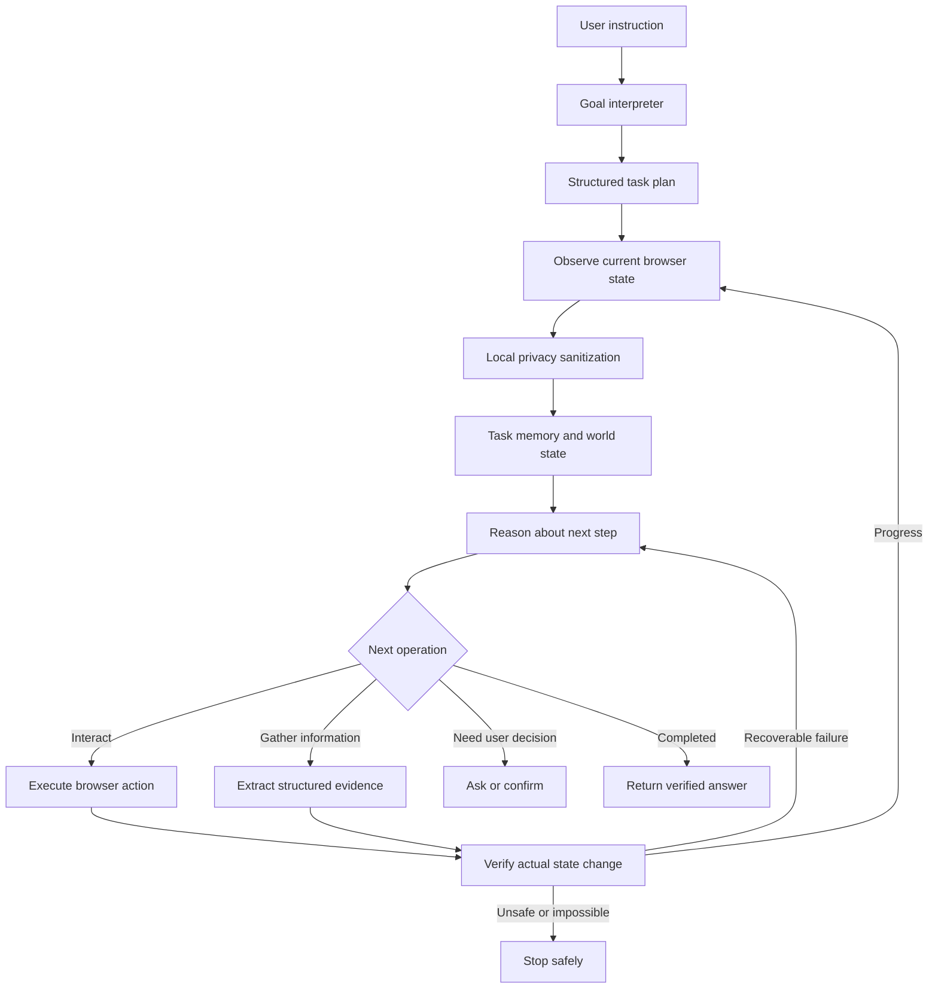

Yes—I understand what you want.

You want **PrivaPilot to behave like a real general-purpose browser agent**, not a hardcoded scraper:

> “On the SIH/BIS website I currently have open, tell me how many submissions are completed.”

The agent should independently determine that it must:

1. Inspect the current page.
2. Find the relevant navigation/tab.
3. Open the submissions section.
4. determine what “completed” means from the page.
5. Read a total, filter records, or traverse pagination if necessary.
6. Cross-check the result.
7. Return the answer with evidence.
8. Continue reasoning and recovering until the task succeeds, becomes unsafe, or genuinely needs clarification.

## Honest current status

The project already has a good foundation:

- A real capture → sanitize → reason → act → verify loop in `apps/extension/src/background/coordinator.ts`
- Local PII and face redaction
- Fail-closed handling for unsafe pages
- Element-based clicking, typing, selecting, scrolling, and waiting
- Protected-action confirmations
- Stale-target recovery
- Twelve successful controlled Chrome scenarios in `docs/benchmark-results/E2E_EXTENSION_MATRIX.json`

However, it is **not yet the fully general agent you described**.

The major limitations are:

- Tasks are interpreted primarily through regex rules in `packages/protocol/src/action.ts`.
- The model receives the current state but not a sufficiently rich structured memory of previous observations and decisions.
- Only visible interactive elements are represented well; tables, cards, counts, pagination, and general page content are not modeled sufficiently.
- The browser API does not yet expose proper tools for tab discovery/switching, navigation, back/forward, pagination, downloads, or structured extraction.
- The action schema has no proper `answer`, `extract`, `navigate`, or `switch_tab` actions.
- It mostly operates on the current viewport.
- Visual perception exists, but it is not connected to production action grounding.
- The current visual-context benchmark is approximately **78.6% recall/precision**, so unseen-page perception still needs work.
- The existing E2E matrix proves controlled workflows, not arbitrary-site generalization.

## Architecture we should build



## Implementation plan

### Phase 1: Replace regex intent handling with structured goals

Introduce a `TaskSpec` such as:

```ts
interface TaskSpec {
  objective: string;
  mode: 'act' | 'answer' | 'extract';
  constraints: string[];
  expectedResult: {
    type: 'text' | 'number' | 'boolean' | 'page_state';
  };
  completionCriteria: CompletionPredicate[];
  requiresConfirmation: boolean;
}
```

For the example, the interpreted task might be:

```json
{
  "objective": "Find the number of completed submissions",
  "mode": "answer",
  "expectedResult": {
    "type": "number"
  },
  "completionCriteria": [
    {
      "kind": "answer_supported_by_page_evidence"
    }
  ]
}
```

Keep deterministic parsing for straightforward commands, but allow the reasoning model to interpret unfamiliar tasks into a **closed, validated schema**.

### Phase 2: Build a richer privacy-safe page representation

Extend `SanitizedContext` in `packages/protocol/src/payload.ts` with:

- Browser tab metadata
- Navigation landmarks
- Visible headings
- Sanitized text blocks
- Tables and column headers
- Row summaries
- Cards and counters
- Pagination state
- Scroll position and page extent
- Current route
- Selected tab
- Loading and empty states
- Stable semantic element fingerprints

For example:

```ts
interface SanitizedTable {
  localId: string;
  caption?: string;
  headers: string[];
  visibleRowCount: number;
  safeRows: string[][];
  pagination?: {
    currentPage: number;
    totalPages?: number;
    totalItems?: number;
  };
}
```

This is necessary because “how many submissions are completed?” is an **information retrieval task**, not merely a click task.

### Phase 3: Add real browser tools

Expand `BrowserAdapter` in `apps/extension/src/browser/browser-adapter.ts` with controlled tools:

- `listTabs`
- `activateTab`
- `openTab`
- `navigate`
- `goBack`
- `goForward`
- `reload`
- `scrollTo`
- `inspectPage`
- `extractStructuredContent`
- `readTable`
- `getPaginationState`

Expand `ActionKind` in `packages/protocol/src/action.ts` with validated operations such as:

```ts
type ActionKind =
  | 'click'
  | 'type'
  | 'select'
  | 'scroll'
  | 'navigate'
  | 'switch_tab'
  | 'go_back'
  | 'extract'
  | 'answer'
  | 'wait'
  | 'ask_user'
  | 'finish'
  | 'blocked';
```

Every tool must remain narrowly scoped. The model should never receive arbitrary JavaScript, CSS selectors, or unrestricted browser APIs.

### Phase 4: Add stateful planning and memory

Each reasoning request should include privacy-safe history:

- Current objective
- Current subgoal
- Pages visited
- Actions attempted
- Verification results
- Facts extracted
- Failed hypotheses
- Remaining completion criteria

For example:

```json
{
  "objective": "Count completed submissions",
  "facts": [
    {
      "fact": "Submissions page opened",
      "evidence": "Heading: Submissions"
    },
    {
      "fact": "Status filter includes Completed",
      "evidence": "Select option visible"
    }
  ],
  "lastAction": {
    "kind": "click",
    "result": "route_changed"
  },
  "remaining": [
    "Determine total completed submissions"
  ]
}
```

Currently, `actionHistory` mostly helps detect repeated actions; it is not a proper reasoning memory.

### Phase 5: Separate planning, grounding, execution, and verification

The model should reason in two stages:

1. **Planner:** Determine the next semantic operation.
2. **Grounder:** Bind that operation to a specific fresh page element.

Example:

```json
{
  "operation": "open_section",
  "targetDescription": "Submissions navigation tab"
}
```

Then the local grounder chooses the matching element using:

- Accessible name
- Role
- Nearby heading
- Container context
- Visual position
- Current route
- Uniqueness
- Visibility
- Occlusion
- Fresh capture identity

Ambiguous matches must result in re-observation or clarification—not an arbitrary click.

### Phase 6: Add information extraction and answer verification

For page-question tasks, implement:

- Reading a displayed total
- Counting visible matching records
- Reading pagination metadata such as “1–20 of 137”
- Applying a status filter
- Traversing pages when no total is provided
- Deduplicating records across pagination
- Cross-checking totals against badges or summaries

The final result should contain safe evidence:

```json
{
  "answer": 42,
  "confidence": 0.98,
  "evidence": [
    "Submissions page opened",
    "Status filter set to Completed",
    "Page summary displayed 42 matching submissions"
  ]
}
```

Sensitive row contents should not be returned unless explicitly requested and allowed.

### Phase 7: Strengthen the privacy model

An important current issue is that the raw `goal` is placed in `SanitizedNetworkPayload`. Therefore, a user instruction containing names, IDs, credentials, or private values could be transmitted even if the screenshot is sanitized.

We should add:

- Local sanitization of the user prompt
- Local sanitization of agent memory and extracted evidence
- Placeholder references such as `[PERSON_1]`
- A local secret/value vault
- Local-only insertion of credentials and sensitive form values
- Redaction of model-visible text blocks
- Output leak scanning before displaying or transmitting answers
- Minimal disclosure based on the current subgoal

Sensitive values should never become part of the model-visible plan.

### Phase 8: Wire visual grounding into production

`VisualCandidateGenerator` and `PerceptionFuser` exist, but they are not connected to the production coordinator path.

We should:

- Generate visual candidates from the same captured screenshot.
- Fuse them with DOM elements.
- Use visual disagreement to lower confidence.
- Add local OCR or a compact semantic classifier.
- Support canvas-rendered controls only with coordinate freshness and occlusion checks.
- Continue preferring semantic DOM targets when available.

This will improve unfamiliar websites, but “works perfectly on every website” cannot honestly be guaranteed. Canvas applications, CAPTCHAs, cross-origin frames, browser-internal pages, and hostile interfaces will still require safe abstention.

### Phase 9: Make recovery intelligent but bounded

The agent should not literally run endlessly. That can cause loops and unsafe actions.

Instead, use:

- Dynamic step budgets
- Progress detection
- Replanning after failures
- Backtracking
- Alternative target selection
- Scroll exploration
- Loading-state waits
- Stale-target recapture
- Repeated-state detection
- Clear clarification requests
- Hard limits for protected operations

A task ends only as one of:

- `completed_verified`
- `needs_user_input`
- `needs_confirmation`
- `blocked_for_privacy`
- `unsupported`
- `failed_after_recovery`

## How your SIH example should execute

For:

> “Go to the SIH/BIS page I currently have open and tell me how many submissions are completed.”

The intended trace would be:

1. Inspect all available tabs locally.
2. Identify the likely SIH/BIS tab from sanitized title/domain information.
3. Activate it if necessary.
4. Inspect navigation landmarks.
5. Find the unique `Submissions` tab or link.
6. Click it.
7. Verify the route or heading changed to `Submissions`.
8. Look for:
   - a completed-status card,
   - a status filter,
   - a table status column,
   - or pagination totals.
9. If needed, select `Completed`.
10. Verify the filter was applied.
11. Read a total or count all relevant records.
12. Cross-check against pagination or a summary badge.
13. Return: “There are **N completed submissions**,” with a short evidence trail.

Nothing in that flow should be hardcoded specifically for SIH, BIS, “PS 171,” or a particular DOM selector.

## Recommended delivery order

1. **General `TaskSpec` and answer/extraction contracts**
2. **Rich sanitized page model**
3. **Stateful planner memory**
4. **Tab/navigation/extraction tools**
5. **Evidence-based completion verifier**
6. **Prompt and memory privacy sanitization**
7. **Production visual fusion**
8. **Unseen-site browser evaluation suite**

So yes, this is possible, and the existing repository is a useful base. But the next milestone should not be “make the prompt smarter.” The root change is to turn the current action loop into a **stateful, evidence-driven browser runtime with richer tools and strict privacy boundaries**.