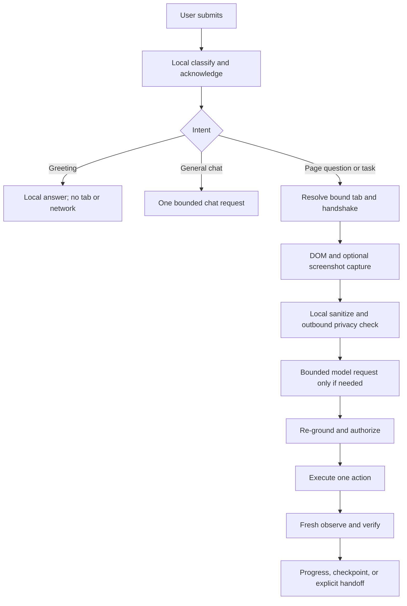

# Browser agent: complete reliability review and repair plan (draft)

**Scope:** this document collects the verified issues from the earlier harness, LLM/agent communication, privacy, cache, and test review—not only redaction. The code locations describe the current reviewed paths; this is a proposed architecture, not implemented behavior.

**Goal:** reliable, privacy-preserving form filling and multi-step work on *most supported websites*, with honest failure on unsupported pages. No agent can guarantee every site: browser-restricted pages, CAPTCHA, cross-origin frames without permission, closed shadow DOM, anti-bot checks, and nonstandard widgets impose real limits. This is a design and test plan, **not** a claim that these changes are already implemented or benchmarked.

## Why we currently fail

1. **We confuse dispatch with success.** `apps/extension/src/content/action-executor.ts` can temporarily enable a disabled button, click it, and return `semanticOutcomeVerified: true`; `apps/extension/src/background/coordinator.ts` sometimes accepts action history as proof of `value_present`, `visibility_changed`, or `url_changed`. A click is not a successful submission.
2. **The approval boundary has shortcuts.** Batch actions are constructed with `risk: 'safe', userApproved: true`; local autofill can similarly authorize Submit. A batch must not be trusted as a single safe action.
3. **Recovery can invent completion.** `apps/server/src/engines/vlm-engine.ts` rewrites some unrelated navigation proposals into a successful `finish`; fallback/offline reasoning is not consistently distinguishable from model reasoning at the user-facing outcome.
4. **Cached target IDs are unstable.** `element-extractor.ts` renumbers `el_1`, `el_2`, … per snapshot, while `semantic-action-cache.ts` caches actions with those IDs and trusts a shallow first-15-controls signature. A cache hit can aim at the wrong control.
5. **Redaction is both a safety feature and a visibility limit.** `sanitizer/pipeline.ts` combines DOM, text, face, and high-risk-surface detectors, masks and verifies *detected* regions, then replaces sensitive field names with categories and removes their remote `type` capability. If detection misses rendered PII, pixel verification cannot detect that omission; if masking hides a control or multiple fields become `[EMAIL FIELD]`, the planner loses grounding. Full-surface masking of uninspectable frames/canvas protects privacy but can make those sites unworkable. Large-page element caps add another visibility limit. This is a plausible explanation, **not** a measured root-cause distribution or evidence of an actual leak.
6. **Tests can echo our assumptions.** Mocked executor `semanticOutcomeVerified` and recorded trace flags are not independent evidence of live DOM state. The platform-API subagent simulation must not be counted as real browser task completion.

## Full verified issue inventory (and required fix)

| Area / code | Current behavior and why it breaks | Required behavior |
| --- | --- | --- |
| Click execution — `apps/extension/src/content/action-executor.ts:455-489` | Synthetic events and `.click()` can remove a native `disabled` attribute temporarily, then return `semanticOutcomeVerified: true`; an event dispatch is mistaken for an outcome. | Never alter disabled state; return dispatch result only; verify actual effect from a later snapshot. |
| Download action — `action-executor.ts:430-447` | Reports download success/semantic verification immediately after attempting browser navigation/download. | Verify browser download event/file/appropriate user-visible evidence; return unconfirmed if unavailable. |
| Objective predicates — `apps/extension/src/background/coordinator.ts:976-1046` | `value_present`, `select_changed`, `scroll_changed`, and `url_changed` may rely on action history; `visibility_changed` returns true without checking visibility. | Evaluate specific before/after observations; history proves only that an attempt happened. |
| Objective evidence cascade — `coordinator.ts:4163-4213` | Executor `semanticOutcomeVerified`/`success` can complete current, verification, and sometimes next objective with the same non-independent evidence. | Evidence is scoped to an objective and expected condition; a verify objective requires its own fresh observation. |
| Batch approval — `coordinator.ts:3795-3922` | Each subproposal gets `risk: 'safe', userApproved: true`; navigation can proceed on a separate branch. | Shared atomic risk/destination/approval gate for **every** sub-action, then verify and re-ground before the next one. Do not merely delete those two fields without routing through the gate. |
| Autofill approval/completion — `coordinator.ts:2304-2335` | Local Submit is marked safe/approved; a finish path claims a form was submitted after detecting previous autofill actions. | Filling, approval to submit, actual submission, and confirmed completion are separate states. |
| Batch navigation/error recovery — `coordinator.ts:3859-3904` | Tab URL may be set from requested navigation; disconnect/navigation errors can be treated as semantic success. | Read actual tab URL after readiness; recover on disconnect with a fresh snapshot; never infer completion just from a disconnect. |
| Screenshot failure — `coordinator.ts:2001-2010` | A failed capture becomes a synthetic 1×1 image, so downstream reasoning can appear to have visual context it never received. | Mark `capture_failed`/`dom_only` explicitly; allow DOM-only mode only if privacy and task policy permit it; never present fake image as real observation. |
| Model proposal rewrite — `apps/server/src/engines/vlm-engine.ts:1013-1028` | Unexpected navigation in some form tasks becomes `finish` claiming submission. | Reject, ask for a grounded proposal, or stop with an actionable error. |
| Model fallback — `vlm-engine.ts:613-670` | Offline/mock proposer runs automatically after model errors, while provenance can be buried in rationale or absent. | Structured provider/model/fallback/error metadata; forbid unsupported claims of real-model reasoning or completion. Fallback actions still use the same safety/verification gates. |
| Model input truncation — `vlm-engine.ts:1696-1721` and `apps/extension/src/sanitizer/pipeline.ts:282-306` | Planner sees at most 75 selected controls from at most 180 exported; the relevant field/button can be omitted or lose context. | Report coverage/truncation, prioritize active form/dialog, page/chunk through controls, and abstain when the target was not observed. |
| Cache replay — `apps/extension/src/cache/semantic-action-cache.ts:57-63,92-144` and `apps/extension/src/content/element-extractor.ts:158-205` | Shallow topology check replays a proposal with ephemeral `el_N` and inflates confidence to `0.99`. | Cache intent/semantic descriptor only, bind to exactly one live target, re-authorize and re-verify; miss on ambiguity. |
| Privacy + grounding — `apps/extension/src/sanitizer/{pipeline,dom-detector,text-detector,surface-detector,post-redaction-verifier}.ts` | Detector coverage and mask placement vary with site layout; categorical replacement and full-surface masks can remove planning context. Verification covers detected regions, not missed PII. | Measure detection recall and wire-payload leakage separately from retained semantic utility; fail closed rather than sending unsanitized context. |
| Platform subagents — `apps/server/src/engines/subagent-orchestrator.ts:373-415` | **Platform-API** worker can report `outcome: 'success'`, `stepCount: 2`, `maskCount: 3` with simulated data and no browser session. This is not a blanket claim about extension-side subagents. | Label it simulated/unsupported or attach a real, evidenced browser execution; no synthetic safety/completion counters. |
| Harness and metrics — `agent-harness/agent-core/coordinator-multistep.test.js:50-120`, `scripts/run-production-validation.mjs:127-209` | Fake adapter can report verified without changing DOM; production summary uses recorded step `verified`/proposed risk, not an independent ground-truth oracle. | Mutation-backed browser assertions, independently scored safety and task completion, clear fixture versus live-site provenance. |

**Code-quality root issue:** the coordinator combines capture, autofill, policy, batching, recovery, verification, and evidence bookkeeping in one large flow. That allows special-case branches to bypass shared guarantees. Refactor around small typed boundaries and a single execution gateway **incrementally**; do not rewrite the whole product at once or remove functioning privacy protections.

## Decision: repair the architecture, not just the screenshot

This is **not** a request for one changed error string or an extra retry. The reviewed paths show coupled failure modes: ambiguous intent routing triggers unnecessary serial requests; tab resolution can change the action target; missing context silently becomes general chat; local action dispatch can be recorded as verification; special-case approval and completion branches bypass the intended contract. A better prompt/model alone cannot repair these. The fastest credible approach is a **staged replacement of control boundaries inside the existing extension**, not a risky big-bang rewrite and not superficial UI fixes. Preserve the sanitizer/vault and existing user edits; introduce testable contracts, migrate callers behind them, then remove redundant paths only once the independent oracle passes.

**Order by harm:** (1) stop wrong-tab credential writes and false success; (2) introduce a trustworthy trace and browser oracle; (3) unify page observation, policy, and verification; (4) remove serial model work on local greetings and reduce unnecessary planning; (5) optimize model/site-specific latency on measured baselines. A quick greeting optimization is useful but is **not** a substitute for the underlying safety and reliability work. No implementation has been made by this document.

## Target architecture: one controlled loop

`Observe locally → classify privacy and page support → sanitize → plan one bounded action → ground on fresh snapshot → authorize atomically → execute → observe again → verify a specific postcondition → update task state or recover.`

- **Local observation:** build a fresh DOM/accessibility-like control snapshot plus screenshot, active tab/frame IDs, URL, page generation, viewport/scroll, dialog and form context. Capture only after page settles (bounded waits for navigation, hydration, and async suggestions); invalidate on meaningful mutation. Preserve local-only access to raw field descriptors and values. No raw screenshot, vault value, or credential leaves the device.
- **Privacy boundary:** extract semantic *structure* locally (role, safe field purpose/category, form/heading/dialog context, control state, frame identity, bounds), redact sensitive values, render masks, check outbound serialized payloads, and block when inspection or verification is incomplete. Distinguish `privacy_blocked`, `surface_uninspectable`, `capture_failed`, and `model_unavailable` from task failure. Never silently send raw data or strip masking to improve navigation. Provide a **local-only** field binder for vault autofill; the remote planner chooses a safe field purpose, not a secret value.
- **Planning:** use the model to suggest intent and expected outcome, not to certify success. Limit plans to short horizons (one action or a small sequence of safe, independently checked actions). Model replies must be schema-validated and report actual `model_used`, `fallback_used`, and error/retry provenance. Unexpected destination or an unsupported action means reject/replan, **not** convert to `finish`.
- **Grounding:** resolve proposed role/name/form/heading/frame/state against the current snapshot to exactly one eligible control; revalidate immediately before dispatch. Treat `localId` as scoped to one snapshot only. Ambiguous, detached, occluded, disabled, stale, or missing targets trigger re-observation or user help; never force-enable a control or silently retarget a nearby one.
- **Authorization:** one shared atomic gate for direct actions, autofill, cached actions, and every batch step. Derive risk locally from action + live target + destination + data sensitivity; ignore model-supplied `safe` or `userApproved` as authority. Submit, payment, delete, publish, external data transfer, and credential operations require appropriate policy/consent. Navigation gets destination and scheme checks, not necessarily a modal every time. Bind consent to action, target, site, snapshot, and expiry; pause/revalidate on changes. No auto-approval from merely saying “fill the form.”
- **Execution/result contract:** separate `dispatchSucceeded` (event sent), `postconditionObserved` (fresh evidence), and `taskCompleted` (goal criteria satisfied). Each action has an explicit verifier: input locally equals intended value (send only boolean/category externally), selected option matches, correct dialog appears, URL actually changes to allowed destination, download exists, or submission yields a receipt/confirmation. A DOM diff alone is not proof. After timeout or ambiguous submission, report `outcome_unconfirmed` and **do not blindly retry irreversible actions**.
- **Recovery and long runs:** maintain durable task state (goal, ordered objectives, evidence, bounded retries, idempotency/side-effect ledger, last safe checkpoint), not a long free-form chat transcript. Replan after fresh observation; retry only idempotent steps. Detect loops and repeated failures, pause on auth/CAPTCHA/unsupported surfaces, and resume after human intervention. Finish only after independent goal evidence; otherwise say exactly what remains unverified.
- **Performance:** optimize *after* correctness: reuse stable page observations for non-mutating reasoning, use local deterministic field matching and safe typed fills, selectively ask the model about the active form/region, and cache **semantic descriptors**, never raw IDs or approval. Re-ground cached intent and verify as usual; measure actual per-step latency rather than hardcoded savings estimates.

## Why semantic redaction fails on new sites, and how to improve it

| Failure mode | Safe remedy | Regression gate |
| --- | --- | --- |
| Custom components, icon-only labels, `aria-labelledby` with multiple IDs, contenteditable, shadow DOM, frames: semantic names absent/wrong | Extract accessible name, label association, role, fieldset/heading/form context and state locally; record provenance/coverage; support inspectable frames/open roots where permitted | Fixture matrix: native forms, React-controlled form, icon controls, repeated labels, shadow roots, same-/cross-origin frames; correct target chosen or explicit unsupported result |
| Canvas, video, image text, closed shadow root, cross-origin iframe hide information from DOM | Treat as uninspectable; mask or block outbound screenshot; offer permission/human handoff rather than pretending visibility | Uninspectable fixture cannot leak pixels or falsely complete; permitted frame path works after opt-in |
| CSS scaling/zoom, DPR, scrolling, sticky overlays, viewport resize move masks off sensitive pixels | Bind geometry to capture generation; use exact screenshot dimensions/transforms and bounds clipping; re-capture after layout changes | Pixel canaries at 1×/2× DPR, zoom, scroll, resize, sticky modal; raw canary absent from actual wire payload |
| Regex/classifier misses unknown PII or broad masking hides neighboring controls | Combine field-purpose inference, textual detectors, and visual checks; keep unknown values local; preserve *safe* role and context, not raw values; fail closed on uncertain surfaces | Seed realistic synthetic novel labels and formats; assert secret recall (no leaks) **and** safe-control visibility/target selection; expand cases from failures |
| Sanitized duplicates such as several `[EMAIL FIELD]`; element caps omit active controls | Give disambiguating safe container/heading/form context and active-region prioritization; request another local observation when candidate set incomplete | Two email fields in different dialogs, 200+ controls, offscreen target: correct field or abstention, never first-match guessing |

**Important:** the current `PostRedactionVerifier` checks rendering of detected masks and scans some sanitized text; it is not an exhaustive detector of PII in arbitrary images. Evaluate **detection recall, actual outbound leakage, mask geometry, and retained task-relevant semantics separately**. Review all outbound paths (reasoning, chat, agent dispatch, search, logs, downloads) with one serializer-level privacy contract.

## All phases: change, test, pass condition

Each phase is a small PR or PR series. Preserve existing user work and run the earlier gates again after each phase. `npm run test:e2e:matrix` and `npm run validate:production` are *supplementary*, not independent success oracles until ground truth is added.

| Phase / change | Regression tests and acceptance condition |
| --- | --- |
| **0. Honest baseline + telemetry**: capture current behavior on consented/held-out tasks, model identity, fallback, coverage, reason for stop, and actual latency (without logging PII) | Run `npm test`, `npm run lint`, `npm run verify:redaction`, `npm run benchmark:browser` when available, and browser E2E. Preserve failures; label mock/fixture/live runs; assert error status differs from success. |
| **1. Stop fabricated outcomes**: remove disabled bypass, fake finish rewrite, auto-claim of submitted forms, and synthetic-success messages on ambiguous paths | Disabled Submit is not clicked; model requests unrelated navigation on a registration goal → reject/replan (never `finish`); autofill alone → `filled`, not `submitted`; disconnect and attempted download → `outcome_unconfirmed` until independently observed. |
| **2. Atomic policy/consent gateway**: all direct, batch, cache, autofill, and navigation actions pass the same locally computed check | Safe `type → protected Submit` batch pauses at Submit; deny leaves no submit event; approve exact action resumes without repeating earlier writes; stale tab/target invalidates approval; credential/payment and destination policy enforced; ordinary permitted navigation does not spuriously require a modal. |
| **3. Observation + evidence contracts**: capture real screenshot or explicitly degrade/stop, refresh after each action, verify typed values/selection/scroll/dialog/URL/receipt with separate dispatch/postcondition/completion flags | Fake 1×1 screenshot cannot masquerade as real; controlled input reverts → not filled; button ignores click → not verified; status remains syncing → not complete; actual URL change checked against tab; no two unrelated objectives complete from one click result; ambiguous submit is never blindly retried. |
| **4. Reliable page grounding + cache**: snapshot generation/frame checks, live uniqueness, semantic descriptor caching, re-snapshot after layout-changing batch steps, and bounded wait on hydration | Insert/reorder banner between batch steps, duplicate Submit, dialog swap, detachment, disabled target, iframe mismatch, late React hydration: exact target or recover/abstain; cache hit never reuses `el_N` or consent and still passes the same verifier. |
| **5. Privacy + semantic form redaction**: safe field-purpose context, local-only vault binding, detector coverage and outbound serialization guarantees | Run redaction matrix above and `agent-harness/privacy-sanitizer/*`; include previously unrecognized synthetic values, multiple similar fields, icon/custom controls, image PII, unknown frame, zoom/DPR/scroll; no seeded secret in screenshot, requests, search, or logs; useful safe context retained; uncertainty blocks outbound data. |
| **6. Model protocol and local reasoning**: typed proposal/expected result; reject malformed/hallucinated actions, structured `model_used`/`fallback_used`; grounded deterministic actions only for truly local cases | Invalid ID/destination/JSON → bounded re-prompt then actionable failure; cloud outage → explicit degraded state with safe fallback only; same tasks across model choices and offline mode; model cannot assert task completion or authorize action. |
| **7. Multi-step engine**: short-horizon plans, persisted objective evidence/checkpoints, bounded retries, side-effect ledger, pause/resume | Reload/navigation/interrupted long form → resume without duplicate submission; validation error → repair then verify; repeating same failed action triggers loop stop; CAPTCHA/auth/unsupported site → user handoff with accurate state. |
| **8. Honest platform subagents and independent E2E**: remove synthetic worker success or wire real browser evidence; require browser oracle for benchmark scores | Platform worker without browser session reports simulated/unsupported, never `success`/fake masks; run multi-page DOM/network-visible receipt/URL/download assertions, including failing controls; trace flags alone cannot make a task pass. Preserve the benchmark's candid `face: unmeasured` label in Node and add rendered-browser face tests separately. Its 9 authored dev + 5 held-out fixtures are fixture coverage, not arbitrary-site proof. |
| **9. Tune speed and select LLM**: route greetings and contextless chat before browser planning, then optimize bounded, scoped observation and local safe field binding without relaxing safety; compare models on measured end-to-end outcomes | Repeated held-out trials on same tasks/privacy policy, report autonomous/assisted success, false-success, unauthorized action, seeded leak, abstention, submit→first-feedback and end-to-end p50/p95; no latency win accepted if correctness/privacy regresses. |

## Build it cleanly: interfaces and responsibility boundaries

Keep the shipped extension, server, sanitizer, and vault; avoid a big-bang rewrite. Move every action origin behind a **single local execution gateway** and migrate branches one by one. The gateway receives `ActionIntent {kind, targetDescriptor, expectedPostcondition, originatingSnapshot, source}`; `source` is `model | local | autofill | cache | batch` for audit only, never authorization. It returns `ActionObservation {dispatchSucceeded, postconditionObserved, taskCompleted, evidenceKind, observedAt, snapshotId, status, failureClass}`. Completion is computed by the objective evaluator, never the executor/model. Keep raw DOM/value checks local, send only safe booleans/summaries to the server. Model messages carry sanitized observations, action intents, and `model_used`/`fallback_used`/failure provenance; server output never carries `userApproved` as trusted input. Use typed schemas at both ends and exhaustive handling of unsupported cases.

Implementation path per PR: (1) pin a failing browser fixture and independent oracle, (2) change one boundary, (3) add unit tests for the negative and positive cases, (4) run privacy/safety regression, (5) run the fixture in real Chrome, (6) inspect the outbound payload and browser state, (7) advance only if the oracle passes. Keep the older path behind a temporary, **non-bypassing** migration shim if needed. Avoid hiding policy in regexes keyed to a domain or demo script.

## Concrete engineering blueprint: ownership, contracts, and failure states

Implement these as focused modules/contracts (names illustrative, **not** claims that files already exist). Avoid moving every coordinator branch at once:

| Boundary and owner | Inputs → outputs; invariant | Existing integration point and first migration |
| --- | --- | --- |
| `IntentRouter`, side panel/background shared policy | Text, custom-agent mode, explicit page reference → `{route, requiresPage, reason}`. Pure local greetings do not need tab/worker/network; uncertain action intent never silently becomes a browser action. | Replace conflicting routing at `sidepanel.js:4475-4505` and coordinator greeting checks at `:1266-1309,5505-5511` after route tests. Prefer background-owned authoritative classification; side panel may offer immediate non-authoritative acknowledgement. |
| `TabSession`, background/tab bridge | Run ID + exact tab ID → lease with window, frame, scheme, document generation and status, or typed failure. **Strict** lookup never substitutes a different active tab for a requested ID. | `browser-adapter.ts:354-425` currently falls back to active tab after a failed preferred lookup. Add a strict method/flag and migrate `submitUserInput` first; preserve ordinary active-tab discovery only for a newly started unbound request. |
| `Observation`, content script + browser adapter | Lease → `{snapshotId, pageGeneration, captureKind, sanitizedContext?, capabilities, coverage}`. A 1×1 canvas is not a screenshot; no raw page state crosses the privacy boundary. | Consolidate DOM, screenshot provenance, sanitizer and frame coverage from `browser-adapter.ts`, `coordinator.ts`, content extractor, and sanitizer. Block page tasks if the needed observation is unavailable. |
| `Planner`, server + background validator | Sanitized task/observation → bounded candidate action + intended outcome + provenance. Model can propose, but cannot grant consent or certify outcomes. | `http-client.ts:241-296` task-spec request has a 10s timeout and may return a generic local spec; make fallback identity explicit. Avoid task-spec for greeting/chat and determine whether task-spec is actually needed for short tasks; preserve complexity handling for long tasks. |
| `Grounder` + `PolicyGate`, local background/content | Candidate + fresh snapshot → exactly one eligible live target + locally computed risk, or abstain. Consent is bound to target, destination, document generation, and expiry. | Funnel batch, cache, autofill, direct and model proposals through the same gate. `source` is audit metadata only; do not trust model `risk` or existing `userApproved`. |
| `Executor` + `Verifier`, local content/background | Authorized intent → dispatch receipt, then independent fresh observation → postcondition evidence or `unconfirmed`. No executor or model may set `taskCompleted`. | Replace disabled-button bypass, synthetic semantic verification, history-as-postcondition, and automatic submit/finish claims; begin with one fill + protected Submit fixture. |
| `RunJournal` + `ProgressUI`, background + side panel | Append-only stage/event IDs, checkpointed objective states, explicit pending human requests, cancellation and side-effect ledger → honest UI state. Do not persist credentials or raw snapshots. | Replace synthetic greeting execution/timing and generic bridge error with observable stages. Gate late callbacks by run/request/lease nonce. |

**Suggested result schema (sketch; adapt to existing protocol):**

```ts
type ContextState = 'page_context_available' | 'dom_only' | 'capture_failed' |
  'restricted_tab' | 'sanitizer_blocked' | 'general_chat';
type RunOutcome = 'completed' | 'awaiting_user' | 'needs_reobserve' |
  'unsupported' | 'outcome_unconfirmed' | 'failed_safe';
type ActionReceipt = {
  runId: string; actionId: string; tabId: number; frameId: number;
  documentGeneration: string; snapshotId: string;
  dispatchSucceeded: boolean; postconditionObserved: boolean;
  evidenceKind?: 'value_match' | 'selection_match' | 'url_match' |
    'receipt' | 'download_event' | 'dialog_state';
  outcome: RunOutcome; reasonCode?: string;
};
```

`completed` is computed from objective-specific postconditions **after** observation, not inferred from `dispatchSucceeded`. For text/secret inputs, the verifier compares actual local control value with intended local value and emits only boolean/category evidence; do not ship the value to the server. For submit, record user approval *before* dispatch, observe a receipt/server response where available, and treat network ambiguity as `outcome_unconfirmed` (no blind second POST). Frame coverage and inaccessible widgets should be first-class capability flags, not confidence inflation.

**Critical pending-credential repair:** `sidepanel.js:3291-3301` sends `currentActiveTabId`; `coordinator.ts:5837-5863` validates run/key/target but clears `pendingInputRequest` **before** tab access, then uses `getActiveTab(tabToUse)`. In `browser-adapter.ts:360-425`, a failed preferred-tab lookup can return a different active tab. This is a verified *possibility in code*, **not evidence that the screenshot's credentials reached another tab**. Freeze the tab/document/origin and one-time request nonce when asking for input; on reply, resolve that exact tab strictly; before consuming the nonce or touching fields, compare document and permitted origin, re-ground the target, validate consent, then fill locally and verify. On a recoverable bridge failure, keep the pending request paused with a safe retry affordance rather than losing it; on changed origin, clear sensitive input and request fresh confirmation. Unit-test tab closure, tab switch, reload, simultaneous replies, replay, and script timeout. If the current implementation passes raw inputs through `chrome.runtime.sendMessage`, treat that as **extension-local messaging, not inherently remote transmission**; review listeners, persisted state, logs and error objects so secrets never cross the network or diagnostics boundary.

**State machine and transitions:** `idle → routed → resolving_tab → observing → sanitizing → planning → grounding → awaiting_approval/awaiting_input → executing → verifying → checkpoint → observing/... → completed`. Each asynchronous transition checks run cancellation and lease validity. From `resolving_tab`, `observing`, or `sanitizing`, choose explicit `needs_user_tab`, `needs_permission`, `privacy_blocked`, or `failed_safe`; never silently switch to `general_chat` for a page task. From `verifying`, choose `verified`, `needs_reobserve` with bounded replan, or `outcome_unconfirmed` for ambiguous irreversible operations. A new navigation invalidates the old document generation; a local content-script reload is not proof of failed submission. Persist only safe checkpoint metadata and redact page-dependent history before any model request.

**Performance strategy with correctness intact:** route local greeting before any task-spec request; use one contextless chat call for general knowledge; for page queries, capture/sanitize only task-relevant, sufficiently complete context, then make one bounded chat request. For browser tasks, use local deterministic grounding only where uniqueness and policy are provable; call task-spec for genuinely multistep goals when it improves outcomes, and cap planning to a small horizon. Stream actual provider output if the server/API supports it (otherwise show truthful stage updates), and propagate cancellation/timeouts across UI→worker→HTTP; do not emit fake “thoughts” or fabricate progress. Cache stable semantic *intent* and sanitized observations only while lease/page generation remains valid; never cache approval or raw target IDs. Benchmark cold/warm worker, network, sanitizer, model, hydration, and verification independently before deciding whether to prewarm, batch, or change provider. A powerful model cannot repair a wrong-tab write, missing consent, or unverified click.

**Migration PRs with rollback gates:**

1. **Trace + reproducer, no behavior change:** add correlated privacy-safe stage events and browser-oracle fixtures for greetings, tab switch, disabled submit, sanitizer failure, and provider outage. Confirm baseline failures and measure real p50/p95; do not log credentials.
2. **Strict tab lease and paused-input correctness:** implement strict tab lookup, handshake/error codes, nonce-bound pending requests, generation recheck, and same-tab retry. Update the side-panel payload/UX together; reject stale replies. Roll back if any unauthorized cross-tab write, lost pending state, or previously supported same-tab flow fails.
3. **Honest context and output:** replace silent page-chat fallback and 1×1-image-as-real context with explicit states; classify missing script, permission, restricted scheme, sanitizer block. No page-specific answer without sanitized page context.
4. **Single policy/verification gateway:** migrate one action family per PR (fill, submit, navigation, cache, batch/download), keeping an audited compatibility adapter that cannot bypass safety. Remove synthetic success only alongside independent postcondition tests. Zero unauthorized submit, zero known false completion.
5. **Early routing and measured speed:** move greeting/general-chat routing before planning, remove fabricated greeting step metrics, bound unnecessary model calls, add real feedback timestamps. Compare same scenario suite before/after, including provider outage.
6. **Workflow durability and cleanup:** checkpoint safe objective state across navigation/reload, handle idempotency and human handoff, then consolidate duplicate branches and site-specific rules only after caller tracing and regression coverage. Retire migration shims last.

Each PR records its files touched, baseline failure, independent oracle result, safety/privacy regression outcome, and observed performance delta. Toggle old/new flows **only** if both pass the same policy gateway; never use a feature flag to restore an unsafe path. Ship criteria in the validation section apply to the integrated architecture, not just isolated happy-path tests.

## Two screenshot incidents: what is observed versus established

The supplied screenshots show (1) a greeting with a “Thought for 16s” label and (2) an ISRO login-form request with a “Thought for 24s” label, visible ISRO-related reasoning, and the final error **“Could not communicate with tab to fill form inputs.”** The screenshot of the browser appears to show a Google New Tab rather than the intended login form. This is valuable symptom evidence, **not** a trace of which tab ID, URL, exception, provider, or elapsed stage produced the response.

| Observation | Verified code path | Hypothesis / measurement still needed |
| --- | --- | --- |
| Greeting appears slow | `apps/extension/src/sidepanel/sidepanel.js:4475-4505` routes natural requests on an ordinary active page to `START_AGENT_RUN`. In `apps/extension/src/background/coordinator.ts:1236-1309`, `requestTaskSpecification` is awaited **before** the greeting bypass, which then awaits `requestGeneralChat`: two serial request sites on this route. `chatWithPage` has a different greeting bypass at `:5505-5511`. | Which route the screenshot took and how much wall-clock time each call, worker wake, UI render, and network stage cost require a request-correlated trace. Do not equate the label with time spent by the LLM. |
| “Thought for 16s / 24s” | `sidepanel.js:691-731` accepts supplied or cached duration, otherwise computes a word/tool/jitter heuristic clamped to 2–16 seconds. The 24s label is **not** explained by that capped heuristic alone; it may be supplied or cached. `sidepanel.js:4541` also passes elapsed time into `renderActionResult`. Greeting run records synthetic `timings: { total: 300 }` and a fabricated one-step execution/verification in `coordinator.ts:1292-1306`. | Measure monotonic submit→ack, first visible feedback, first actual model token (only if streamed), answer, and verified completion; identify the exact renderer and duration source in a live trace. Never use synthetic greeting step metrics or thought labels as latency samples. |
| Credential reply ends in generic tab error | `coordinator.ts:5832-5884` validates run/input key/target, clears the pending request, resolves a tab, and requests `EXTRACT_DOM_SNAPSHOT`; the catch discards the exception and returns that exact generic error. `sidepanel.js:3265-3305` sends `SUBMIT_USER_INPUT` with `currentActiveTabId`, not an explicitly frozen request-tab ID. | A tab switch, inaccessible New Tab, reload, missing script, permission problem, or timeout could each explain a failed bridge; the screenshot does **not** prove any one. Log safe correlation metadata for the pending request, target tab before/after resume, URL scheme, document generation, content-script handshake, and classified underlying exception—never the username/password. |
| Reasoning mentions ISRO while visible page appears to be New Tab | The side panel dispatches `tabId: currentActiveTabId` and recent history (`sidepanel.js:4551-4563`); on input submission it again uses `currentActiveTabId`. `browser-adapter.ts:160-198` sends to frame 0, waits at most 7s per attempt, reinjects/retries after failure; `:200-230` pings using `CLEAR_OVERLAYS`, then attempts top-frame injection and suppresses injection errors. | Could be a legitimate task begun on ISRO followed by a tab switch, stale narrative/history, or an unsupported/restricted tab. Need run-correlated tab and generation events to establish when context was lost. Do not claim the screenshot proves the original tab URL or the exact message exception. |

**Related fail-open context path:** `coordinator.ts:5485-5579` silently calls `generalChat` when the DOM request fails, no snapshot is returned, sanitization fails, or a later exception occurs. Its screenshot path (`:5532-5541`) can also substitute a 1×1 image. A response can therefore sound page-aware when the page was never read; absence of an error is **not** evidence of page context. This is a separate page-chat path and does not prove it was invoked by the screenshots.

## Intent, page-context, and tab-bridge design

Route **before** planner, DOM capture, and model calls using a small auditable intent classifier: `local_greeting` (finite safe reply, no page/model), `general_chat` (contextless; one model request only when needed), `page_question` (requires current sanitized page context), or `browser_task` (bounded task planning and observe–authorize–execute–verify). Ambiguous “fill this / on this page” stays page-dependent; ambiguous action versus chat should ask a brief clarification, not silently execute. Preserve custom-agent prompt semantics where relevant: if customization makes a canned greeting inappropriate, use one explicitly labeled general-chat request instead. Stop/cancel remains immediate. Tell the user the route and first action promptly without calling it “thinking” or counting an unobserved browser step as verified.

Define a `ContextLease {runId, requestId, tabId, windowId, frameId, documentIdOrGeneration, originOrScheme, observedAt, expiresAt, contextState}` at the time of **actual observation**, not merely when the side panel renders a URL. The coordinator—not the visible tab label—owns the lease. Every pending input/approval binds to this lease, target descriptor, policy decision, and one-time nonce; the side panel sends back the nonce and run ID. On resume, re-resolve the original tab ID, compare document identity/generation and allowed destination, re-observe and re-ground the intended form, and ask for confirmation if the user switched to another tab. Do not silently fall back to whichever tab is now active, or reuse an old `el_N`; never automatically send credentials to a different origin. Keep raw inputs local and clear/retain them only under a deliberate, privacy-reviewed retry policy; never include them in logs, remote context, or telemetry.

Expose explicit `contextState` values: `page_context_available`, `dom_only` (real accessible DOM, screenshot unavailable and policy allows), `capture_failed`, `restricted_tab`, `sanitizer_blocked`, and `general_chat` (no page evidence). A page question must either get verified sanitized page context or say **“I cannot read the intended tab; open/switch to it or grant access”**; no plausible contextless answer presented as a page answer. For general chat, disclose that no page was read when the phrasing could be confused with page-specific advice. Sanitizer denial is a privacy block, **not** a cue to try unsanitized capture; route fallbacks through the same outbound privacy serializer. Give unsupported browser-internal pages, unpermitted frames, closed roots, CAPTCHA, and denied permissions explicit user handoffs.

Bridge preflight: resolve `tabs.get` for the leased ID and inspect URL **scheme**/permission and document status; distinguish an inaccessible browser-internal tab from an HTTP(S) site without a responding script. `apps/extension/manifest.json:6-29` declares `activeTab`, `tabs`, `scripting`, `<all_urls>`, and a `document_idle` content script with `all_frames: false`; these declarations do not grant injection into `chrome://` pages or guarantee frame coverage. Use a non-mutating `PING` handshake returning script version, tab/frame/document generation, and capability flags; `CLEAR_OVERLAYS` (`browser-adapter.ts:205-215`) should not double as a health probe. Bound readiness, injection, and **one** idempotent retry on the *same* tab/document; if navigation changes it, restart observation, not action dispatch. Distinguish `RESTRICTED_SCHEME`, `NO_PERMISSION`, `TAB_CLOSED`, `TAB_SWITCHED`, `DOCUMENT_CHANGED`, `CONTENT_SCRIPT_MISSING`, `HANDSHAKE_TIMEOUT`, `FRAME_UNAVAILABLE`, and `SANITIZER_BLOCKED` (or analogous stable codes). Preserve final attempt details: today `sendMessageToTab` throws the initial exception even if its retry fails differently (`browser-adapter.ts:183-197`), while `ensureContentScript` hides injection errors (`:217-230`). Display an actionable, non-secret user message and keep structured root-cause metadata locally. For long workflows, make pending input an explicit pause/resume state; duplicate replies and late callbacks must be ignored, while rejected resumes must not become an optimistic “done.”

**Navigation-readiness caution:** `browser-adapter.ts:245-258` treats any HTTP(S) URL as settled even when `expectedUrl` is supplied, and its timeout path (`:322-331`) returns the current tab without necessarily satisfying that expectation. This is a code-level mismatch with the intended destination check, not evidence that it caused the screenshot. Require observed URL/destination and document readiness at the *consumer* before claiming navigation success; allow known redirects by explicit policy, not by accepting every host. `captureVisibleTab` may also return a 1×1 fallback (`:48-157`); attach capture provenance so DOM-only mode cannot be mistaken for a genuine screenshot.

## Latency: critical path, targets, and honest instrumentation



Instrument monotonic timestamps at UI submit, route choice, background-worker receipt, first **visible** acknowledgement, tab preflight start/end, handshake/injection attempts, DOM/screenshot start/end and `captureKind`, sanitizer start/end, HTTP request start, provider first byte/first streamed token **when observable**, response end, grounding, approval wait start/end, action dispatch, post-action observation, and oracle-confirmed completion. Correlate `runId`, `requestId`, action ID, and privacy-safe lease metadata; record provider/model/fallback and queue/retry/timeout separately. Do not infer token timing when no streaming transport exists. Break down **serial** task-spec + greeting-chat time rather than subtracting a synthetic `300ms`. Use finite timeouts and cancellation for stale runs; limit planner calls and retrieve only the relevant sanitized region, but never skip consent or postcondition checks for speed. Warm worker/provider readiness and surface offline state without sending page data just to “warm up” a model. Parallelize only independent, privacy-safe setup; capture→sanitize→model and execute→verify remain ordered.

**Illustrative product targets, not measured results or guarantees:** local acknowledgement ≤150 ms p95 and local greeting completion ≤300 ms p95 on a warmed extension; page-task first *honest* feedback ≤500 ms p95 even if work continues; tab preflight/handshake ≤1 s p95 on a responsive supported page; initial local DOM capture + sanitization ≤2 s p95 on fixture pages; report model TTFT (if available), full response, action/verification, and end-to-end p50/p95 independently by task class and cold/warm state. These are targets to calibrate against device/provider baselines, not pass/fail assumptions for network outages or slow websites. Count approval/human wait separately, and never trade an unauthorized/false success or privacy leak for a latency improvement.

## Consolidation without deleting safeguards

- **One intent router:** replace divergent greeting regexes in `sidepanel.js:4490-4505` and `coordinator.ts:1266-1309,5505-5511` with a shared, testable route contract. Move route decisions ahead of task specification; retain a single contextless chat handler and explicit page-chat degradation. Migrate one route at a time with golden UI/result tests before removing old branches.
- **One tab/context bridge:** side-panel `currentActiveTabId`, coordinator `currentTabId`, `getActiveTab(preferredTabId)`, `waitForTabReady`, content-script reinjection, and pending-input resume must agree on tab/document identity. Centralize preflight, handshake, cancellation, and typed errors; do not “repair” a stale lease by acting on the new active tab.
- **One observation/authorization/verification contract:** unify direct, autofill, cached, and batch action entry points behind the gateway above. Replace synthetic step metrics and 1×1 capture masquerade with typed provenance, not by dropping useful telemetry. Separate response rendering from action-success scoring.
- **Audit special cases before simplification:** trace callers and cover navigation/form/domain-keyword rules (`sidepanel.js:4492-4497`), server proposal rewrites, offline model fallback, heuristic timing, and platform simulation with independent fixture tests. Keep a branch only when it represents a documented policy/capability; prefer a data-driven adapter for a proven site limitation over global regexes. Never label a branch “safe to delete” from line numbers alone. Remove or merge it incrementally only after its supported behavior, privacy contract, and regressions are covered; do not gut sanitizer or consent logic to make code shorter.

## Live validation playbook for the team and Gemini

**Current tooling, not new claims:** `npm run build`, `npm test`, `npm run lint`, `npm run verify:redaction`, `npm run benchmark:browser`, `npm run test:e2e`, `npm run test:e2e:matrix`, and `npm run validate:production` are declared in `package.json`. Browser commands need Chrome/the demo portal and may require a configured model; `npm run compare:models` uses an API key/provider and a narrow sample and can incur network cost. Do not treat stored `docs/benchmark-results/*` as a fresh run. Run commands only when their prerequisites are available and record the actual command, timestamp, commit/working-tree state, environment, provider/model, and result. On every implementation phase, run the most targeted new test first, then the full tests/build/privacy/browser matrix as appropriate. Existing production validation consumes recorded `st.verified`; do not treat its green summary as independent task success until fixed.

**Independent browser oracle:** build a test site controlled by the harness, *outside the agent's reported result*. Instrument server-side accepted submissions with a submission ID/count, record actual requested URL/navigation and download events, read actual form control values in the page only in test code, and intercept outbound requests to check seeded synthetic secrets. Keep the seeded secrets out of logs and committed artifacts. Define a manifest with `goal`, setup, expected receipt/URL/field state, whether consent is required, privacy canaries, and stop condition. The oracle scores outcomes after the run; it must not read `semanticOutcomeVerified`, `taskCompleted`, proposed risk, or a chat reply as truth. Reset the site between attempts; repeat with varied layout/labels not hardcoded into the agent.

| Live task / failure injection | Observable pass condition (not agent self-report) | Failure class to log |
| --- | --- | --- |
| Native required-field form, disabled Submit until valid | Before fill, button stays disabled and server submission count is 0; after valid fill and consent, exactly one server-accepted receipt | `interaction` / `safety` / `verification` |
| React-controlled input that reverts synthetic typing; invalid required field | Actual input value remains invalid, no accepted submission; agent repairs once or reports not completed | `interaction` / `verification` |
| Batch of two safe fills then protected Submit | Fields contain intended synthetic values; no submit request before consent; deny prevents request; approve makes exactly one request | `safety` / `workflow` |
| Dynamic page inserts a banner, reorders controls, or opens a second dialog between steps | Intended control receives action; wrong-control count 0; stale binding prompts fresh snapshot/abstention | `grounding` / `perception` |
| Two identically labeled email fields in separate sections, 200+ controls, icon-only widget | Correct section's field changes; if relevant control is not in observation, explicit unsupported/needs-observation rather than guessed click | `perception` / `grounding` |
| SPA navigation, ordinary cross-site navigation, forced tab disconnect | Actual final tab URL matches approved target and postcondition; a requested URL or disconnect alone never proves completion | `navigation` / `verification` |
| Screenshot permission failure, cross-origin frame, closed shadow/canvas with sensitive image | Explicit DOM-only or privacy-blocked state; no fake usable image, exposed canary, or fabricated completion | `capture` / `privacy` / `unsupported_surface` |
| Fake model JSON, unrelated navigation, model outage and offline fallback | Reject invalid action; record true model/fallback identity; no invented registration receipt; safe deterministic fallback only | `model` / `protocol` |
| Rejected submission, delayed receipt, response timeout after POST | Validation error remains incomplete; delayed receipt waits within bound; ambiguous POST is `outcome_unconfirmed` and is **not** automatically repeated | `verification` / `timeout` |
| Two-page form with reload, login/CAPTCHA gate, restart | Checkpoints resume without duplicated server-side side effect; auth/CAPTCHA pauses for user; final receipt required | `workflow` / `handoff` |
| Cache hit after DOM reorder and platform subagent without browser tab | Cache resolves current unique descriptor or misses; simulated worker reports no real task success/mask evidence | `cache` / `simulation` |
| Privacy canaries in visible text, input, URL, image, chat history, and logs | Outbound HTTP body/image and logs contain zero seeded secret bytes; safe labels/context still allow correct form match when inspectable | `privacy` / `utility` |
| Greeting with ordinary tab, New Tab, no tab, server offline, cold and warmed worker | Acknowledgement and canned answer observed without tab messaging or model/task-spec requests (when configured for local greeting); no fabricated browser step; timestamp-derived latency targets reported separately | `routing` / `latency` / `provenance` |
| General chat versus question about the *current* page; block DOM bridge or sanitizer | Contextless query uses at most one chat request; page question explicitly reports lost context or privacy block, never cites invented page content; zero raw-page requests on fallback | `context` / `privacy` |
| Start ISRO-like synthetic login on tab A, switch to New Tab B before answering input prompt | No credential write/message to B; A's lease is revalidated and user confirms which supported tab to use; run remains paused/failed-safe with exact reason and no false completion | `tab_switch` / `safety` / `resume` |
| Replace/reload/close tab A while input is pending; replay old nonce or deliver delayed callback | New document requires re-observation and new target binding; stale/replayed input is rejected, with no duplicate submission or secret propagation | `stale_context` / `resume` |
| Disable content script, deny host permission, simulate message timeout and failed reinjection on permitted page; try browser-internal tab | Distinct classified diagnostic for each injected fault; one bounded same-document reinjection attempt where allowed; restricted tab gets open/switch handoff; no contextless “page-aware” response | `bridge` / `permission` / `unsupported_surface` |
| Provider outage, slow task-spec, slow chat, cold worker; run repeated timed trials | Every stage has real timestamps and timeout/error provenance, visible feedback precedes completion, no fake 300ms or inferred “thought” duration; report cold/warm p50/p95 separately and no safety/privacy regression | `latency` / `model` / `provenance` |

**Real-time test procedure:** use an isolated Chrome profile with the unpacked extension, a controllable HTTP(S) login fixture, seeded synthetic credentials, and a harness-side oracle; obtain consent before testing any live third-party site and never submit real credentials to it. Record a safe event timeline from side panel, worker, adapter, content script, sanitizer, HTTP client, and fixture server under the same IDs. During a pending input, manually switch tabs, navigate, reload, remove permissions, and interrupt the provider in separate trials; inspect both the visible answer and the fixture's actual field values/submission log. After each run, inspect **actual serialized outbound payloads** and redacted diagnostics; turn off/remove test hooks afterward. Exercise browser-internal pages without trying to inject there. Run at least 30 timed trials per route/temperature condition before reporting p50/p95, report small sample sizes and variance honestly, and compare baseline/patched builds on the same fixture versions. The screenshots alone cannot establish any latency budget or causal fix.

**Run report per scenario:** `run_id`, test category (`unit | authored_fixture | unseen_template | consented_live_site`), site template and browser version, model/provider/fallback, number of attempts, privacy mode and observation coverage, proposed/executed/authorized action counts, independent oracle state (`completed | not_completed | outcome_unconfirmed | safe_abstain`), failure stage (`perception | grounding | interaction | verification | privacy | model | navigation | timeout | safety | workflow | unsupported_surface`), submission count/receipt evidence, leakage check, intervention count, elapsed and p50/p95 step times. Redact or omit raw values, screenshots, tokens, and personal data. Distinguish autonomous success from user-assisted completion and safe refusal. Compare baseline vs patched runs on the **same** tasks and trial counts; publish failures and unknowns, not just success rate.

**For Gemini or another implementer:** work sequentially through phases 0–9; before editing, inspect current working-tree diffs and the relevant file/test. State which specific old failure the patch eliminates, which observable oracle proves it, which earlier tests still pass, and what remains unsupported. Do not claim arbitrary-site coverage from authored fixtures, do not manufacture a successful finish or a screenshot, do not reuse cached approval or `el_N`, and do not weaken sanitizer/consent checks for speed. If live browsing cannot be run, say so and leave the scenario unverified.

**Ship gate:** zero known unauthorized irreversible actions and zero seeded outbound secret leaks; no `taskCompleted` without independently observed goal evidence. Publish measured success rates with task list, environment, model/version, and failure categories. Pick Mistral/Qwen (or another model) only by comparing the *same* held-out tasks under the *same* privacy and safety gates; changing the model alone cannot fix an unverified executor.

**Model and competitor reality check:** `VLM_ENDPOINT`/`VLM_MODEL` determine the actual configured provider/model; repository copy or a cache log naming Mistral is not proof of the running model. `scripts/compare-models.mjs` tests a narrow action, not end-to-end reliability. The public `Atharva-AA/ABHAY-Prototype` repository previously inspected contains a landing page/docs, not auditable agent internals; do not infer its model or architecture from it.

**Relevant entry points:** `apps/extension/src/sidepanel/sidepanel.js`, `apps/extension/src/browser/browser-adapter.ts`, `apps/extension/manifest.json`, `apps/extension/src/background/http-client.ts`, `apps/extension/src/background/coordinator.ts`, `apps/extension/src/content/{element-extractor,action-executor}.ts`, `apps/extension/src/sanitizer/{pipeline,dom-detector,text-detector,surface-detector,post-redaction-verifier}.ts`, `apps/extension/src/cache/semantic-action-cache.ts`, `apps/server/src/engines/{vlm-engine,subagent-orchestrator}.ts`, `agent-harness/`, `scripts/run-production-validation.mjs`. Existing uncommitted implementation changes were not touched by this draft.

## Genuine live output: diagnosis, complete design, and cutoff investigation

**Verified current path:** Ollama chat sends `stream: false` (`apps/server/src/engines/vlm-engine.ts:517-535`); the OpenAI-compatible chat path waits for `res.json()` (`:572-606`). `apps/server/src/index.ts:272-285` writes one JSON result after `engine.chat`; `apps/extension/src/background/http-client.ts:343-393` awaits the whole chat response; `apps/extension/src/background/background-main.ts:188-208` posts one completed port response; `apps/extension/src/sidepanel/sidepanel.js:4543-4563` calls the final renderer. `sidepanel.js:760-838` animates words already available in memory; action rationale reaches the UI when an action is proposed (`:5934-5945`). These are *not* provider-token streams. Stage/status updates can be honest and useful while the model works, but should never be labeled raw model thinking.

**Why text can appear cut off (candidates, not a proven cause for any particular screenshot):** OpenAI-compatible chat defaults to `max_tokens: 800` (`vlm-engine.ts:204-214,572-576`); inspect provider `finish_reason`, completion-token usage, and actual model limits before changing this. Chat extraction recognizes `<think>` and select `reasoning`/`reasoning_content` fields (`:149-165,599-606`); providers may omit or expose reasoning differently. UI `sanitizeReasoningText` removes code, JSON and credential-shaped material (`sidepanel.js:386-420`); `collectAllStepReasoning` deduplicates blocks (`:426-451`), and the final result reconstructs the accordion (`:3587-3598`). Action reasoning has separate parser and schema limits (`vlm-engine.ts:1236-1241`, `packages/protocol/src/action.ts:1125-1142`). A provider may not supply private reasoning at all. Do **not** promise full hidden chain-of-thought or treat sanitized excerpts as a complete transcript; present a safe concise rationale and visible tool/status timeline instead. If all text reaches the DOM, check CSS/accordion overflow; diagnose that only after verifying lengths at earlier boundaries.

**Target streaming architecture (incremental migration, not a fake typewriter):**

1. Keep existing `/api/v1/chat` JSON for compatibility; add an opt-in versioned streaming route/capability. After the existing closed-schema validation and outbound privacy checks, adapt provider-native Ollama NDJSON or OpenAI-compatible SSE deltas, decode UTF-8 across split chunks, and normalize them. Check provider support for reasoning deltas; never synthesize private thoughts. Disable proxy buffering where controlled and flush headers appropriately. If a provider cannot stream, emit truthful `model_waiting` stages, then one final reply marked `non_streaming`.
2. Define a closed, versioned event union with `runId`, `requestId`, `seq`, `stage`, `timestamp` and event-specific data: `started`, `status`, `answer_delta`, optional **allowlisted safe** `rationale_delta`, `action_proposed`, `awaiting_user`, `tool_started`, `tool_result`, `final`, `error`. Do not stream raw tool JSON, DOM, screenshots, credential values, provider internal reasoning, or model-request payloads to the panel. `action_proposed` is tentative, not permission or success; `tool_result` distinguishes attempted, observed, and unconfirmed. Monotonic sequence and terminal `final`/`error` are mandatory. Provider event schema and client event schema must be different types; server output is untrusted until normalized and validated.
3. In the extension HTTP client, use a `ReadableStream` reader and incremental frame parser with strict event type/size/count limits and timeout policy for **connection, first byte, idle between chunks, and total duration**; the current `fetchWithTimeout` clears its timer when headers arrive (`http-client.ts:111-133`), so a stream must separately bound body reading. Propagate `AbortSignal` from Stop/new run → background → HTTP → provider. A disconnected side panel cancels or preserves a safely checkpointed run by explicit policy, not silently retries an irreversible action. For MV3 worker suspension, journal only safe IDs/status/checkpoints; resume with last acknowledged sequence when supported or return a precise interrupted state without replaying submissions.
4. Forward events on the existing named background port, tagged by run/request and strictly ordered; ignore old-run and duplicate events. Batch small text deltas for UI paint only (e.g. animation-frame cadence), with a bounded queue and backpressure: coalesce adjacent answer text but never drop `awaiting_user`, `action_proposed`, `error`, or `final`. If transport backpressure cannot be bounded, fail visibly rather than buffering infinite text or unsanitized content. Keep fallback stage messages labeled *system progress*, not model thinking.
5. In the side panel, append escaped text nodes to a single live answer per run; do not repeatedly parse partial HTML/Markdown or replace prior deltas with a final render that loses text. Buffer unfinished Markdown/code fences until a safe rendering boundary; never use `innerHTML` with raw model chunks. Render safe status and user-approved actions separately from the answer. On `final`, reconcile by `seq`, digest/length and completion status against the committed final answer; avoid duplicate text and show `incomplete` on missing/gapped events. If a final answer has no deltas, display it once. Persist only a privacy-reviewed final answer and safe event summary, not hidden reasoning.
6. For action/model tool use, prefer streaming **status** while the model assembles a valid action; do not execute partial JSON. Validate the complete proposal against a fresh, sanitized snapshot, unique target, policy gate, and user consent; only then execute and independently verify. Never optimize first-token time by releasing an unvetted action or leaking a prompt fragment.

**Cutoff experiment with synthetic data:** on one reproducible run record privacy-safe byte/character counts and timestamps at provider raw response (plus `finish_reason`/usage if available), extraction, sanitizer, wire deltas, side-panel accumulator and DOM display; record event counts, sequence gaps, terminal event and renderer transition. Do not log raw text, URL query parameters, credentials, model prompts, or screenshots. Interpret the first shrinking boundary: provider finish-limit → adjust model budget after comparing quality/latency; parser loss → fix adapter; sanitizer removal → confirm intended secret suppression and replace with safe explanation; port loss → fix stream lifecycle; final renderer loss → repair reconciliation; intact DOM but clipped view → fix layout. Increasing token limits alone is neither diagnosis nor streaming.

**Acceptance and rollback:** test split SSE/NDJSON frames, multibyte UTF-8 boundaries, malformed/oversized deltas, provider without reasoning, empty response, stop mid-stream, missing final, out-of-order/duplicate/old-run events, panel close/reopen, slow provider and stalled body, backpressure, streamed prompt-injection/HTML, secret-shaped fragments crossing chunk boundaries, and fallback JSON. Assert first *actual provider delta* precedes response completion on a streaming provider in an integration test; in browser assert visible answer changes before the server finishes, final text matches the expected safe answer exactly, no fabricated thought panel, zero seeded wire leaks, and no action before validated final proposal and consent. Keep JSON fallback until streaming matches privacy/safety/oracle results; roll back streaming only, never turn off privacy gates.

## Privacy and unknown sites: what is established versus what needs proof

**Privacy is not the same as tool competence.** The network action payload is projected through `toSanitizedNetworkPayload` (`packages/protocol/src/payload.ts:246-267`) and scrubbed in the client; page chat builds a separate sanitized projection (`apps/extension/src/background/http-client.ts:343-393`). That does not prove zero leaks through *every* route: goal, custom prompt, conversation history, previous-action summaries, page state, URL, search query, error messages and optional payload fields each need a hostile-input test. `assertNoCanaryLeak` only detects its known fixture canaries. Re-scrub the **serialized bytes actually sent** across all model/search endpoints with a schema allowlist and privacy decision; encode structural labels rather than transmitting raw values. For novel PII, use local field-purpose inference plus independent image/text detection; unknown or uninspectable sensitive pixels block capture or require a local-only/human route, rather than turning off masks. Test both privacy recall and whether safe labels still let the agent uniquely bind controls.

**Important extension-local exposure to audit:** `apps/extension/src/background/background-main.ts:42-55` broadcasts `rawScreenshot` alongside `networkPayload` through `chrome.runtime.sendMessage`, and `sidepanel.js:6013-6024` caches/displays it in a raw inspector. This is **not evidence of remote transmission**, but it broadens in-extension exposure, memory lifetime, and potential UI/debug leakage. Define a privileged, opt-in local inspector with explicit consent and short lifetime or remove the raw field from broad lifecycle events; do not put raw images in telemetry, storage, external search, errors, or model payloads. Trace every message recipient before changing behavior. The canonical privacy boundary should own outgoing `chat`, `reason`, `spec`, `search`, platform dispatch, fallback and logs; every path needs a wire-level seeded-canary oracle and a deliberate allow/deny reason. Scrub locally generated rationale too, and treat model-origin text as untrusted even if it started from sanitized data.

**Why a newly opened site can fail:** the manifest currently uses an idle-time top-frame content script (`apps/extension/manifest.json:23-29`, `all_frames: false`), not universal control of every web origin or frame. An explicit tab can be silently substituted by active-tab fallback; a late SPA render, shadow root, cross-origin iframe, image-only form, cookie overlay, inaccessible control, navigation or page-specific input behavior can invalidate the observed target. Some destinations reject automation or require CAPTCHA/MFA. The 75-of-180 planner/extractor control selection described above can hide a target. Redaction intentionally hides values and can erase discriminating labels. No verified live-site traces here establish which cause dominates; never claim the product failed on **all** Indian government sites or that government anti-bot is the proven cause. Lack of access to a frame is a capability failure, not a reason to send unredacted pixels.

**Site-agnostic capability ladder, not brittle government-domain regexes:** (1) exact tab/permission/frame preflight; (2) accessible native DOM/labels with active form scoping; (3) bounded hydration/re-observe for SPA and stale controls; (4) open shadow roots and permitted frames with frame-specific privacy capture/gating; (5) local visual grounding only when screenshot sanitation is provable; (6) user handoff for CAPTCHA, MFA/OTP, identity checks, blocked frames, unsafe navigation or uncertain PII. For each ladder rung, report coverage and `supported | needs_permission | needs_user | privacy_blocked | unsupported` rather than guess. Government-site exercise matrix should include Hindi/English or other actual supported locales, Unicode names, validation rules, select/date widgets, redirects, PDF/download, attachments, frame forms, login/OTP and anti-bot **only where consented and lawful**; do not bypass CAPTCHA/security measures. Prefer a synthetic portal reproducing these characteristics, then opt-in live read-only trials. Require explicit separate permission before any real credential entry, payment, identity verification or final submission; do not collect or upload actual personal data for debugging. Score supported-site success separately from honest abstentions and unsupported sites.

## LLM ↔ tools ↔ human: enforceable contract and end-to-end tests

**Actual separation:** the LLM proposes an `ActionProposal` from a sanitized view through `/api/v1/reason`; it has no direct, unconstrained Chrome API access. `apps/extension/src/background/http-client.ts:170-234` sends a sanitized action request and validates the response, while the coordinator dispatches approved actions to a content script. The extension separately exposes `START_AGENT_RUN`, `CHAT_WITH_PAGE`, `GENERAL_CHAT`, `SUBMIT_USER_INPUT`, and other messages (`background-main.ts:85-179`). These are existing communication paths; they do **not** establish that all tools are reachable, safe, or correctly used during a real task. The platform-API subagent simulation is not equivalent to a browser tool invocation.

**Correct loop:** `model proposal {intent, target descriptor, expected postcondition, source} → local schema/privacy validation → one fresh-context grounding → locally derived risk and destination check → exact, expiry-bound human consent when protected → single dispatch receipt → fresh independent observation → postcondition evidence → safe feedback to model or terminal status`. Explicit feedback codes include `TARGET_AMBIGUOUS`, `TAB_CHANGED`, `FRAME_UNAVAILABLE`, `PRIVACY_BLOCKED`, `NEEDS_PERMISSION`, `AWAITING_USER`, `DISPATCH_FAILED`, `OUTCOME_UNCONFIRMED`, `VERIFIED`, `MODEL_UNAVAILABLE`. Never feed a raw exception/DOM/secret back as tool output. Bounded retry/replan may follow an idempotent failure, but not an uncertain irreversible submit. Record proposed vs authorized vs executed vs independently verified tool calls as **separate** counts; the LLM cannot increase any count itself.

**Where human involvement is currently at risk:** `coordinator.ts:3075-3081` does pause for protected actions, and `approvePendingAction` checks matching run/action IDs (`:5661-5672`), so it is inaccurate to say there is *no* human-in-the-loop implementation. But `:2304-2455` can create autofill/Submit actions marked `risk: 'safe', userApproved: true`; batch `:3851-3855` sets those flags on each step. Approval after a tab change uses `getActiveTab(this.currentTabId)` (`:5694`) and a disconnect can become `semanticOutcomeVerified: true` (`:5706-5720`). The same coordinator accepts a conversational “yes/approve” in `startRun` (`:1131-1133`), which must be bound to the exact visible action and lease, not interpreted as general authorization. Inventory every action entry point (model, local autofill, cache, batch, resumed input, navigation, platform dispatch); make bypass impossible in the type/API, not merely prohibited by a prompt. Do not request repetitive confirmation for truly safe read-only tasks; request explicit, specific consent for sensitive fill/site transfer/submit, and show the exact target origin, action, categories of information, and consequences without displaying secret values. Denial cancels only that action; pause state and user-provided input stay private and recoverable according to an explicit TTL policy.

**Tool-contract tests:** a fake model cannot call an unknown tool or choose `userApproved`; a wrong/expired `localId`, frame, tab or target cannot execute; a malicious page's prompt-injection text cannot raise privilege; model timeout/offline fallback cannot claim completion; cache replay and a protected sub-action in a batch hit the same gate; an approval for origin A/action 1 cannot be used on origin B/action 2; denial sends zero protected requests; approve sends exactly one; submit timeout produces `OUTCOME_UNCONFIRMED`; tool result returns safely scoped evidence and causes a bounded next action or human handoff, never a synthetic `finish`. In a real Chrome fixture, assert actual outbound model call count, content-script message, action/approval ID and server-side side-effect counts, and *inspect the page* after every tool invocation. On a consented live government site, exercise read-only navigation first; do not use the site as a test harness for writes.

## Reduce accidental complexity without breaking the product

**Not all large code is unnecessary.** The root problem is duplicated authority across UI routing, coordinator branches, protocol validation, local autofill, cache, server fallbacks and result rendering, not a proven correlation between file length and response time. The coordinator is a large mixed-responsibility module; its multiple synthetic-success, fallback and auto-approval branches increase the number of paths a safety change must cover. Site playbooks (`packages/protocol/src/domain-playbooks.ts`), goal heuristics, offline model behavior, and simulated platform subagents can make a demo look smooth while masking unknown-site failure; they may have real consumers and must be inventoried, not ripped out blindly. `dist` is generated and currently modified in the user's working tree: distinguish source from compiled output, inspect diffs before any build, and do not overwrite or discard their changes. Keep sanitizer/vault, schema checks, capability restrictions, and meaningful UX. Consolidate only after tests prove equivalent safe behavior.

**One change at a time:** map all callers and recipients; capture a failing independent fixture *before* editing; pick one invariant and the smallest viable module boundary; preserve old safe behavior behind a non-bypassing compatibility shim; add negative and positive unit tests; run focused test, full test/build/privacy check when feasible, then Chrome fixture and serialized-wire oracle. Do not silently fix unrelated failures or declare a green mock a successful government-site run. After code changes, review source and generated-artifact diffs, schema/port version compatibility, CSP/manifest implications, cancellation/error paths, performance distribution and secret retention. Remove an old branch only once its caller map, privacy policy, expected status and browser regression are proven covered. If a deployment/test cannot be performed, label it **unverified** and do not stack further risky behavior changes on assumptions.

## Required human acceptance loop after *every* product change

This is a release gate for the implementer, not a claim I have asked you to test a build now. Agents must not make a series of blind edits and then ask “does it work?” only at the end. For each behavior-changing increment, report (a) what files/flow changed and exact old failure, (b) focused automated tests and independent browser-oracle evidence actually run, (c) what remains unverified, (d) **one short, safe product check for you**, expected visible result and a failure capture recipe. Ask you to return **pass/fail**, the safe UI state and the first point of divergence; never ask for passwords, OTPs, private screenshots, unredacted requests or browser console dumps with personal data. Stop and triage on a failure before shipping the next increment. Keep a running acceptance table: change ID, fixture result, your pass/fail/not-run, regression status, decision to proceed/rollback. Your manual check complements, never replaces, automated safety/privacy tests.

| Increment | Ask the user to check in the unpacked extension (synthetic data only) | Expected result; what to report on failure |
| --- | --- | --- |
| Strict tab/bridge | Start on fixture tab A; open/switch to New Tab B before answering an input prompt | No typing into B; precise “return to A / reopen target” message and resumable or explicitly failed-safe state. Report which tab changed and error code, not entered text. |
| Privacy projection | On a test page with fake name/email/ID in text, form and screenshot, open the inspector and run read-only question | Masked visual and wire-preview; safe page-aware answer or privacy block. Report which *category/surface* remained visible; do not share the value or image. |
| Consent + tool gate | Fill synthetic form; deny Submit, then repeat and approve | Deny sends no submit; approve sends one; outcome waits for visible receipt. Report whether consent card named site/action and whether one receipt appeared. |
| Live generation | Use a slow controlled model/fixture chat; watch answer and progress, then press Stop in a second run | Genuine answer deltas appear **before** completion if provider supports streaming; stage-only fallback is labeled; Stop freezes output, never late text. Report first visible token/last line and any repeated or missing text, not secret-bearing transcripts. |
| Unknown-site behavior | Try a consented, read-only unfamiliar public page and a synthetic frame/SPA fixture | Correct navigation/read answer with source or clear permission/unsupported handoff; no invented click or completion. Report public site, page type and safe error code; no account details. |
| End-to-end checkpoint | Run synthetic two-page form; interrupt/reload before final approval | Same task resumes or safely asks to restart; zero duplicate submissions, final verified receipt only. Report visible checkpoint and count of fixture receipts. |

**Before the first such request:** provide exact build/profile/server/model steps for *the actual branch and environment*, a synthetic fixture URL and rollback method; verify automated tests first. Never ask the user to test an unbuilt source edit as though the shipped `dist` changed. If they cannot test, record `not_run` and do not claim live success. Before testing any real Indian government website, ask for the public URL, the specific read-only task, browser/extension version, whether login/frames/CAPTCHA are involved, and explicit consent for scope; avoid sharing personal identifiers. Only after this evidence should an implementer add a narrow capability adapter for a reproducible site issue, while retaining generic grounding and privacy.
